# Round Remote

**One round touch screen for your music, movies, smart home, games and party apps.** Round Remote is built for a Raspberry Pi with a 4″ round 720×720 touch display, and it also runs as an ordinary web page (for example on GitHub Pages).

**▶ Try it: [royborkin.github.io/RoundSpotify](https://royborkin.github.io/RoundSpotify/)**. Tap **Demo** to try it without an account.

<table>
  <tr>
    <td align="center">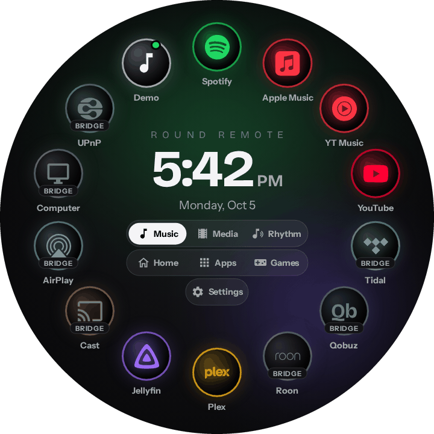<br><sub>Home · Classic</sub></td>
    <td align="center"><br><sub>Vinyl · Classic</sub></td>
    <td align="center"><br><sub>Fluid lyrics · Music Red</sub></td>
  </tr>
  <tr>
    <td align="center">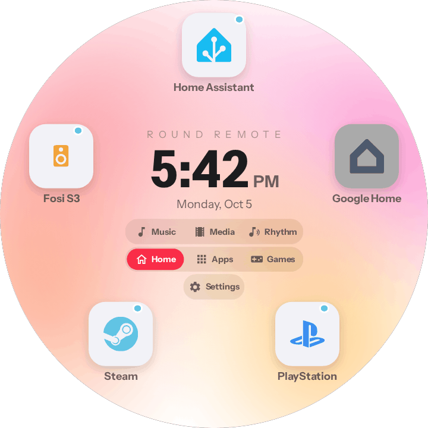<br><sub>Smart home · Music Red, light</sub></td>
    <td align="center">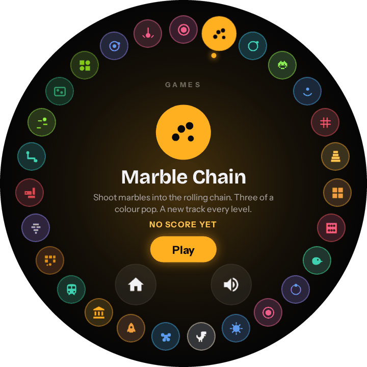<br><sub>32 games · Classic</sub></td>
    <td align="center">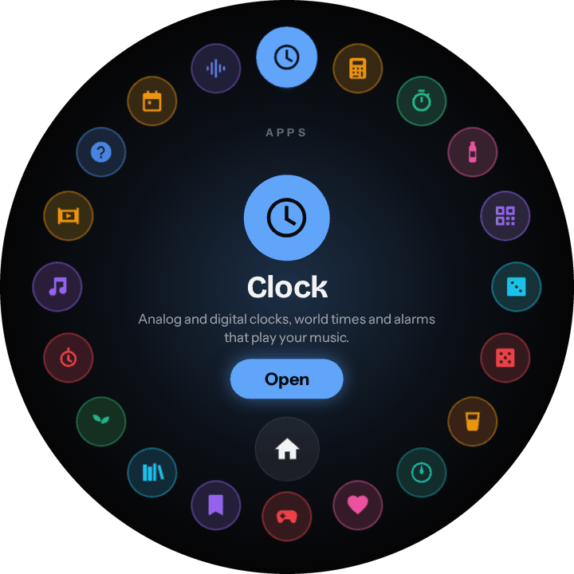<br><sub>18 apps · Classic</sub></td>
  </tr>
</table>

*All screenshots are from Demo mode on the 720×720 round screen, with sample data. Every theme comes in Dark, OLED and Light.*

> **Two targets, one app.** The same files run as a **Raspberry Pi kiosk** (the round screen as an appliance) and as a web page on **GitHub Pages** (phones, tablets, computers). Nearly every feature works on both; [Where it works](#where-it-works) lists the exceptions. The few Pi-only settings (Wi-Fi, Bluetooth, sound, battery, screen and updates under *Settings → Device*) show up only on the Pi and stay hidden on the web. Battery saver and screen rotation are under *Settings → General* on the web. The phone pages for the party apps and games need the [bridge](#the-bridge), which the Pi runs for you; on the web, start it on a computer. Without the bridge these apps and games run on one device.

© 2026 Roy Borkin. All rights reserved. See [Copyright & license](#copyright--license).

---

## Contents

1. [Features at a glance](#features-at-a-glance) · [Where it works](#where-it-works)
2. [Music](#music)
3. [Movies & TV](#movies--tv)
4. [Home & smart home](#home--smart-home)
5. [Games](#games): [Party games with phones](#party-games-with-phones)
6. [Rhythm (music games)](#rhythm-music-games)
7. [Apps](#apps): [Board Games companions](#board-games-companions) · [Collection](#collection) · [Decide](#decide-games-with-an-app-here-and-draw-lists)
8. [Settings & themes](#settings--themes): [Themes](#themes-settings--theme) · [Settings and Settings → Device](#settings)
9. [Setup](#setup): [GitHub Pages](#put-it-on-github-pages) · [Raspberry Pi kiosk](#raspberry-pi-kiosk) ([what you need](#what-you-need), [install](#3-install-one-command), [companion of a server](#pi-as-a-companion-of-a-round-remote-server), [Wi-Fi](#5-getting-on-wi-fi-and-bluetooth), [display troubleshooting](#display-modes-rotation-and-a-black-screen), [uninstall](#uninstall)) · [The bridge](#the-bridge) · [Bridge config](#bridge-config)
10. [Run it on a server (Docker)](#run-it-on-a-server-docker): [what runs where](#what-runs-where) · [TerraMaster](#option-a-terramaster-docker-manager--container-manager-projects) · [Portainer](#option-b-portainer-stack) · [updating](#updating) · [troubleshooting](#troubleshooting-the-server)
11. [Connecting your services](#connecting-your-services)
12. [Smart-home alerts](#smart-home-alerts)
13. [Phone pages](#phone-pages)
14. [Controls: touch, keyboard and knob](#controls-touch-keyboard-and-knob)
15. [Troubleshooting](#troubleshooting)
16. [Honest limits](#honest-limits)
17. [Project structure](#project-structure)
18. [Privacy & security](#privacy--security)
19. [Credits & third-party notes](#credits--third-party-notes)
20. [Copyright & license](#copyright--license)

---

## Features at a glance

Under the clock, the Home screen has its menu in three rows:

1. **Music** · **Media** (movies & TV) · **Rhythm**
2. **Home** (smart home) · **Apps** · **Games**
3. **Settings**

Music, Media and Home each show their own services around the ring: tap one, or swipe sideways to move between them. Rhythm, Apps, Games and Settings open their own screens. With a keyboard or the knob, ← → step through the buttons and ↑ ↓ move between the rows (Enter opens). The clock, the menu and the now-playing pill always fit inside the ring of services, at every control size.

**Your own ring.** Hold a service tile (or right-click it) → **Hide from Home** takes it off the ring, with an **Undo** for a few seconds; it stays signed in. *Settings → Home screen → Services* lists every service of Music, Movies & TV and Home with a switch each and ↑ ↓ to change their order. **Battery:** when the device has a battery (the Pi's UPS / PiSugar through the bridge, or a phone, tablet or laptop), its level shows next to the date, with a bolt while charging; amber at 20 %, red at 10 % (*Settings → Home screen → Battery level on Home* turns it off).

<table>
  <tr>
    <td align="center"><br><sub>Music · Classic, dark</sub></td>
    <td align="center">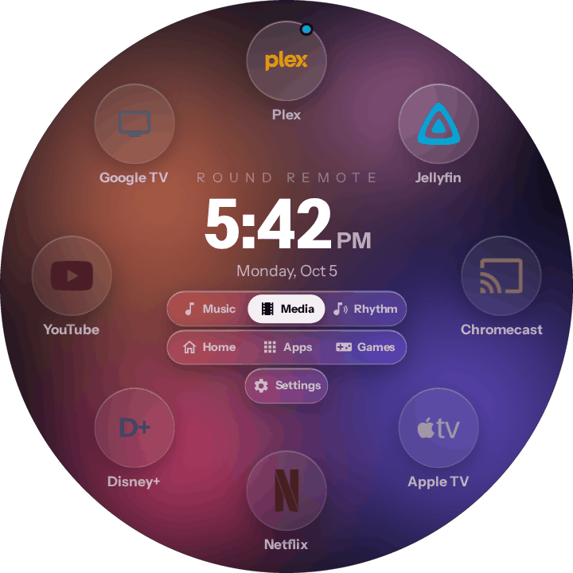<br><sub>Media · Liquid Glass, dark</sub></td>
    <td align="center"><br><sub>Home · Music Red, light</sub></td>
  </tr>
</table>

| Area | What you get |
|---|---|
| **[Music](#music)** | Spotify, Apple Music, YouTube Music, YouTube, Plex / Plexamp, Jellyfin, Roon, UPnP / DLNA, Google Cast, AirPlay, Tidal, Qobuz, the apps on your computer, and a Demo. Six ways to show the song: Info, Vinyl (or cassette / CD), synced Lyrics in six styles, Video, Tone Visual and Fun Facts. |
| **[Movies & TV](#movies--tv)** | Now playing and a full library for Plex and Jellyfin, plus Chromecast, Apple TV, Netflix, Disney+, YouTube on the TV and a Google TV remote. |
| **[Home & smart home](#home--smart-home)** | Home Assistant (favourites, rooms, scenes, round controls), Google Home commands and speakers, PlayStation and Steam status screens, and a Fosi S3 music streamer. |
| **[Games](#games)** | 32 games: 27 round arcade and puzzle games with a top-5 chart for every mode, three party games played from your phones (Notes Game, Code Words, Fill the Blank), plus Trivia Night and Drinking Games (18+). A pause menu with a mini player, touch, keyboard and knob controls. |
| **[Rhythm](#rhythm-music-games)** | Hitster plus five rhythm games that learn the song that's playing on your own music service. |
| **[Apps](#apps)** | 18 tools: clock & alarms, calculator, timers, party games, board-game companions for 17 games and rules for 45, a physical-media collection (games, board games, books, vinyl, CDs, discs), wish lists, plants & pets, focus timer, sleep sounds, party DJ, movie night, countdowns and more. Guests join several of them from their phones. |
| **[Settings & themes](#settings--themes)** | 11 themes, each in Dark, OLED or Light with your own colours, console-style Home backgrounds, settings profiles you can copy to another display, and smart-home alerts. |

### Where it works

Round Remote runs in four ways: as a **Raspberry Pi appliance** (the round screen; the Pi also runs the bridge), as a **web app** on GitHub Pages in any browser, with the **bridge on a computer** next to the web app (`start-bridge.bat` / `.sh`), which reaches what a browser can't, and as a **Docker server** on a NAS or home server ([Run it on a server](#run-it-on-a-server-docker)) that round displays (Raspberry Pi companions), phones and computers connect to.

| Feature | Pi appliance | Web app alone (GitHub Pages) | Web app + bridge on a computer | Docker server (+ Pi companions) |
|---|---|---|---|---|
| Spotify, Apple Music (MusicKit), YouTube / YouTube Music on this display, Plex, Jellyfin, Home Assistant, Demo | ✅ | ✅ (http servers: allow *local network access* in Chrome / Edge, or use https) | ✅ | ✅ |
| Roon, UPnP / DLNA, Google Cast, Tidal, Qobuz, the Computer tile, YouTube on your TV, Google TV remote, Apple TV, Netflix / Disney+ tiles, Google Home, PlayStation, Steam, Fosi S3 streamer | ✅ | — | ✅ | ✅ except the Computer tile (host networking; Apple TV needs the `WITH_PYATV=1` image) |
| AirPlay receiver (the display as a speaker) | ✅ | — | Linux only | — |
| Games, Rhythm games, Apps on one device | ✅ | ✅ | ✅ | ✅ |
| Phone pages: Tasks, Collection upload & barcode, Party DJ, Movie Night, Trivia Night, Notes Game, Code Words, Fill the Blank | ✅ | — (each app has a one-device / pass-the-remote mode) | ✅ | ✅ (QR codes point to the server) |
| Static key pages (Code Words in one-device mode, the Codenames companion) | ✅ | ✅ | ✅ | ✅ |
| Collection connections (BoardGameGeek, PriceCharting, RAWG, Discogs, TMDB…), Wish Lists' Steam / PlayStation import, rhythm chart library, tempo look-ups | ✅ | — | ✅ | ✅ |
| Rhythm: learn from the sound of the bridge's computer | ✅ (music the Pi itself plays) | — | ✅ | — |
| Rhythm: learn from a microphone | ✅ (USB mic) | ✅ | ✅ | ✅ |
| Settings profiles saved on the bridge | ✅ | file export / import only | ✅ | ✅ (on the server, shared by all displays) |
| *Settings → Device*: Wi-Fi, Bluetooth, sound, battery & power, screen off, motion-sensor rotation, updates, restart / shut down | ✅ | — | — | ✅ on each Pi companion (its own device); the server updates as a new image |
| Screen rotation (manual or the device's motion sensor) and Battery saver | ✅ (*Settings → Device*) | ✅ (*Settings → General*) | ✅ | ✅ |
| Smart-home alerts (Home Assistant) | ✅ | ✅ | ✅ (plus Google Home broadcasts) | ✅ (plus Google Home broadcasts) |

---

## Music

### Services

Sign in to each service once. After that, one round screen lets you control the volume, seek, skip, pick playlists and devices, and search.

| Service | How it connects | Works from GitHub Pages? |
|---|---|---|
| **Spotify** | Web API (sign in once). Controls any of your Spotify devices, and the page itself can be a Spotify speaker. | ✅ |
| **Apple Music** | Either remote-controls Apple Music on a computer (**Cider**, **Sidra** or the **Apple Music app for Windows**) with no developer token, or plays it *on this display* with MusicKit (needs a developer token). | ✅ MusicKit; the computer option needs the bridge |
| **YouTube Music** | YouTube player on this display (search and your playlists), **the YouTube app on your TV** once it's linked with a TV code, or **a browser tab on your computer** playing YouTube Music. | ✅ (free API key); TV and computer need the bridge |
| **YouTube** | The same, for any YouTube video. | ✅ (free API key); TV and computer need the bridge |
| **Plex / Plexamp** | Sign in with a plex.tv code. Controls Plexamp (headless too) and Plex players through your server. | ✅ |
| **Jellyfin** | Quick Connect or username/password. Controls any Jellyfin app session and uses server lyrics when available. | ✅ (see [Jellyfin](#jellyfin) for http servers) |
| **Roon** | Official Roon extension API: zones, volume, playlists and search. | Needs the bridge |
| **UPnP / DLNA** | Standard AV renderers: WiiM, Bluesound, Denon/Marantz, BubbleUPnP, Volumio, moOde… | Needs the bridge |
| **Google Cast** | Chromecast, Nest and Cast speakers. Shows and controls whatever is *cast* to them (for apps opened directly on the TV, see [YouTube on your TV](#youtube-on-your-tv-google-tv-android-tv-smart-tvs-consoles)). | Needs the bridge |
| **AirPlay 1/2** | The Pi becomes an AirPlay speaker (shairport-sync) and controls the phone or Mac that's streaming. | Linux/Pi bridge only |
| **Tidal** | No public remote-control API. The tile follows TIDAL playing through Roon, Cast, UPnP or AirPlay. | Needs the bridge |
| **Qobuz** | Qobuz Connect is closed to third parties. Same approach as Tidal. | Needs the bridge |
| **Computer** | Music and video apps on the computer running the bridge: Apple Music (Cider, Sidra, the Windows app, iTunes), Spotify desktop, YouTube / YouTube Music in Chrome, Edge or Firefox, VLC, TIDAL desktop… Uses the system's own media controls (Windows media sessions, or MPRIS on Linux / the Pi) plus Cider's API. | Needs the bridge |
| **Demo** | Fictional songs with original lyrics and generated music. Try everything without an account. | ✅ |

On the Home screen:

- a green dot means you're signed in;
- services that still need the bridge show a small **BRIDGE** tag;
- *Settings → Show only signed-in services* hides everything you haven't set up;
- *Settings → Show the Demo service* hides or shows the Demo tile.

The platform logos come from the free [Simple Icons](https://simpleicons.org) set (jsDelivr, with unpkg as a backup). They're downloaded once and then kept in the browser, so the Pi shows them offline too. Qobuz isn't in that set, so its tile keeps its letters. Tiles show letters until a logo has been downloaded once.

### The player and its six views

In every view the controls hide by themselves after a few seconds; tap the screen to bring them back. The ring around the edge is the seek bar: drag it around the circle. The *Service · Device* line near the top can be turned off in Settings. Swipe left or right (or press <kbd>1</kbd>–<kbd>6</kbd>) to change the view.

<table>
  <tr>
    <td align="center"><br><sub>Info · Classic</sub></td>
    <td align="center"><br><sub>Info, controls hidden (song card on blurred art)</sub></td>
    <td align="center">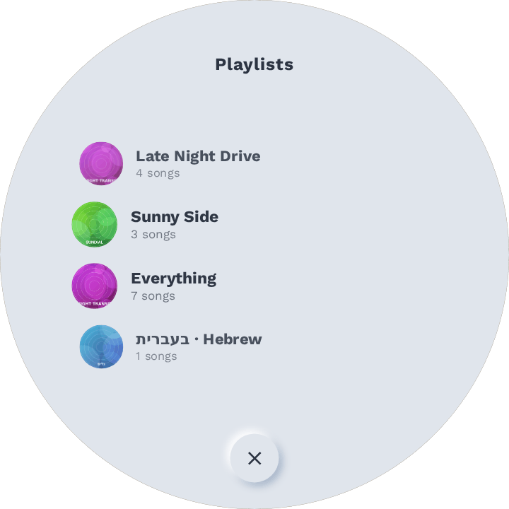<br><sub>Playlists · Soft, light</sub></td>
  </tr>
</table>

**1. Info (classic):** round artwork, title, artist and album. The accent colour is taken from the artwork. When the controls hide, you choose what fills the screen:

- the artwork, *clear* or as a *milky blur*, or
- a **song info card** with the song, artist, album, year and time left, on *black* or on the *blurred artwork*.

You can also hide the round artwork in the middle, and turn off the controls hiding by themselves in the Classic view only.

<table>
  <tr>
    <td align="center"><br><sub>Vinyl · Classic</sub></td>
    <td align="center">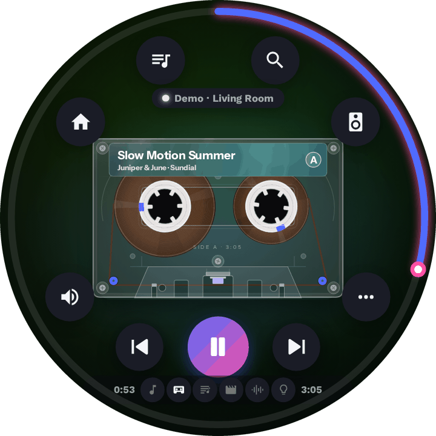<br><sub>Cassette (Clear) · Vivid</sub></td>
    <td align="center">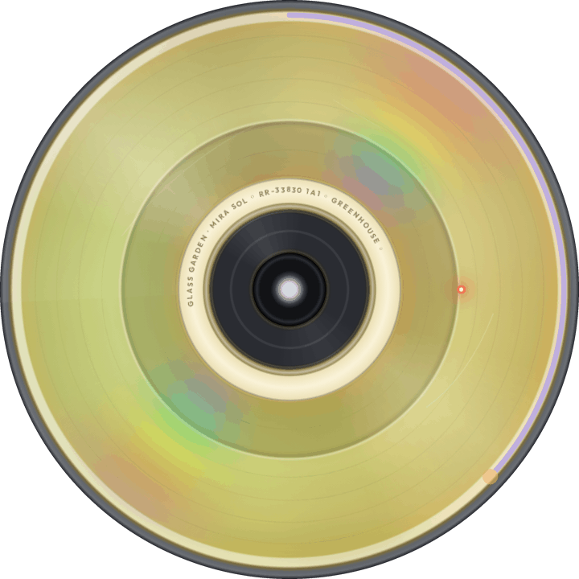<br><sub>CD · back (Gold CD-R)</sub></td>
  </tr>
  <tr>
    <td align="center">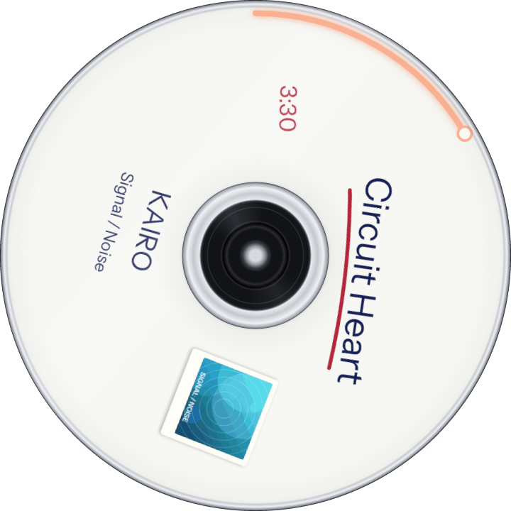<br><sub>CD · top (CD-R marker)</sub></td>
    <td></td>
    <td></td>
  </tr>
</table>

**2. Vinyl:** the whole screen becomes a record.

- Spin it with your finger to scrub back or forward; a flick keeps it coasting.
- The tone arm follows the song and hides with the controls. To keep it visible, turn off *Hide the arm with the controls* in the ⋯ panel or in Settings.
- **Record speed** (45 / 33⅓ / 16 / 8 / 4 rpm) sets both the spin and how far one turn scratches, so the record always moves with the music.
- **Record design** *Classic* (grooves), *Clear* (see-through, swirled) or *Flat*, any record colour, and a *Classic*, *S-arm* or *Minimal* tone arm.
- A slider sets the centre artwork size, from none to full screen. The song title around the label can be turned off.
- **Player:** the record can be swapped for a **cassette** or a **CD** (⋯ in the view, or *Settings → Music → Vinyl · Tape · CD*), each in three styles. They spin up and coast down with play/pause, scrub when you drag them (with fling momentum), and wind to the new spot when you seek with the ring or the knob.
  - **Cassette** (*Classic* smoke shell with a paper label and the title hand-written · *Clear* see-through shell with coloured guides and an artwork-tinted label · *Chrome / Metal* black and brushed-silver type IV). The reels turn at their real relative speeds, and the left pack shrinks while the right one grows as the song plays. Drag the tape sideways (or turn a reel) to wind; flick to fast-forward or rewind.
  - **CD · back** (the data side: *Silver* with a rainbow sheen · *Gold CD-R* whose burned area grows with the song · *Black* game-disc style with a violet sheen). A red read-laser moves outward with the song; the title is engraved around the hub.
  - **CD · top** (the label side: *Full print* artwork over the whole disc · *CD-R marker* white disc with the title written by hand and an artwork sticker · *Ring* silver disc with the artwork as a band and the title on an arc).
  - Spin a CD like the record to scrub. Like a real CD it turns faster near the start of the song (constant linear velocity).

<table>
  <tr>
    <td align="center"><br><sub>Fluid</sub></td>
    <td align="center"><br><sub>Kinetic Type · Stack</sub></td>
    <td align="center">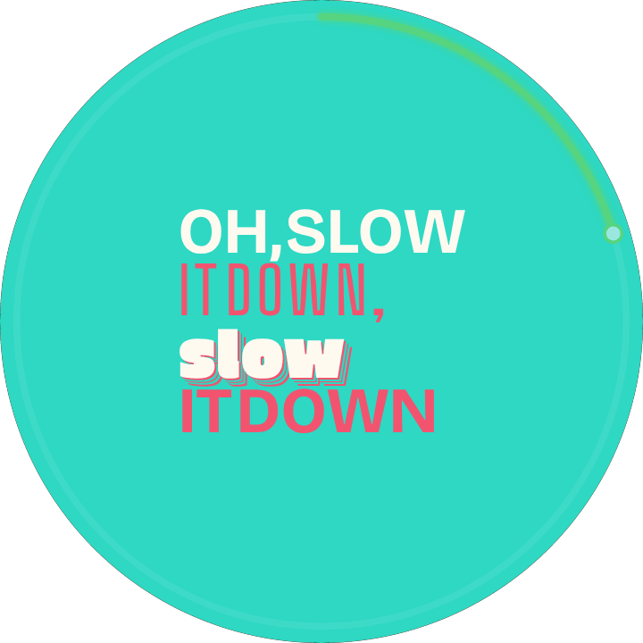<br><sub>Kinetic Type · Pop</sub></td>
  </tr>
  <tr>
    <td align="center">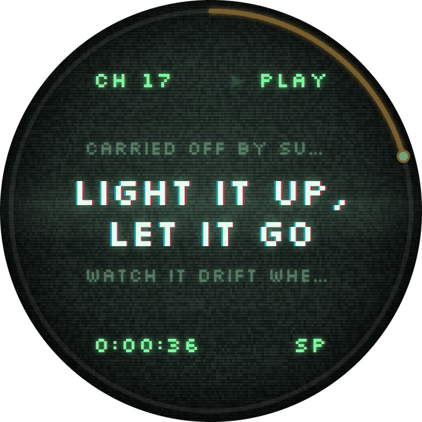<br><sub>CRT TV</sub></td>
    <td></td>
    <td></td>
  </tr>
</table>

**3. Lyrics:** synced lyrics in six styles:

- **Basic**, **Typing** (typewriter) and **Roll** (3D drum).
- **Fluid**, in the spirit of Lyricify / BetterLyrics: a flowing album-art colour field, lines that glide in a staggered cascade, and words that fill with a soft glow and lift as they're sung. Long notes glow letter by letter.
- **Kinetic Type**, lyric-video typography with thirteen variants:
  - **Stack:** full-width words stacked like a poster.
  - **Camera:** the view pans, zooms and turns 90° between phrases.
  - **Slam:** one huge word at a time.
  - **Mosaic:** each word snaps onto the edge of the block, some turned sideways, in mixed typefaces, building an interlocking word puzzle (classic After Effects lyric-video style).
  - **Black & White:** heavy caps on black with a new scene for every line: giant words the camera flies through, words ticking along a rule, words around a planet or riding a wave, a block inside a ring, and black-on-white blocks with an hourglass wipe.
  - **Hand-drawn:** flat mint / indigo / pink palettes that change with a paint-splash wipe; small hand-lettered words over one big brush word that writes itself on, staircases and little planets; everything jitters like frame-by-frame animation.
  - **Pop:** flat bright colour screens that change with a circular wipe; one huge striped-3D word with the small words stacked beside it, single-word slams with paint drops, and mixed-typeface stacks.
  - **Pastel:** pink, lavender and yellow with rough brush letters; the line arrives as chat bubbles, with a highlighter swiped behind each word, over a repeating word wallpaper, inside pulsing hearts, or in a grid of tiles with doodles.
  - **Comic:** comic-book caption boxes with hard black shadows on a night halftone sky; big words get a burst and an RGB glitch, and it all moves "on twos" like an animated film.
  - **Neon Drive:** synthwave: words fly toward you down a neon road, flicker in a neon kaleidoscope, glow on a striped retro sun, or appear under a magnifying lens gliding over the blurred lyrics.
  - **Animated:** karaoke fill.
  - **Moving Words**.
  - **Random:** a different variant for every line. It goes through all of them in a shuffled order before any repeats. Choose which variants it uses in *Settings → Lyrics → Random includes*.
- **CRT TV:** the lyrics on an old tube television: scanlines, RGB fringing and phosphor glow, live static, a rolling hum bar and flicker. Each new line changes channel (the picture collapses to a bright line and springs back), a tracking tear slides across now and then, and a VHS on-screen display (channel, ▶ PLAY, tape counter, SP) shows while the controls are hidden.
- **Hebrew and other right-to-left lyrics** are detected line by line and shown right to left in every style: word order, typing, the karaoke fill, staircases and Mosaic all run from the right, and a line that mixes in an English word still reads correctly. Hebrew letters use Rubik, Karantina, Frank Ruhl Libre and Amatic SC. The Demo has a Hebrew song to try it: **אור על המים** (playlist *בעברית · Hebrew*).

Lyrics come from [LRCLIB](https://lrclib.net), a free, open lyrics database, or from your Jellyfin server.

<table>
  <tr>
    <td align="center"><br><sub>Video, song info shown · Music Green</sub></td>
    <td align="center">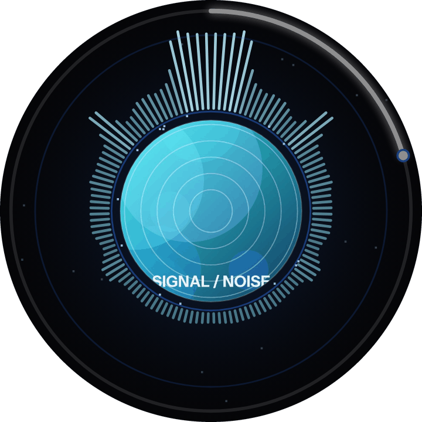<br><sub>Tone Visual · Halo · XMB</sub></td>
    <td></td>
  </tr>
</table>

**4. Video:** like the classic view, but the background is a video:

- **YouTube / YouTube Music:** the song's own video.
- **Every other service:** the song's official music video, found on YouTube, played muted and kept in sync with the song. This needs the free YouTube API key (see [YouTube](#youtube-and-youtube-music)).
- **Demo:** a generated colour loop.
- **Video types:** pick one or more of *Official clip*, *Abstract* (visualizers and animated videos), *Live*, *Fan made*, *Album cover* (the song with its cover art) and *Lyric video*. Every YouTube result is sorted into one of these from its title and channel, and only the types you picked are used. With several picked, each song tries them in its own order, so a playlist gets a mix. Covers by other artists, karaoke, remixes, slowed/sped-up versions, loops, shorts and videos much longer or shorter than the song are always skipped.
- **No suggestion screens:** the last 20 seconds of a video (where YouTube puts its end screens) are never played; it loops before them. The video fades out while the song is paused, so YouTube's "More videos" panel never shows.
- **Photo slideshow** (instead of a video): photos of the artist and album from Wikipedia, Wikimedia Commons and Deezer, crossfading with a slow zoom.
- **Prefer the official clip** (on by default): when a song has an official clip, it's used first, whatever else you picked; the other types are the fallback.
- **Show song info when the controls hide** (off by default): the song name, artist, album and time left, with a small progress bar, over the video.
- The round artwork on top can be hidden.

**5. Tone Visual:** abstract shapes and colours that move with the music, in eight styles:

- **Ferrofluid:** black magnetic liquid in a glowing lamp. Spikes rise with the bass; the fluid pulls together when it's loud and breaks into droplets when it's quiet.
- **Liquid Sphere:** a 3D sphere whose surface bulges and ripples with the music.
- **Spectrum Bars:** thin grey frequency bars on black with a faint reflection.
- **Dot Ripple:** a 3D disc of dots; every beat sends a ripple out from the centre.
- **Cymatics:** sand on a vibrating plate gathers on the still lines and draws Chladni figures that change with the sound.
- **Halo:** spectrum bars in a ring around the album art, with ripples and sparks on the beat.
- **Aurora:** flowing colour smoke mixed from the album art's own colours.
- **Oscilloscope:** a glowing green phosphor trace.

**Where the sound comes from.** This is a remote: the music plays on your speaker, TV or phone, so the app never receives the audio itself. Pick the source in the Tone Visual panel (the button on the right) or in Settings:

- **Simulated** (default): follows the song's playback: a beat at a tempo picked for each song, bass, melody and louder/quieter sections. It pauses, seeks and changes songs with the music, but it doesn't hear it.
- **Microphone (live):** listens to the room and reacts to the real sound. On the Pi, plug in a USB microphone; the kiosk script allows it automatically. In a browser, allow microphone access when asked.

Liquid Sphere and Aurora use WebGL. With *Reduce effects* on, every style draws at a lower resolution with fewer particles for the Pi 3.

**6. Fun Facts:** facts about the song, the album and the artist, one at a time over the blurred artwork: from Wikipedia (in Hebrew for Hebrew songs) and MusicBrainz (release date, how many releases, where the artist is from, when they started, genres). Choose how long each fact stays (6–60 s) in the Fun Facts panel or in Settings; tap a fact to skip to the next one. The timer rests while the music is paused.

### Search, volume, playlists and devices

<table>
  <tr>
    <td align="center"><br><sub>Search + round keyboard</sub></td>
    <td align="center"><br><sub>Volume dial · Console 5</sub></td>
    <td align="center"><br><sub>Playlists · Soft, light</sub></td>
  </tr>
</table>

- **Top buttons:** Services (Home) · Playlists · Search · Devices.
- **Volume:** the left button opens a round dial (drag around it, −/+, or the mouse wheel).
- **⋯** (right button) in Info / Vinyl / Video: shuffle, repeat, skip ±15 s, the full-screen art style (Info), the player (vinyl, cassette or CD) and its style, centre artwork size, arm hiding and record speed (Vinyl). **Aa** in Lyrics: style, Kinetic Type variant, timing offset.
- **On-screen keyboard:** **עב / EN** switches between English and Hebrew; **123** shows numbers and symbols.
- **Customize the controls:** every button, the ring, the times and the view buttons can be shown or hidden (**⋯ → Customize controls**, or hold the middle of the player).

---

## Movies & TV

<table>
  <tr>
    <td align="center">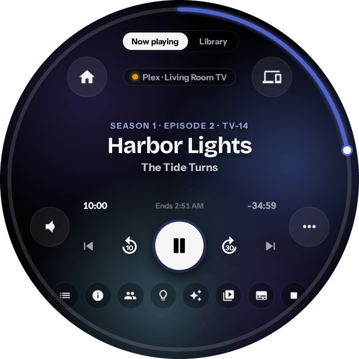<br><sub>Now playing (Plex) · Moving colours</sub></td>
    <td align="center">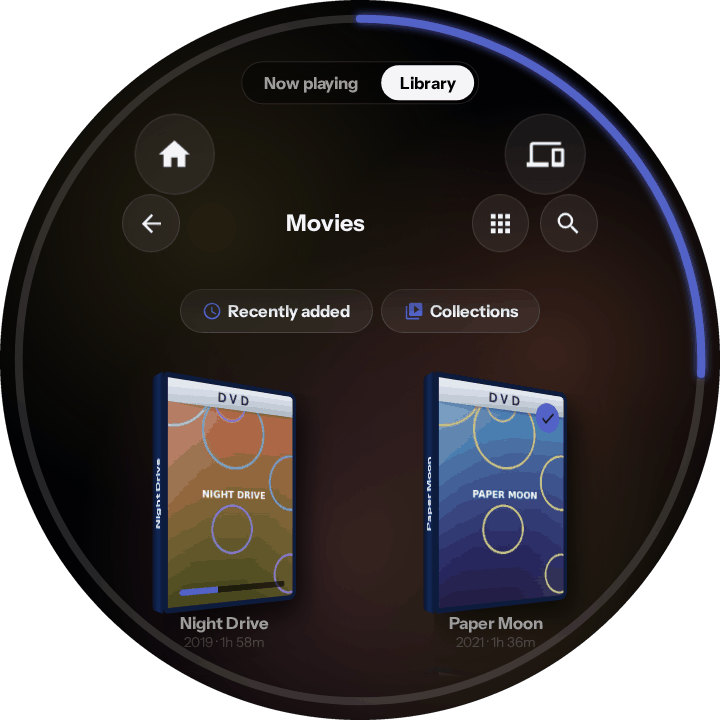<br><sub>Library · DVD view</sub></td>
    <td align="center"><br><sub>Media services · Liquid Glass</sub></td>
  </tr>
</table>

| Service | What you get | Works from GitHub Pages? |
|---|---|---|
| **Plex** | Now playing on any Plex player (Plex on your TV, Android/Google TV, Apple TV, Roku, Plex HTPC…) and your **Library**: libraries, Continue watching, Recently added, collections, search, details, cast, seasons and episodes, and *Play on the TV*. Same sign-in as the music Plex tile. | ✅ |
| **Jellyfin** | The same for Jellyfin clients (Jellyfin on your TV, Android TV, Jellyfin Media Player, the web app, Kodi…), plus *Next up*. Same sign-in as the music Jellyfin tile. | ✅ |
| **Chromecast** | Whatever is cast to a Chromecast or Google TV from any app: movie or show, season and episode, progress, skip, volume, stop. | Needs the bridge |
| **AirPlay · Apple TV** | The Apple TV and whatever is playing on it, from any app or AirPlayed to it: title, series, season, episode, progress, skip, volume, a D-pad remote and your apps. Uses [pyatv](https://pyatv.dev); pair once with the code on the TV. | Needs the bridge |
| **Netflix** | Follows Netflix wherever it's on: an **Apple TV** shows the title, series, season and episode; a **Chromecast** shows what Netflix sends; a **Google TV** knows Netflix is open. Adds the remote and **Open Netflix** on a Google TV or Apple TV. (Netflix has no public API, so there's no catalog to browse.) | Needs the bridge |
| **Disney+** | The same for Disney+. | Needs the bridge |
| **YouTube** | YouTube on your TV: **Library** searches YouTube and your playlists (YouTube API key / Google sign-in). *Play* sends the video to YouTube on your TV (linked with a TV code), a Google TV or an Apple TV, and you get the remote. | Needs the bridge |
| **Google TV** | A full-screen remote for Google TV / Android TV (Chromecast with Google TV, Sony, TCL, Hisense, Philips, Shield…): D-pad, OK, Back, Home, power, volume, mute, play/pause and an app launcher, through the protocol the Google TV phone app uses. Pair once with the code on the TV. **Or skip the bridge** through Home Assistant's Android TV Remote integration, or the free TV Remote app on the TV. | Bridge, Home Assistant, or the TV Remote app |

**Now playing** shows:

- the movie title, or the show's name with the season, episode number and episode title;
- the year, running time, age rating and rating;
- the progress ring around the edge (drag it to seek), with time passed, time left and when it ends ("Ends 22:41").

The buttons are play/pause, skip back and forward (10 s and 30 s by default), and previous / next episode. For a show, previous / next play the neighbouring episode, even across seasons. Below them:

- **Seasons & episodes** (for a show): every season of the show; pick one to see its episodes, with the one playing marked. Tap an episode to play it;
- **Info:** summary, tagline, genres, director, writers, studio, release date;
- **Cast:** photos, names and roles;
- **Fun facts:** from Wikipedia and your library's details. They change every few seconds; tap for the next one;
- **More like this:** suggestions from your own library;
- **Collection:** the other movies in its collection (for example the rest of a trilogy);
- **Audio & subtitles:** pick the audio track and the subtitles, or turn subtitles off;
- **TV remote** (Apple TV) and **Stop**.

Tap a suggestion or a collection title to open its page in the Library tab.

**Skip intro / Skip credits:** when the TV shows *Skip intro*, the app shows it too, at the bottom of Now playing (also while the controls are hidden). A bar inside it fills up until the intro ends. Tap it to jump past the intro, recap, credits or ad. Credits at the end of an episode become **Next episode**.

- Plex uses its intro and credits markers (Plex Pass: *Skip intro* / *Skip credits* detection in the server settings).
- Jellyfin uses media segments (Jellyfin 10.10 or newer, with intros detected by a plugin such as *Intro Skipper*). Older servers with the Intro Skipper plugin work too.
- *Settings → Movies & TV* can hide the button, or **skip intros & recaps automatically**.

**Subtitles from the internet:** in **Audio & subtitles**, tap **Find subtitles online**. You can also tap **Subtitles** on a movie or episode page in the Library.

- Pick a language (your languages come first; **More…** shows all of them) and tap a result.
- The server downloads it, and when it's for what's playing, the app turns it on on the TV. The TV app only knows the subtitle tracks that existed when the video started, so if it doesn't switch by itself, the video restarts at the same spot (3 seconds back) with the new subtitles. Plex also saves them as this video's subtitles, so they're used the next time it plays.
- Plex uses its built-in subtitle search (OpenSubtitles). Jellyfin needs a subtitle plugin, such as *Open Subtitles*, installed on the server, and your user needs the *subtitle management* permission.

**Customize the controls:** every part of the Now playing screen can be shown or hidden: the ring, tabs, each button, the title lines, times and the function buttons. Use **⋯ → Customize controls** or Settings. If you hide the ⋯ button, hold an empty part of the screen to get back.

**⋯ Options** chooses the background:

- **Poster**, **Photo** (the movie's backdrop), **Blurred** or **Black**;
- **Slideshow:** the movie's backdrops, then pictures from its collection, show and suggestions, with a slow zoom;
- **Content aware:** the background follows what you're looking at: the movie that's playing, or the movie, show or library page you've opened in the Library. It's graded by genre: dark red for horror, cool and scanned for sci-fi, teal for thrillers, orange-and-teal for action, warm for comedy and animation, golden dust for fantasy, film grain for documentaries, soft pink for romance and drama;
- **Moving colours:** soft, slowly drifting blurs of colour taken from the poster of what you're watching or browsing.

While you watch, the controls hide by themselves. The title and time left can stay on screen, and optionally the clock and rotating fun facts. Tap anywhere to bring the controls back.

**Library** (Plex and Jellyfin) lets you browse your libraries: Continue watching, Next up (Jellyfin), Recently added, Collections, and every movie and show. Search with the 🔍 button. An item's page shows the poster and details; *Resume* / *From start* / *Mark watched*; seasons and episodes; the cast; the rest of its collection; and "More like this". *Play* starts it on the TV you picked under **Devices**. On a show, *Play next episode* picks up where you are.

**Library views** (the ▦ button next to search, or Settings):

- **List** and **Posters** (one big poster at a time);
- **Grid**;
- **Cover Flow** (swipe the covers like an old iPod or Mac);
- **Rings** (one title at a time, full screen, with its watched progress as a ring; swipe sideways);
- **Watch** (a smartwatch-style honeycomb: drag around, the bubbles grow in the middle);
- **DVD** (cases with spines);
- **Disc** (discs printed with the artwork);
- **DVD + disc** (the disc slides out of the case when you touch it).

In the picture views, *Recently added* and *Collections* become chips at the top.

---

## Home & smart home

<table>
  <tr>
    <td align="center">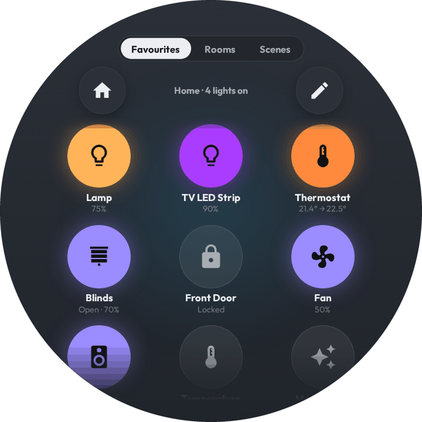<br><sub>Home Assistant favourites · Slate</sub></td>
    <td align="center">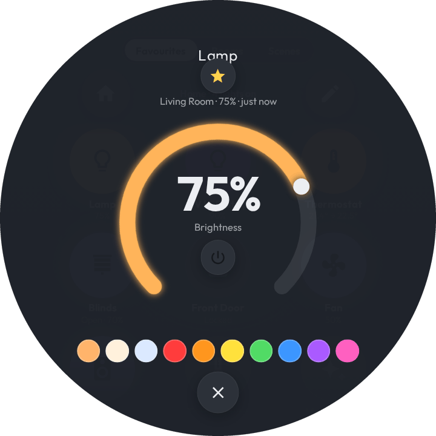<br><sub>Round light control</sub></td>
    <td align="center">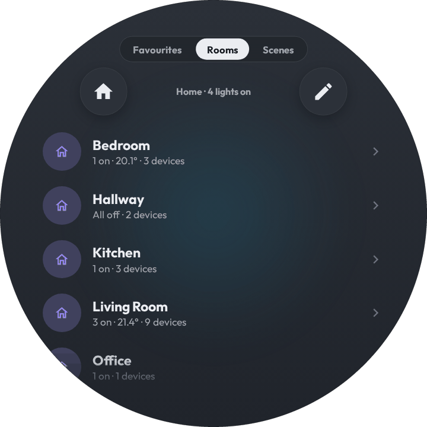<br><sub>Rooms (your HA areas)</sub></td>
  </tr>
  <tr>
    <td align="center">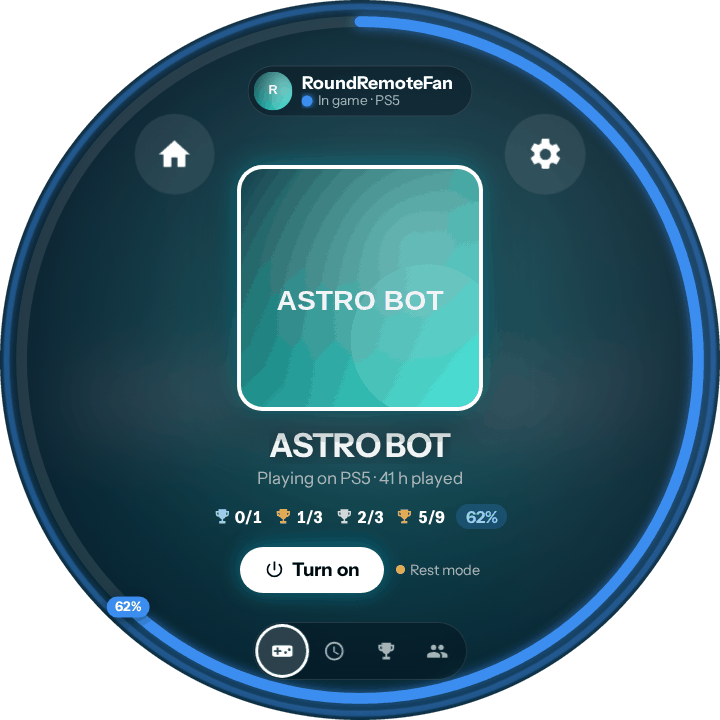<br><sub>PlayStation · Now · Console 5</sub></td>
    <td align="center">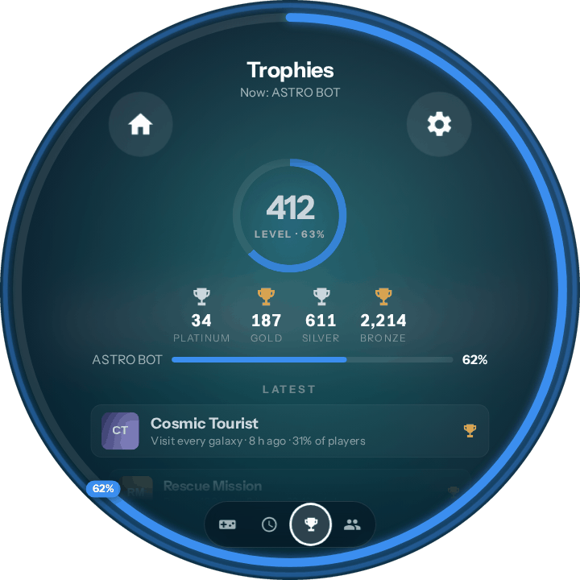<br><sub>PlayStation · Trophies</sub></td>
    <td align="center">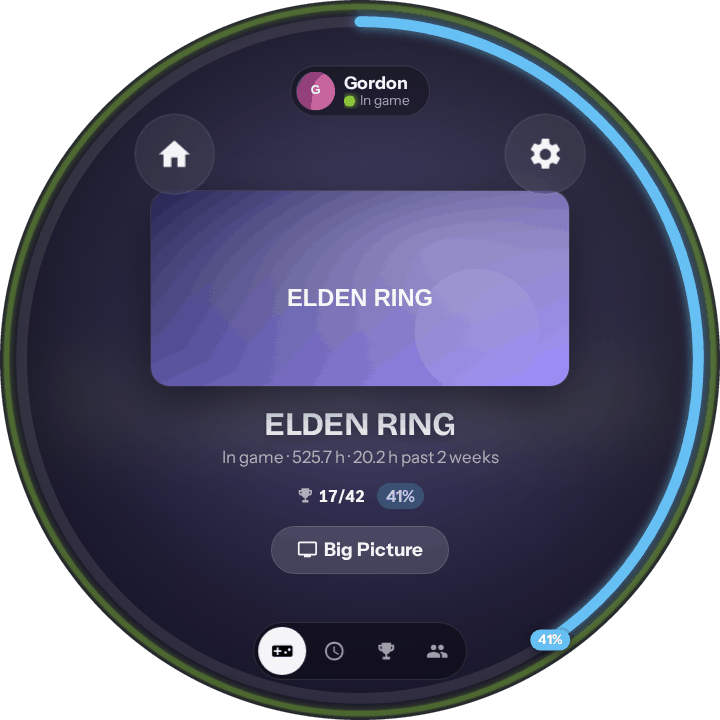<br><sub>Steam · Now</sub></td>
  </tr>
  <tr>
    <td align="center">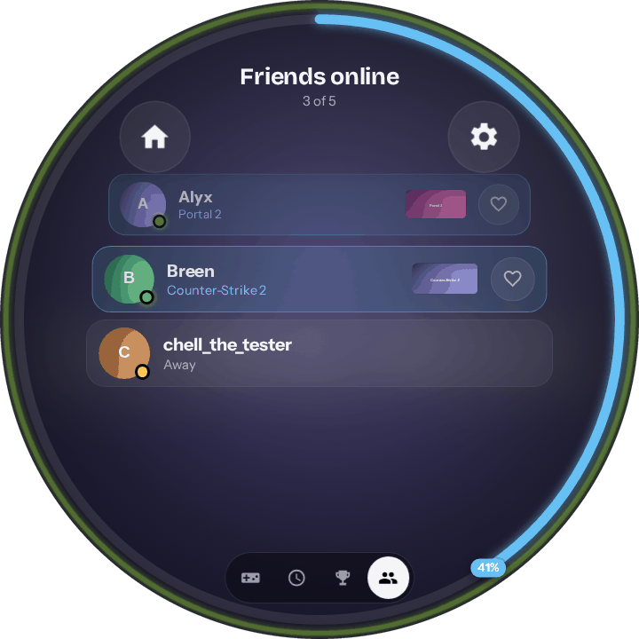<br><sub>Steam · Friends</sub></td>
    <td align="center">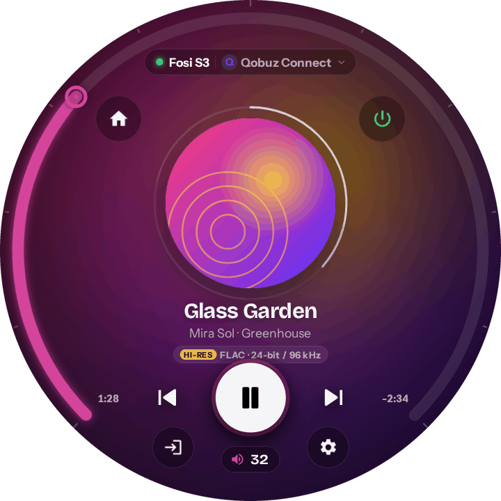<br><sub>Fosi S3 streamer</sub></td>
    <td align="center"><br><sub>Home services · Music Red, light</sub></td>
  </tr>
</table>

| Service | What you get | Works from GitHub Pages? |
|---|---|---|
| **Home Assistant** | Your whole Home Assistant, live:<br>• **Favourites** (you pick them), **Rooms** (your HA areas) and **Scenes** (scenes, scripts, automations, buttons).<br>• Round controls: brightness and colours for lights, a temperature dial and modes for climate, position for blinds, speed for fans, locks, speakers (volume, play/pause, what's playing), cameras (live snapshots), vacuums, alarms, and big readings for sensors. | ✅ with an https address; an http address works with `cors_allowed_origins` (or through the bridge) |
| **Google Home** | Your own command tiles for Google Assistant ("Turn off the kitchen lights", "Good night", "Set the thermostat to 22"), **Ask Google** anything, and **Broadcast** a message to your speakers. Answers show on screen and can be spoken. The **Speakers** tab has volume, play/pause and stop for your Google / Nest speakers and displays. | Needs the bridge (and a one-time Google sign-in for commands) |
| **PlayStation** | A round console screen: your PSN profile and presence (online/offline, on PS4 or PS5), **the game you're playing now** large in the middle with its art, play time and **trophy progress around the rim**, the latest trophies you earned and the easiest ones still to get, **recently played games** with play time, your **trophy level** and platinum/gold/silver/bronze counts, and **friends online** with what they play. **Wake / rest mode** for the PS5 through Home Assistant (ps5-mqtt) or `playactor` on the bridge. | Needs the bridge (sign in once with an NPSSO token) |
| **Steam** | Your Steam status (online / away / in game) and level, **the game you're playing** with its header art, hours and **achievement progress around the rim**, the latest unlocks and what's next (with how many players have them), **recently played games** with hours, and **friends online** with their games. **Start a game** or **Big Picture** on the computer running the bridge. | Needs the bridge (a free Steam Web API key) |
| **Fosi S3** (music streamer) | Your network streamer on one round screen: the **artwork** (blurred behind everything) with title, artist and album, the service and the **audio format** (e.g. *Hi-Res · FLAC · 24-bit / 96 kHz*), the track progress around the art, play / pause / next / previous, and a big **volume ring around the rim** you turn with a finger (or the knob, wheel or arrow keys), with mute. **Sources** lists the streamer's own inputs and services: tap Line In, Optical, HDMI or Bluetooth to switch to it; Spotify, Qobuz Connect, TIDAL, Roon, Google Cast, AirPlay and UPnP show how to play to it from the app. **Settings** switches the output (RCA/XLR ↔ optical), shuffle / repeat, standby. Works with other StreamUnlimited-based streamers too (the ones whose web page is at `http://<ip>/webclient`). | Through the bridge (direct when the app is opened over http on your network and the streamer allows it) |

**Using Home Assistant:**

- **Tap a circle** for the quick action: lights, switches and fans toggle; blinds open or close; scenes and scripts run; locks lock or unlock; speakers play or pause.
- **Tap the name** (or hold the circle) for the full round control, with a ☆ to make it a favourite.
- **✎** (top right) chooses your favourites, room by room. Until you choose, Favourites shows suggestions.
- **Rooms** shows each HA area with how many things are on and the temperature, plus **All off**.

**Google Home:** tap a tile to send its command; hold a tile to edit or delete it; **+** adds one. **Ask Google** takes anything you type, and **Broadcast** sends a message to every speaker. The **Speakers** tab needs no sign-in: it lists the Google / Nest speakers and displays the bridge finds (like the Cast tile).

**PlayStation and Steam** have four pages each. Swipe sideways, turn the knob, use ← → or tap the dots at the bottom:

- **Now:** your profile and status at the top, the game you're playing in the middle (or your avatar with *Online* / *Offline · 2 h ago*), its trophy or achievement counts, and the progress as an arc around the rim. The outer ring shows your status (PlayStation: blue in a game, green online, grey offline; Steam follows its own colours: green in a game, blue online, amber away).
- **Recent:** recently played games with platform, play time and when (Steam: hours in total and in the past two weeks).
- **Trophies / Achievements:** your level (the ring is the progress to the next level), platinum / gold / silver / bronze totals (PlayStation), the current game's progress, your latest trophies or unlocks (with how rare they are) and **Up next**: the most common ones you don't have yet. When you're not playing, it shows the game you last earned trophies in.
- **Friends:** friends who are online, with the game they're playing.

Setup for every Home service is under [Connecting your services](#connecting-your-services).

---

## Games

Tap **Games** on the Home screen for **32 games** on a ring: tap one (or drag around the ring, scroll, or use ← →) to see it in the middle, then tap **Play**. Every game keeps a **top-5 chart** for each of its modes and options (like difficulty); Notes Game and Code Words, which are played in teams, keep their scores per game instead. It shows after every round and under **Top 5** on its start card. When a score makes the chart you're asked for your name; the last name is filled in next time and you can tap it to change it. Each place shows the name and the date. The scores are saved with your settings, so a settings profile copies them to another display.

**Pause (⏸ at the top):** Resume, Restart and Quit, sound on/off, and a mini player for whatever is playing in Music or Movies & TV: previous, play/pause, next and volume.

<table>
  <tr>
    <td align="center"><br><sub>The Games ring</sub></td>
    <td align="center">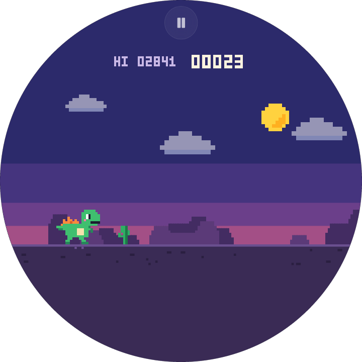<br><sub>Dino Run</sub></td>
    <td align="center">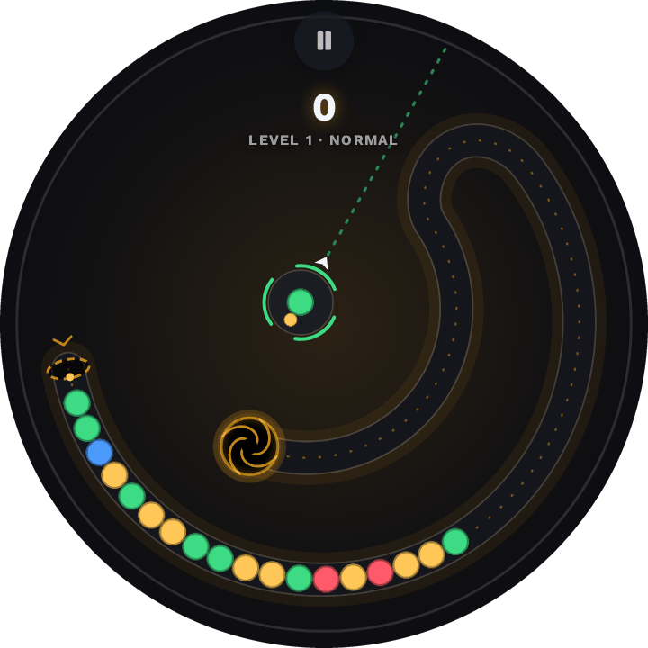<br><sub>Marble Chain · Vivid</sub></td>
  </tr>
  <tr>
    <td align="center">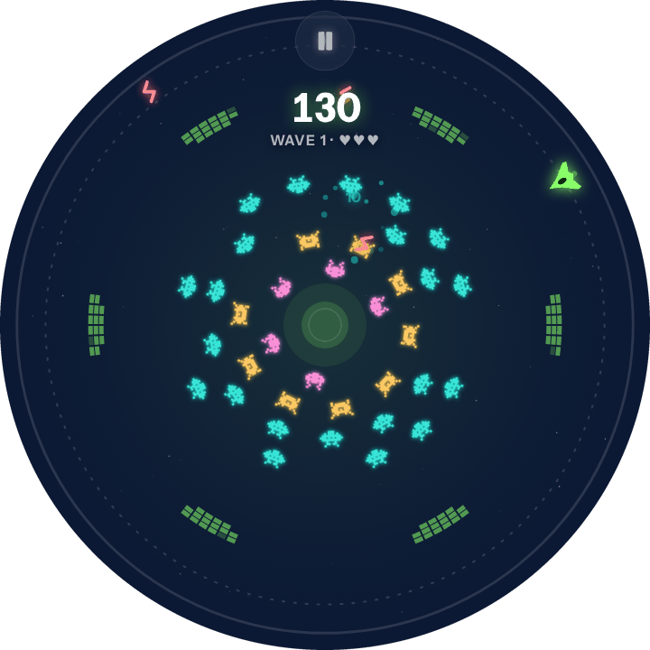<br><sub>Ring Invaders · XMB</sub></td>
    <td align="center">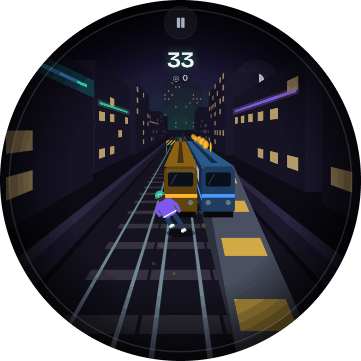<br><sub>Rail Rush</sub></td>
    <td align="center">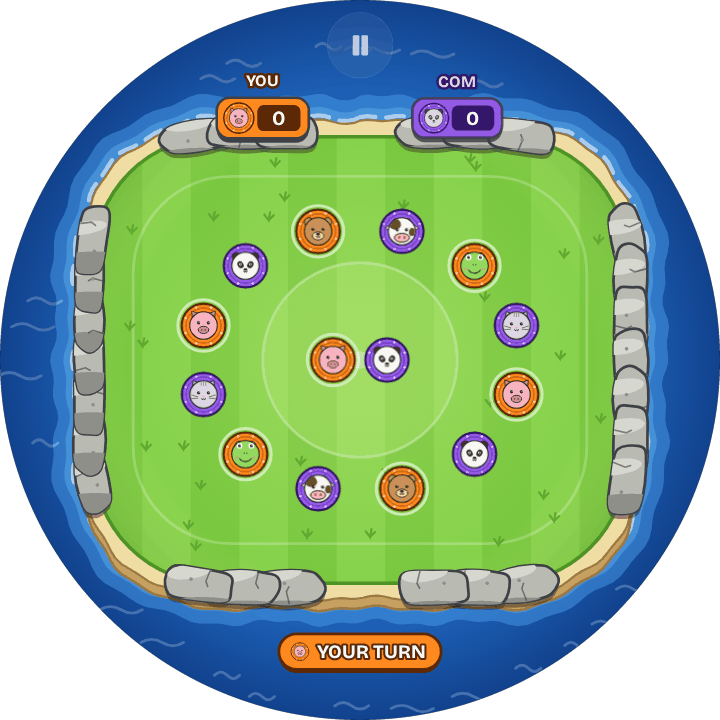<br><sub>Zoo Splash</sub></td>
  </tr>
  <tr>
    <td align="center">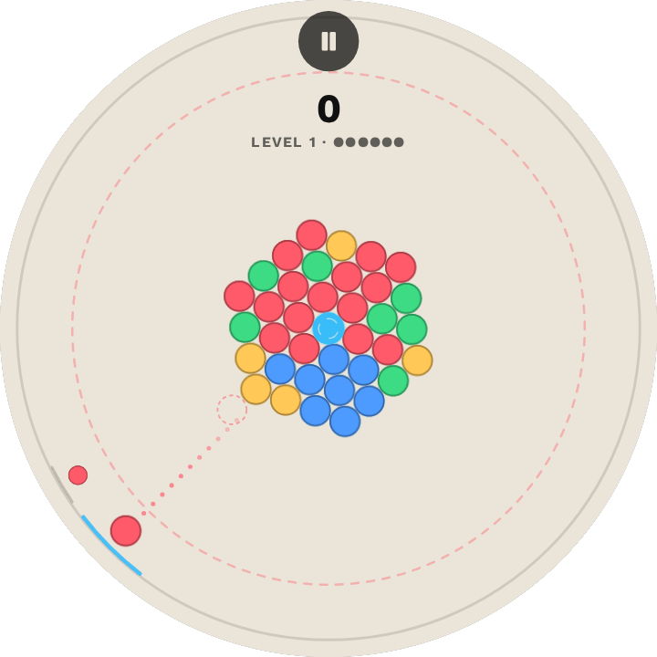<br><sub>Bubble Shooter · Bauhaus, light</sub></td>
    <td align="center">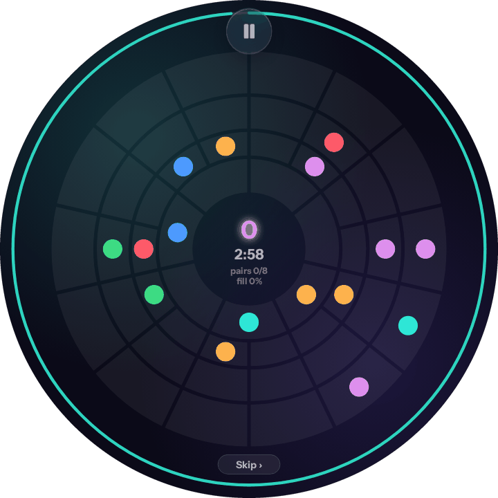<br><sub>Pipe Link · Liquid Glass</sub></td>
    <td align="center">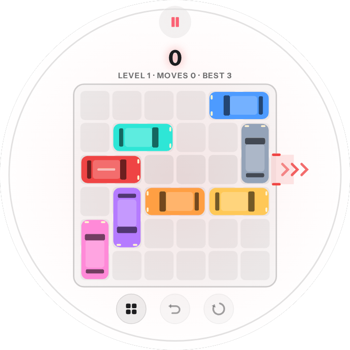<br><sub>Rush Hour · Music Red, light</sub></td>
  </tr>
  <tr>
    <td align="center">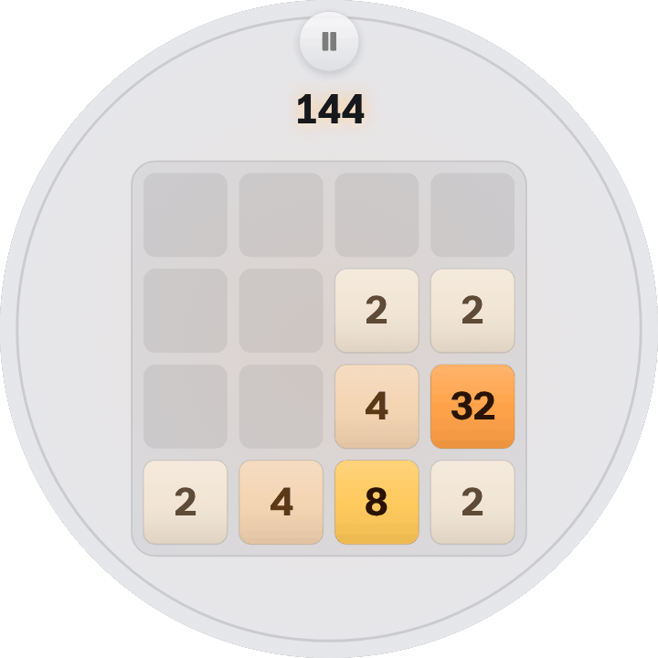<br><sub>2048 · Click Wheel, light</sub></td>
    <td align="center">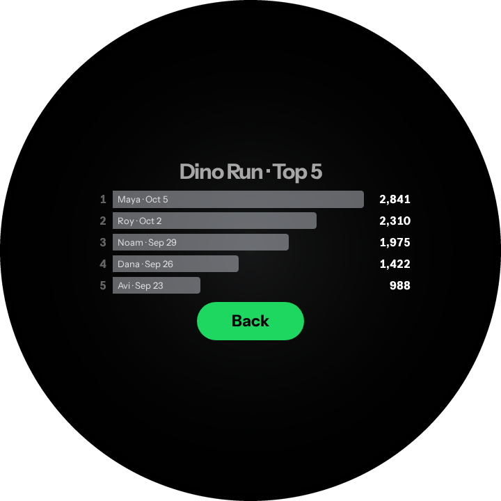<br><sub>Top 5 · Music Green, OLED</sub></td>
    <td></td>
  </tr>
</table>

| Game | How it plays |
|---|---|
| **Grow** | Hold to grow a bubble, let go to bank it. Bigger is more points, but touching the edge or a drifting spike pops it. 3 lives. |
| **Marble Chain** | A marble shooter. Drag to aim, let go to shoot, tap the shooter to swap; 3 of a colour pop. Modes:<br>• *Random* (Easy / Normal / Hard): every level is a new layout: the shooter, the vortex and the track are placed and shaped at random (spirals, S-curves, crowns, zig-zags). On Hard, many levels have **two tracks at once**, each with its own chain and vortex.<br>• *Classic*: the original 6 tracks. |
| **Perfect Circle** | Draw a circle in one go and get a score for how perfect it is. |
| **Ring Invaders** | Space invaders in a circle. Your ship flies around the rim and shoots inward at invaders spreading out from the core. |
| **Circle Pong** | Keep the ball inside the circle with a paddle on the rim. Modes:<br>• *Classic*.<br>• *Two balls*.<br>• *Power-ups*: wide or shrinking paddle, slow-mo, multi-ball, shield, sticky paddle, ×2 points, fast ball, reversed controls.<br>• *Against*: the rim is split into 2, 3 or 4 sectors and you play against computer blockers on Easy, Normal or Hard. 3 lives each; a knocked-out sector becomes a wall.<br>• *2 players*: two halves on one screen, one finger each. |
| **Tic Tac Toe** | 1P vs COM (Easy / Normal / Hard) or 2 players. |
| **Stack** | Tap to drop each sliding block on the tower. Overhang is cut off; perfect drops keep it whole. |
| **2048** | Swipe to slide and join the tiles. |
| **Four in a Row** | 1P vs COM (Easy / Normal / Hard) or 2 players. |
| **Floppy Bird** | Tap to flap through the gaps. |
| **Running Circle** | Your ball runs around a ring. Tap to hop to the other side of the line and dodge the obstacles. |
| **Hit Circle** | Tap each circle as its ring closes in. Perfect timing scores most. |
| **Minesweeper** | A round minefield in Easy, Medium or Hard. Hold to flag. Your best times are kept. |
| **Dino Run** | Flat 8-bit pixel art: our own little dino with orange back plates, pixel cacti and gliders, stepped mesas and a day → night palette change. Jump the cacti and duck the gliders. Hold to jump higher. Obstacles are always spaced so you can land and jump again (no impossible sequences), with mixed cactus groups and quick doubles as you speed up. |
| **Bubble Shooter** | Shoot from the rim into a bubble cluster around a core. 3 of a colour pop; bubbles cut off from the core fall. |
| **Jetpack Dash** | Hold to fly. Dodge zappers, missiles and lasers, and collect coins. |
| **Temple Dash** | Run an ancient path. Swipe to turn at corners and to change lanes, swipe up to jump and down to slide. |
| **Rail Rush** | Three rail lanes. Swipe to switch lanes, jump and roll, and ride the train roofs. |
| **Bricks Breaker** | Aim and fire a volley of balls from the centre at numbered bricks on the rings. Every turn the rings move inward. Power-ups: +1 ball, ring and line lasers, bombs, double damage, fire balls, ×2 balls and a shield. |
| **Block Destroyer** | Breakout on a round screen: a paddle on the rim and 12 block layouts, with strong, metal, explosive and spinning blocks, looping faster. Power-ups: wide paddle, multi-ball, fireball, laser, sticky, slow, extra life and shield, plus shrink and fast. |
| **Rush Hour** | Slide the cars and trucks to get the red car out. 48 puzzles in 4 packs, from Beginner (3 moves) to Expert (up to 49 moves), with stars, unlocking, Undo and Restart. |
| **Pipe Link** | Join each pair of matching dots with a pipe and fill every cell, without crossing. Endless generated puzzles on a *Round* board (rings × sectors) or a *Square* board, Small to Huge. A timed run: 100 points per puzzle plus a speed bonus. |
| **Sketch Jump** | Bounce up a notebook page from ledge to ledge. Hold left or right (or ←/→) to steer, tap to shoot. Moving, crumbling, one-use and spring ledges, a balloon boost, and monsters you can stomp or shoot. |
| **Zoo Splash** | Inspired by the classic ICQ game Zoopaloola. Two teams of animal pucks on an island: pull one of yours back like a slingshot and knock the other team into the sea. 1P vs COM (Easy / Normal / Hard) or 2 players. |
| **RPS Battle** | Inspired by the classic ICQ game RPS. Two armies of rock, paper and scissors soldiers on a 7×6 board. Hide your flag and a trap, march one step at a time, win the battles and capture the enemy flag. Ties re-pick. 1P vs COM (Easy / Normal / Hard, optional 10 s or 20 s turn timer) or 2 players with a pass-the-screen cover. |
| **Orbits** | *Spinning*: 30 gravity levels. Touch, drag and let go to fling planets into orbit around black holes until the ring fills; later levels add twin, moving and repelling holes, asteroids and planets that pull on each other. Planets leave coloured trails. *Targets*: your planet circles a sun; tap to let go and fly into the next orbit, collecting stars. 3 lives. |
| **Rope Snip** | Swipe to cut the ropes and swing the sweet into the hungry critter's mouth, grabbing the 3 stars. 36 levels in 3 boxes with bubbles, puffers, ringed pins, spikes, moving pins and a gravity switch. The top 5 is your total stars. |
| **Notes Game** (פתקיות) | The Israeli party game in the spirit of Fishbowl. *With phones*: scan the QR code, pick a team (or let the game balance them) and write your notes (names everyone knows) or pick from a starter pack of ~260 English and ~280 Hebrew famous names; the bowl on the display fills up. Teams take turns against the clock (30 / 45 / 60 / 90 s): the explainer's phone shows the note with big ✓ Got it and ⤼ Skip, teammates' phones say *Guess!*, the display shows the round and its rule, whose turn, a timer ring that beeps in the last 10 s, the scores and the notes left. Rounds (pick them and their order): Describe, One word, Charades, Sounds only, One gesture under a sheet — the same notes every round. Options: notes per player, 2–4 teams, skip penalty, skips per turn, carry the time left into the next round (classic rule). The end: scores, the best explainer, play again with the same notes or new ones. *One device* (no bridge, e.g. on GitHub Pages): type the notes on the display or add famous names, and the explainer holds the display. English or Hebrew on the display and on every phone. |
| **Code Words** | A word-guessing team game in the spirit of Codenames, with our own look and word lists (~410 English and ~410 Hebrew words in 16 categories, plus a Kids set and your own words). A 5×5 grid fills the round screen (wider rows in the middle), red vs blue, 9/8/7/1 key. *With phones*: spymasters join by QR and only they see the key on their phone (the host can reassign); the spymaster types the clue and number on the phone; operatives tap the cards on the display (tap twice to reveal) or vote on their phones. Number + 1 guesses, a bystander or the other team's card ends the turn, the assassin ends the game. Optional turn timer, reveal animation, new game with the same teams (the other team starts). *One device* (no bridge): hold 🔑 to peek at the key, or scan the key QR — a page that rebuilds the key from the game's code, works on GitHub Pages too. |
| **Fill the Blank** | A party card game for 3–20 players in the spirit of Cards Against Humanity, with our own name, look and cards. *With phones*: scan the QR code, pick a colour, and your phone holds your hand of 7 answer cards. Each round a prompt card (one or two blanks — *Pick 2* in order) shows big on the display with the players around the rim; everyone but the rotating judge plays from their phone, anonymously; the judge taps through the answers (phone or display/knob) and picks the funniest → a point and confetti. First to 5–15 points or a round limit; podium at the end. House rules: *Fresh hand* (trade a point to swap cards), *Robo* (a house bot that plays a random card), *Write your own* blank cards (0–3 per game), a timer that plays a random card for the slow ones, and *Everyone votes* instead of a judge. Packs: Family (~120 prompts + ~400 answers in English, ~60 + ~200 in Hebrew) and Party 18+ (~100 + ~300 English, ~50 + ~150 Hebrew, behind an 18+ check), a *house pack* that phones add cards to (kept in `bridge/blanks.json`), and your own JSON packs — uploaded from a phone or imported by link (`{ name, lang, prompts: [{ text, pick }], answers: [text] }`; imported packs are your responsibility). **Cards** (in the lobby and under Rules): play from *Built-in* (our packs), *Custom* (the house pack + imported packs) or *All*; the lobby shows how many custom cards there are, and if a choice can't deal a game you're told how many prompts and answers it has and can add cards or switch to All. **Add cards** (on the start card, in the lobby and under Rules → Custom cards) shows a QR code for a phone page (`/blanks/add`, no game needed): write prompts with `____` for each blank (Pick 1 / Pick 2 detected), answers, in English or Hebrew, each optionally 18+; the phone lists the house pack and can delete its own cards. *Custom cards* on the display shows the counts, browses and deletes house cards, exports everything as one JSON file (QR to save it on a phone, or download) and imports packs by link; 18+ house cards are only dealt when you turn them on (Card packs). A phone that reloads gets its hand back; the display can resume a game after a reload. *Pass the device* (no bridge, e.g. on GitHub Pages): add the players on the display, each picks privately on the round screen with a cover screen in between. |

Every game works with touch, and also with the keyboard: arrows, space and Enter. Games that turn something around the circle also take a rotary knob (←/→ or the scroll wheel). The ⏸ button at the top pauses the game; you can also turn the sound on or off there and on the Games ring. Circles and balls are drawn flat: solid colours, no gloss. The games follow the theme. The names, characters and art are original; several games are round takes on well-known arcade classics.

### Party games with phones

Three of the games are for a room full of people: **Notes Game**, **Code Words** and **Fill the Blank**. Guests scan a QR code and play on their phones, and the round display is the table: the timer, the grid, the cards and the scores. Each one also has a one-device mode without the bridge (for example on GitHub Pages).

<table>
  <tr>
    <td align="center">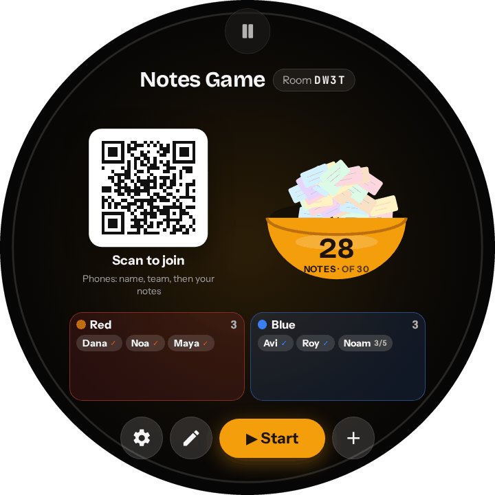<br><sub>Notes Game · the lobby</sub></td>
    <td align="center">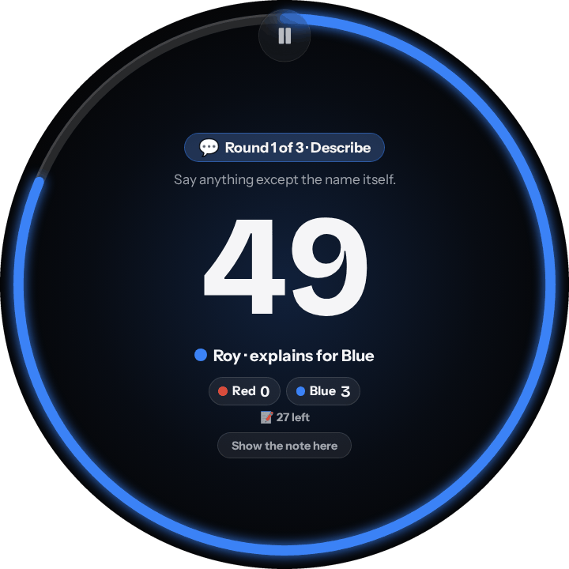<br><sub>Notes Game · a turn</sub></td>
    <td align="center">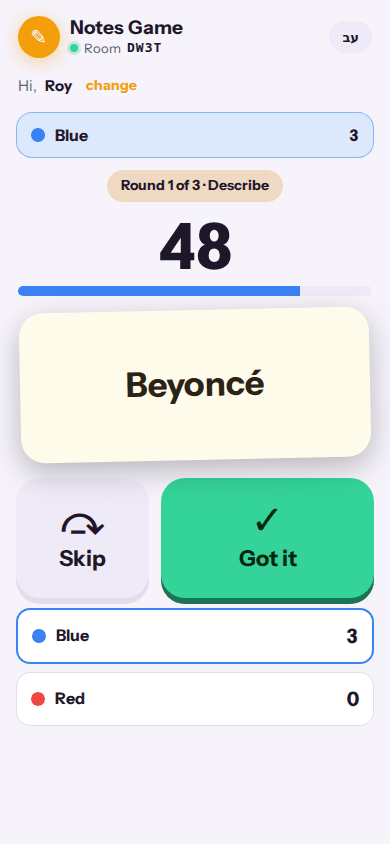<br><sub>The explainer's phone</sub></td>
  </tr>
  <tr>
    <td align="center">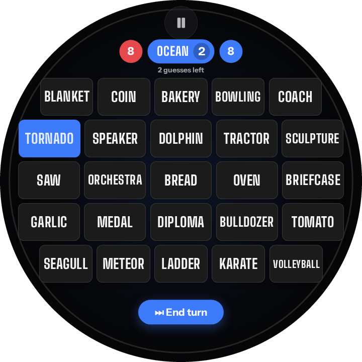<br><sub>Code Words · the grid</sub></td>
    <td align="center">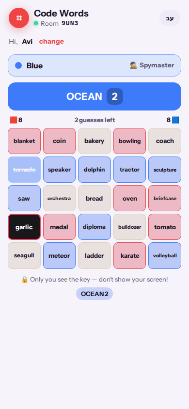<br><sub>The spymaster's key</sub></td>
    <td align="center">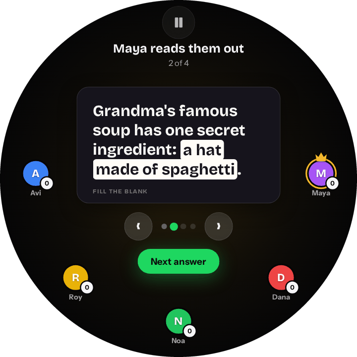<br><sub>Fill the Blank · the judge reads</sub></td>
  </tr>
</table>

*About the names:* these are our own games, with our own names, look, word lists and cards. **Notes Game** is the Israeli folk party game פתקיות (a cousin of Fishbowl / Salad Bowl), so in Hebrew it's called by that name. **Code Words** is inspired by Codenames and **Fill the Blank** by Cards Against Humanity; they use no names, text or art from those games. (The [Board Games](#board-games-companions) app also has companions for the real Codenames, Cards Against Humanity and פתקיות, for when you play with the box.)

---

## Rhythm (music games)

Tap **Rhythm** on the Home screen. First choose **where the music plays**: any of your music services (Spotify, Apple Music, YouTube Music, Plex, Jellyfin, the Demo…). The song plays on your speakers or phone as usual; the round display is the game. The choice is remembered (**Change** switches it). The games sit on a ring around what's playing, with play/pause/skip and **Choose song** (search or one of your playlists).

<table>
  <tr>
    <td align="center">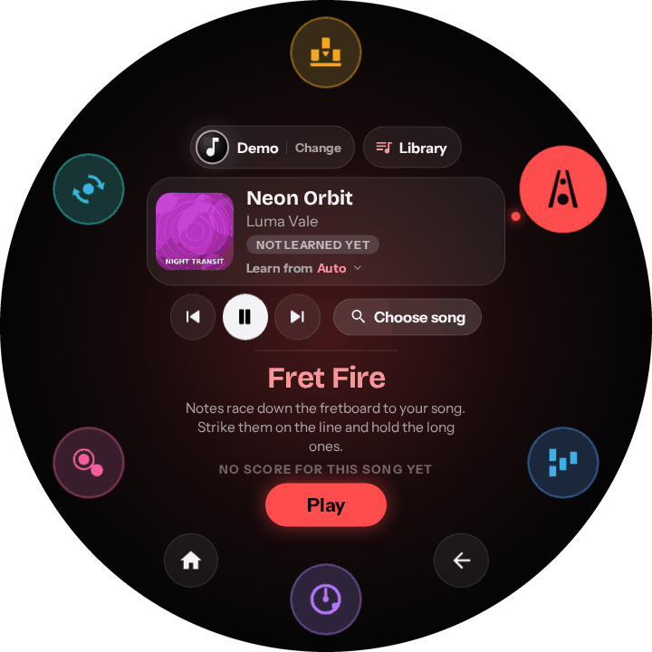<br><sub>The Rhythm screen</sub></td>
    <td align="center">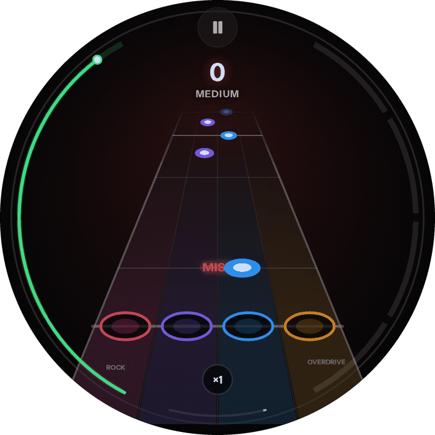<br><sub>Fret Fire</sub></td>
    <td align="center">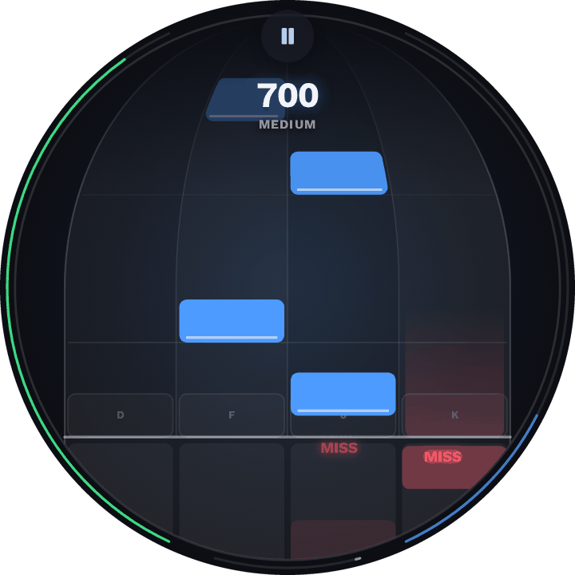<br><sub>Rhythm Rush · Vivid</sub></td>
  </tr>
  <tr>
    <td align="center">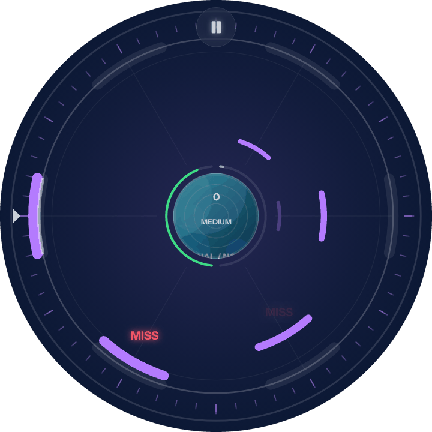<br><sub>Chrono Ring · XMB</sub></td>
    <td align="center">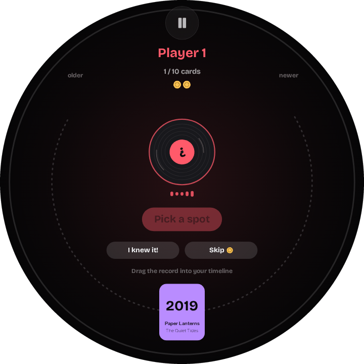<br><sub>Hitster</sub></td>
    <td align="center">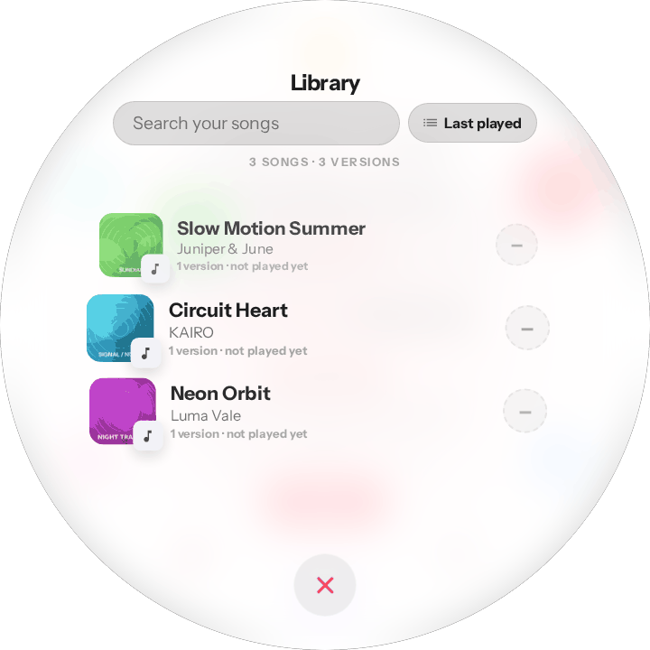<br><sub>Library · Music Red, light</sub></td>
  </tr>
</table>

| Game | How it plays |
|---|---|
| **Hitster** | A party game: a mystery song plays (the display hides the title) and you place it in your timeline by year: before, between or after your cards. Right = the card stays. Four modes:<br>• *Original* (2–6 players, the real Hitster token rules: name title + artist → +1 token, a token skips a song, 3 tokens buy a card, and the others can shout **HITSTER!** and put a token on the gap they think is right; if you're wrong and they're right, they win the card. *Pro* / *Expert* rules: 5 tokens, you must also name the song (and in Expert the exact year) to keep it).<br>• *Classic* (the same race to 5 / 10 / 15 cards, no tokens).<br>• *Bingo* (Hitster Bingo: spin the wheel for a category: solo or band, before 2000, decade, year ± 2 / ± 4, or in Expert song title, artist, exact year, ± 3. Everyone answers in turn, and the right ones cross a box of that colour on their 4×4 card; first line wins).<br>• *Co-op / Solo* (Solo: how long a streak before 3 mistakes; Team: 2–6 players build one timeline together with shared tokens; 10 cards wins, 3 mistakes lose).<br>609 well-known songs from 1939 to 2025 (91 Israeli), each tagged with genres and its language. On the setup screen pick the song languages (English, Hebrew, both, other languages; separate from the game's language) and block genres (pop, rock, hip-hop, Mizrahi, Eurovision, children's…); the time period is the start card's *Songs* option (a decade range, *Israeli hits*, or one of your playlists). **Update songs** (setup screen, or *Settings → Rhythm → Hitster*) adds more well-known songs from Wikidata: kept on the display for good, de-duplicated, and each update fetches the next most popular ones. In English or Hebrew (*Settings → Rhythm → Hitster language*, or EN \| עב on the setup screen; *Auto* follows the keyboard language): in Hebrew the whole game reads right to left (older songs on the right). |
| **Fret Fire** | A fret highway: notes ride down to 3–5 fret buttons. Hold for sustains, chords on Hard+, and Overdrive phrases that double your points. Keys 1–5 or A S D F G. |
| **Rhythm Rush** | Falling tiles in 3–4 lanes: tap as they reach the line, hold long tiles, chords and doubles on the hard levels. Keys D F J K. |
| **Chrono Ring** | Notes fly out from the centre to the ring; tap the ring where they land. Holds, slides along the ring, doubles and flicks. Knob or ←/→ + Space also work. |
| **Beat Circles** | Tap the circles as their approach rings close in; follow sliders, spin spinners. Approach time and circle size change with difficulty. Z / X also hit. |
| **Spin Beat** | Turn the wheel (drag, knob, ←/→, A/D) so its colour matches the notes; tap, hold, drum hits on the hub and big spins. |

**How the games learn a song.** The five rhythm games make their levels from the song itself: 5 difficulties (Easy, Medium, Hard, Expert, Master), each with its own top 5 per song. The first time you play a song the app *learns* it, saves what it learned, and later plays start straight away. Spotify and the other streaming services don't let apps hear their audio (and Spotify no longer offers song analysis), so the app learns from what's available:

| Where the music is | How the app learns it |
|---|---|
| **Plex, Jellyfin** | Downloads the track and analyses it offline, much faster than real time (usually 10–40×). No listening needed. |
| **Demo** | The Demo songs have real music (made by the app); learning renders and analyses them in seconds. |
| **Bridge computer** | If the music plays on the computer running the bridge (e.g. Spotify desktop), the bridge records that computer's sound and the app listens to the song once (see [Rhythm: let the bridge hear your music](#rhythm-let-the-bridge-hear-your-music)). |
| **Microphone** | A microphone on the display (e.g. a USB mic on the Pi) hears your speakers: the song plays once from the start while the app listens. |
| **Chart library** | Fan-made **Clone Hero / Rock Band / Guitar Hero charts**: the app searches *Chorus Encore* (enchor.us, the Clone Hero chart search with tens of thousands of songs) for the song that plays and uses a chart someone made for it. In seconds, no listening, and *Fret Fire* plays the charter's own notes (Easy → Easy … Expert and Master → Expert; the fewer lanes on Easy/Medium are folded sensibly); the other games make their levels from the chart's notes and drums. Needs the bridge with internet. **Only the note chart is downloaded** (a few KB read out of the chart package with range requests), never the song's audio, video or artwork. |
| **Nothing to listen to** | The app looks up the song's tempo online (through the bridge) or you tap along to the beat, then builds a level on that beat. Less faithful to the song, but it works anywhere. |

**Learn from.** Under the song on the Rhythm screen, **Learn from: Auto ▾** opens a small chooser: *Auto*, *Song file* (Plex / Jellyfin / Demo), *Microphone*, *Bridge computer*, *Tempo / tap* and *Chart library*. Each says whether it works right now for this service and song, greyed with the reason when not (*Needs the bridge*, *No microphone permission yet — tap to ask*, …), and the chart library says how many charts it found. It's the same setting as *Settings → Rhythm → Learn songs from*. At the bottom: **Learn again with …** (the next game learns the song again that way) or, for the chart library, **Choose a chart**: the best matches by name and length, with the charter, instruments and difficulties, length and a match score, plus *Search by hand…*. *Auto* uses a chart for streaming songs when one clearly matches (same name, length within 4 s) before listening with the bridge or a microphone.

Each learn is saved as a **version**; a song can have several (tap the learned badge on the Rhythm screen to pick one, make a new version from the same learn, or learn it again). The selected version has a **Sync** nudge (−500…+500 ms): a chart was made for the charter's own copy of the song, which may start a little earlier or later than the streaming one. If the notes come early or late, nudge them (it's saved with the version). *Settings → Rhythm* has the preferred way to learn (Auto picks the best available), an **audio latency calibration** (tap along to clicks) and *Forget learned songs*.

**Library.** **Library** (next to the service at the top of the Rhythm screen, or the <kbd>L</kbd> key) lists every song the app has learned, from any service: artwork, title, artist, the service, how many versions, times played and the best grade with its score. Sort by *Last played*, *Most played*, *A–Z* or *Service*; the search box (with the on-screen keyboard) filters long lists. Tap a song for its versions (source: song file, microphone, bridge, tempo or chart; when it was learned, its sync nudge, plays and the best grade per game) and a grid of the best score and grade for each game (Fret Fire, Rhythm Rush, Chrono Ring, Beat Circles, Spin Beat) at each difficulty. **Play** (or tap a cell of the grid) picks the version, game and difficulty, makes that version the selected one, starts the song on its own service (switching the Rhythm service if the song belongs to another signed-in one, by its id or by searching the service for it) and opens the game. Tap a version to play it, select it, rename it or delete it; *Delete song* removes every version (the top-5 charts stay). A rotary knob or the arrow keys move between the buttons, Enter presses, Escape goes back. Each version keeps its own stats (plays and best score, grade, accuracy and full combo per game and difficulty); songs played before the Library existed show their best scores from the top-5 charts.

---

## Apps

Tap **Apps** on the Home screen for handy tools on a ring. (**Trivia Night** and **Drinking Games** are on the Games ring now, after the party games: they open as apps and Back returns to the Games ring.) Apps that need your attention (alarms, timers, reminders, limits) ring on any screen while Round Remote is open, and can also reach you through your home (see [Smart-home alerts](#smart-home-alerts)).

<table>
  <tr>
    <td align="center"><br><sub>The Apps ring</sub></td>
    <td align="center">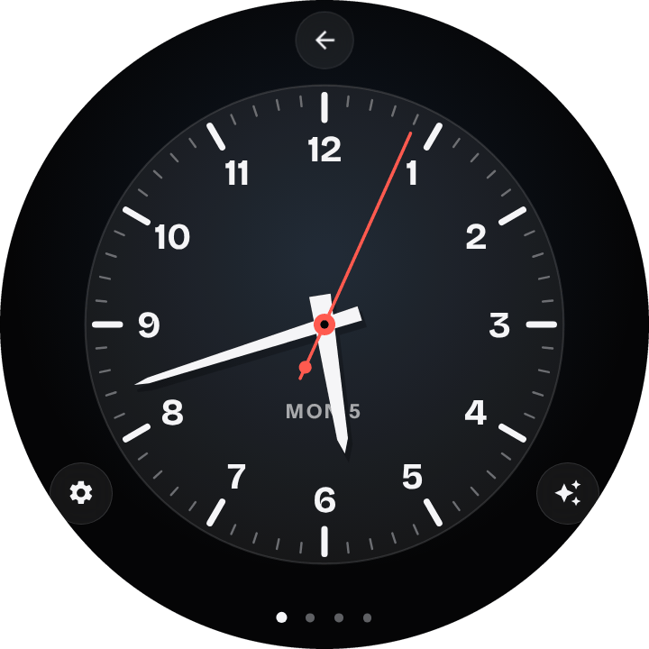<br><sub>Clock</sub></td>
    <td align="center">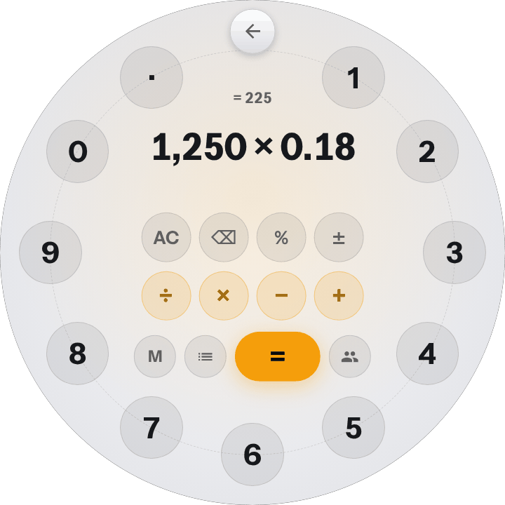<br><sub>Calculator · Click Wheel, light</sub></td>
  </tr>
  <tr>
    <td align="center">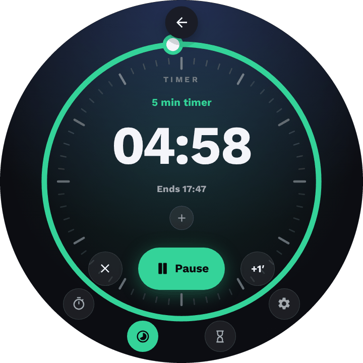<br><sub>Timer · Vivid</sub></td>
    <td align="center">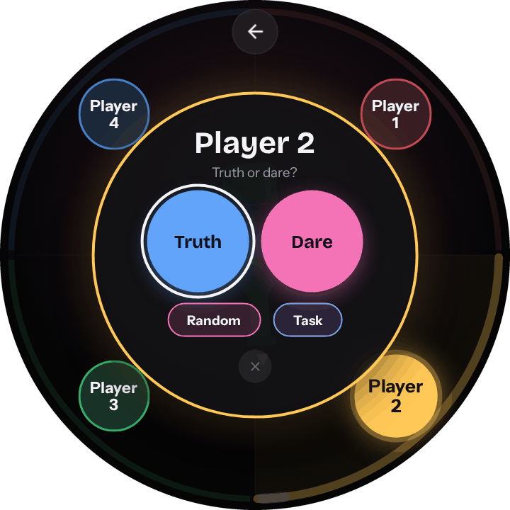<br><sub>Truth or Dare</sub></td>
    <td align="center">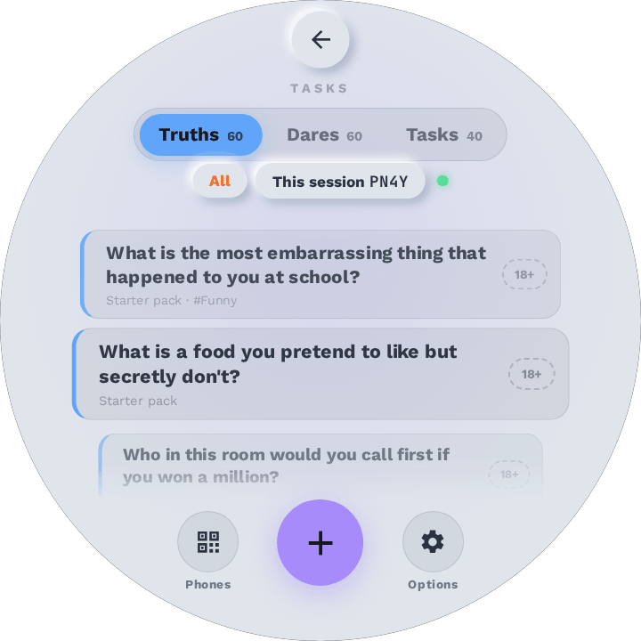<br><sub>Tasks (18+ per entry) · Soft, light</sub></td>
  </tr>
  <tr>
    <td align="center">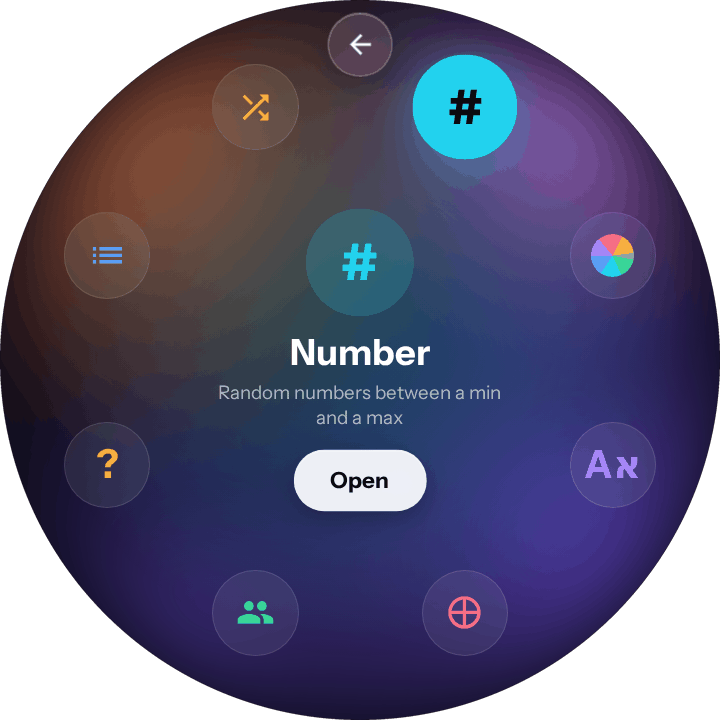<br><sub>Randomizer · Liquid Glass</sub></td>
    <td align="center">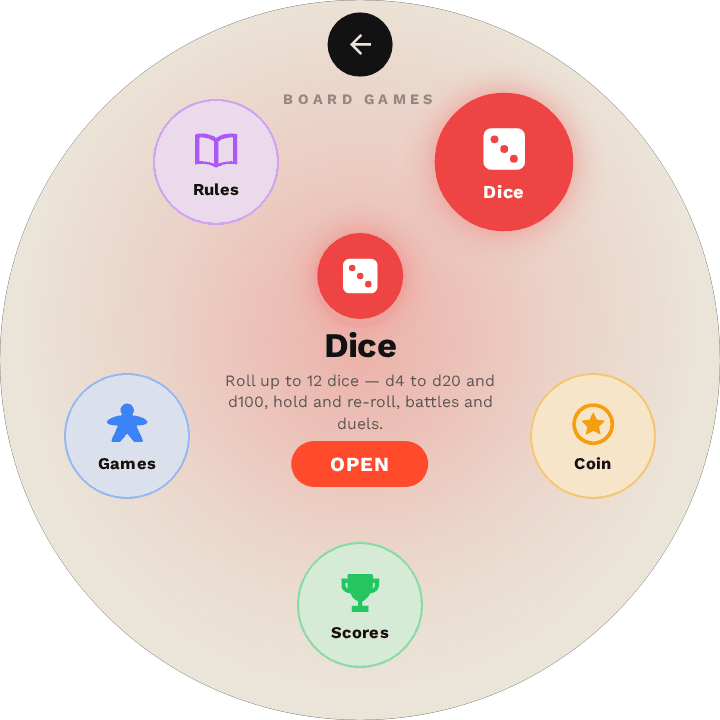<br><sub>Board Games · Bauhaus, light</sub></td>
    <td align="center">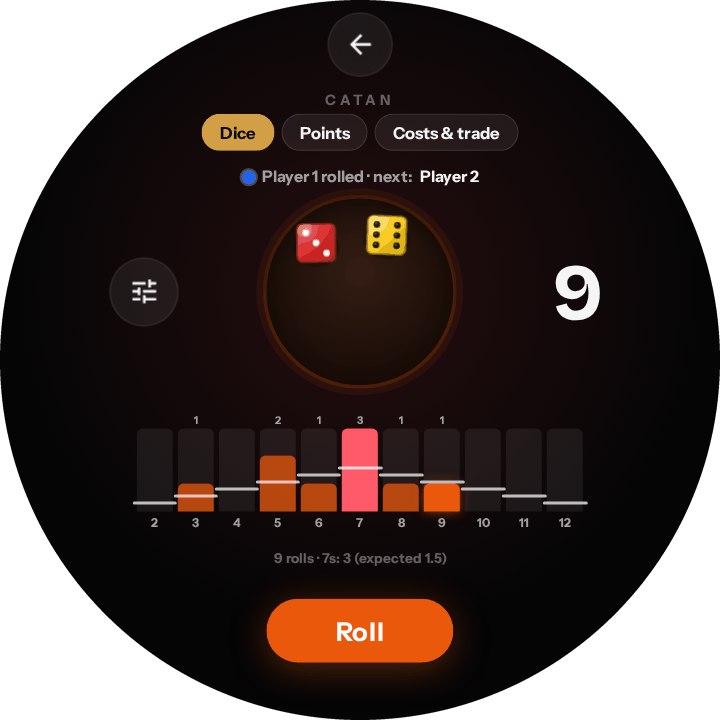<br><sub>Catan companion</sub></td>
  </tr>
  <tr>
    <td align="center">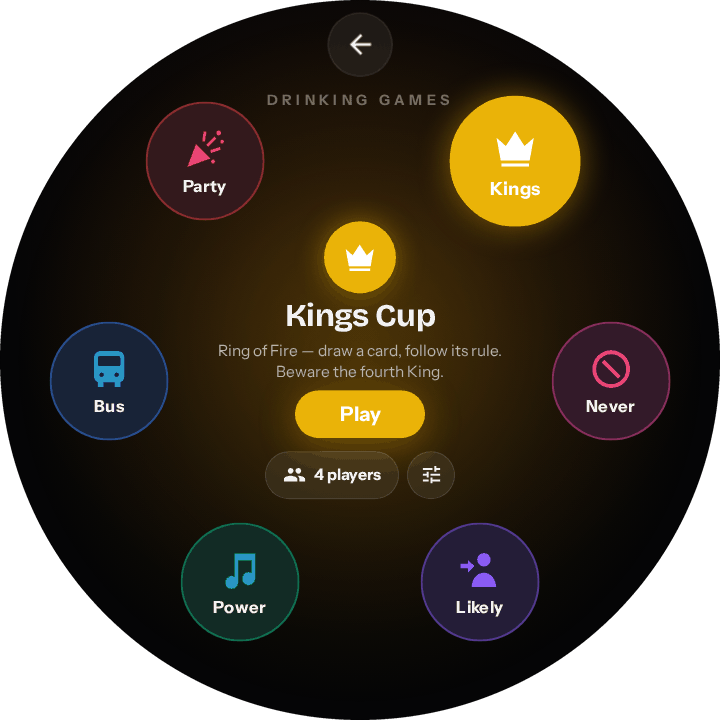<br><sub>Drinking Games (18+)</sub></td>
    <td align="center">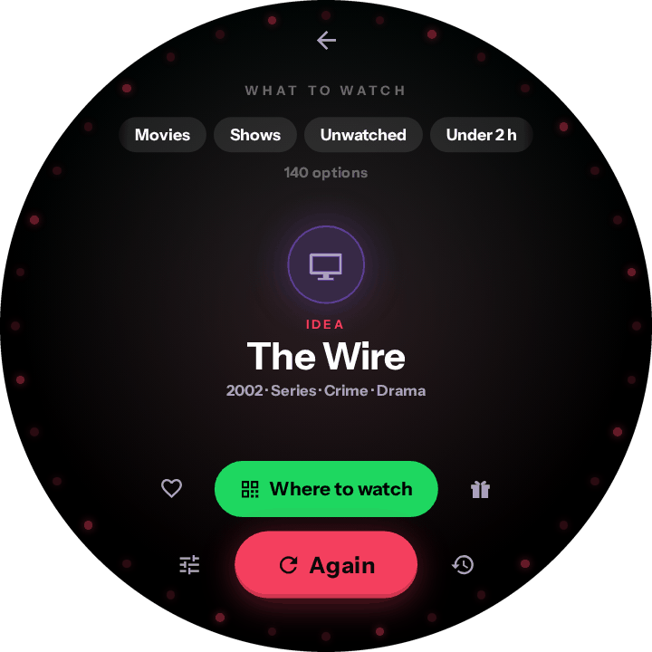<br><sub>Decide · Music Green, OLED</sub></td>
    <td align="center">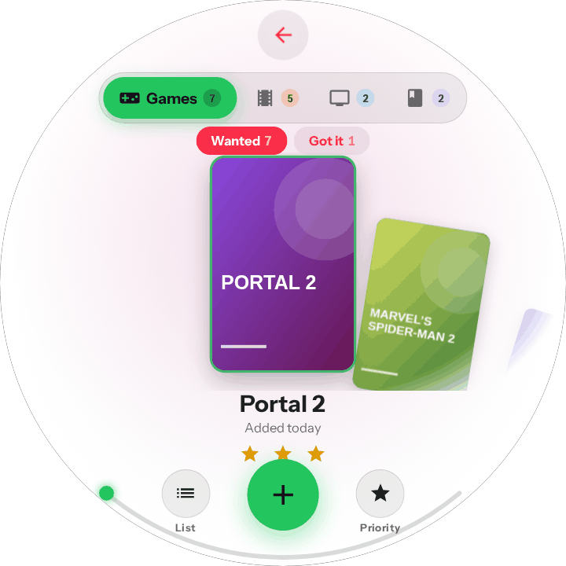<br><sub>Wish Lists · Music Red, light</sub></td>
  </tr>
  <tr>
    <td align="center">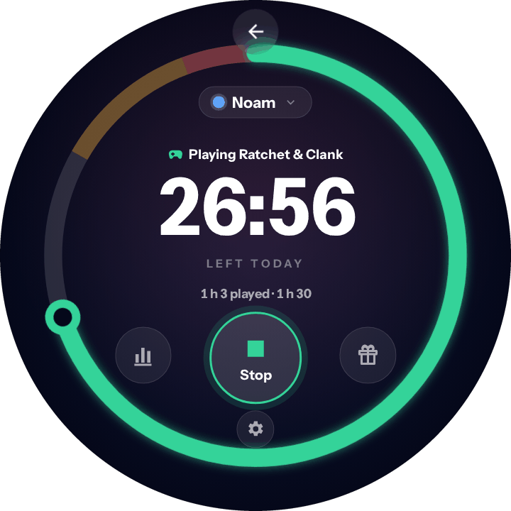<br><sub>Play Time · Console 5</sub></td>
    <td align="center">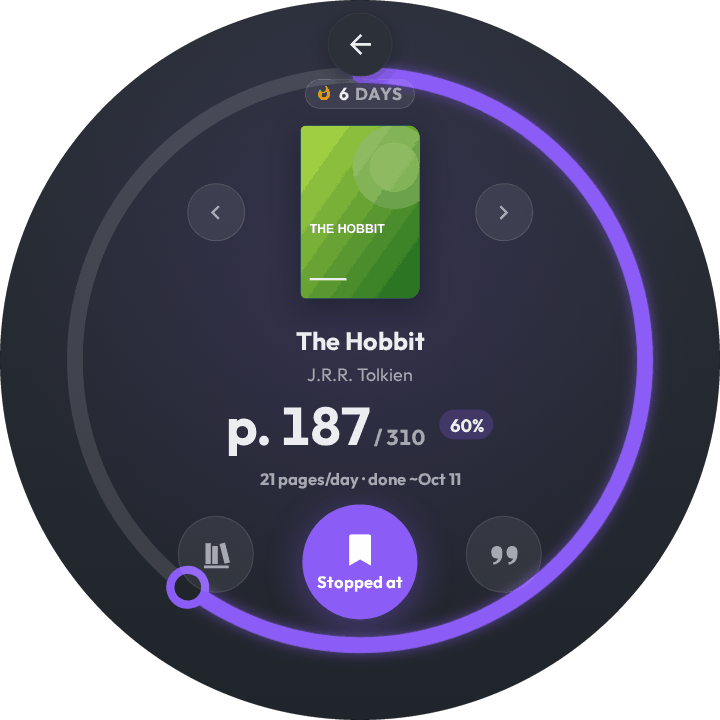<br><sub>Bookmarks · Slate</sub></td>
    <td align="center">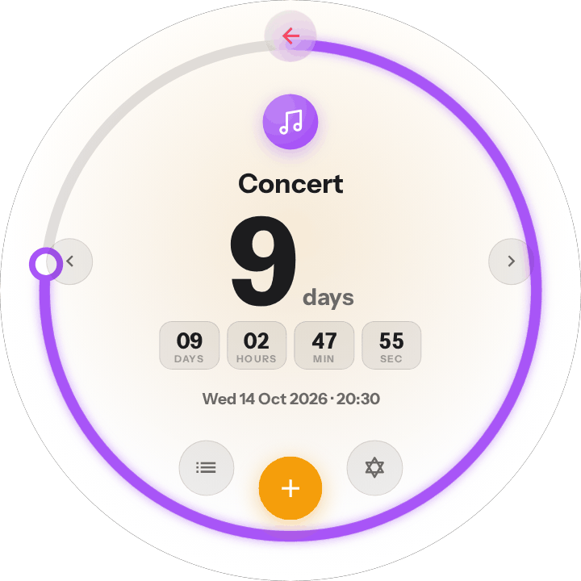<br><sub>Countdowns · Music Red, light</sub></td>
  </tr>
</table>

| App | What it does |
|---|---|
| **Clock** | Analog (classic, minimal, neon, roman), big digital, a world clock (160 cities, day/night) and **alarms that play your music** (a playlist from your service, the current song, or a built-in sound) with Snooze / Stop. Alarms ring on any screen while Round Remote is open. |
| **Calculator** | Digits round the rim like a clock face, correct order of operations, %, memory, history and a tip & split helper. Works with the keyboard. |
| **Timer** | Stopwatch with laps, several countdown timers set with a dial (or presets), and an **hourglass** you flip. When time is up it plays your music (or a sound). |
| **Truth or Dare** | Flick the bottle to spin it. *Spin* mode just picks someone; *Truth or Dare* mode then shows a truth, dare or task, with Done / Chicken and scores. Options: **Chicken = do a task** (chickening out flips the card to a penalty: a task from the pool or a built-in list; *Still chicken* counts a double chicken) and **18+ mode** (asks once that everyone is 18+; adult cards mixed in or 18+ only, with an 18+ badge on the table). |
| **Tasks** | Your truths, dares and tasks (starter packs in English and Hebrew included, plus an 18+ party set that only appears in 18+ mode). **Any entry can be marked 18+**: the *18+* chip on its row, the *Adults only* switch on its card, or the *18+* box when adding (built-in ones too). 18+ entries only show, count and get drawn while 18+ mode is on. Players **scan the QR code with their phone** and add their own (needs the bridge; see [Phone pages](#phone-pages)). Everything is kept; choose *All* or *This session*. |
| **Randomizer** | Random number, colour, letter (English or Hebrew), who goes first (a spinning wheel), teams, yes / no / maybe, pick from your own lists, shuffle. |
| **Board Games** | **Dice** (1–12 dice, d4–d20 and d100, hold & re-roll, advantage, Risk-style battle, duel), **coin flip**, **score keeper**, **companions for 17 games** (Catan with its expansions, Munchkin, Codenames, Dixit, Cards Against Humanity, פתקיות and more) and **rules for 45 board and card games** (in our own words, with expansions and editions; search in English or Hebrew). See [Board Games companions](#board-games-companions) below. |
| **Drinking Games** (on the Games ring) | 18+ (asks once). Six party games for a shared players list: **Kings Cup** (52-card deck with flip animation, editable rule per rank, Question/Thumb Master, mates, rules in play, the four Kings), **Never Have I Ever** and **Most Likely To** (3-2-1 countdown, tap who got pointed at), **Power Hour** (a new song every 60 s / 30 s Turbo from your music service, next track or a playlist, for 30/60/100 rounds; beeps only without music), **Ride the Bus** (red/black, higher/lower, inside/outside, suit, then the bus) with a Higher or Lower mode, and **Party Cards** (challenges, pairs, mini-games, votes and rules that last a few cards, naming your players). Prompts in English or Hebrew, mild or with spicy cards. Sips, not shots; a water-break reminder every 20 min (Settings). |
| **Decide** | Can't choose? Six slot-machine deciders (marquee lights, ticks, confetti; turn the knob to spin): **what to watch** (your Plex / Jellyfin movies & shows: unwatched, genre, under 2 h, movie or show, continue watching, with *Play on TV* and *Add to wish list*, or ~140 well-known titles), **what to do** (210 ideas in English and Hebrew by mood, indoors/outdoors, alone/with others, time, cost), **what to play** (board, card and party games with player count and time, plus the Games / Rhythm games and party apps; opens the game, its rules or its Board Games helper; *Pick from → Games with an app here* and a *Party / couples* filter: 2 / 3–5 / 6+), **where to go** (45 kinds of places plus your own, opened in Maps via a QR code), **which video game** (Steam / PlayStation recently played plus 66 picks; launch on the bridge PC) **what to eat** (110 dishes from 15 cuisines, Hebrew names for Israeli favourites; cook / order / go out, optional *cuisine first*) and **My lists** — your own draw lists ("Friday night", "Couple night"…) picked from every game Decide knows (your Collection, Board Games helpers and rules, party apps and games, rhythm games, the games on this screen, our picks, your own), spun on their own or from *What to play* / *Video game*. Favourites, history (no immediate repeats) and your own options per decider. See [Decide: games with an app here and draw lists](#decide-games-with-an-app-here-and-draw-lists). |
| **Wish Lists** | Games, movies, shows and books you want, on a ring of covers (or a list) with priority stars, notes and *Wanted → Got it / Watched / Read*. **+** searches the Steam store, imports your Steam wishlist and PlayStation / Steam games (needs the bridge), your Plex / Jellyfin library plus iTunes for movies and shows, and Open Library for books, or type a title. Tap ♡ on a movie or show in *Movies & TV* or on a game in the PlayStation / Steam screens to save it there. |
| **Play Time** | The "I played too much" timer. Players with a **daily gaming budget per weekday**, an optional session limit and a **bedtime** (quiet hours). A big dial shows the time used and what's left, turning amber and red. Start / stop by hand, or **automatically** while the linked PlayStation or Steam account is in a game. Warnings at **15, 5 and 0 minutes** and at bedtime ring on any screen (and through your smart home, *Settings → Alerts*); when time is up it can **pause the music** and put the **PS5 in rest mode** after a 60-second "Saving? +5 min / Rest now" countdown. A week of history, streaks within budget, **bonus minutes**, and an optional 4-digit parent PIN. |
| **Bookmarks** | Where you stopped in every book: a progress ring, **Stopped at** with a big number pad (page, or h:mm for audiobooks), pages a day and the **estimated finish date**. Find books on **Open Library** (covers, page counts) or type them in; paper, ebook or audiobook. Notes & quotes, Reading / Want to read / Finished shelves (want-to-read books can go on your **Wish Lists**), a reading streak and **daily reading reminders** that ring on any screen. |
| **Collection** | Your **physical media** on six shelves — **video games, board games, books, vinyl, CDs, DVD & Blu-ray** — as covers you turn with a finger or the knob, a list, or grouped by platform / type / genre. See [Collection](#collection) below. |
| **Plants & Pets** | Care reminders for everyone you look after. See [Plants & Pets](#plants--pets) below. |
| **Focus** | A Pomodoro timer with focus music and Home Assistant lights. See [Focus](#focus) below. |
| **Party DJ** | Guests request songs and vote from their phones. See [Party DJ](#party-dj) below. |
| **Movie Night** | A shortlist, phone voting, a drumroll reveal and the lights dimmed. See [Movie Night](#movie-night) below. |
| **Trivia Night** (on the Games ring) | A quiz with teams and phone buzzers. See [Trivia Night](#trivia-night) below. |
| **Countdowns** | Days until birthdays, trips and holidays (Jewish holidays worked out on the device). See [Countdowns](#countdowns) below. |
| **Sleep Sounds** | Generated noise and nature sounds with a sleep timer. See [Sleep Sounds](#sleep-sounds) below. |

### Board Games companions

<table>
  <tr>
    <td align="center">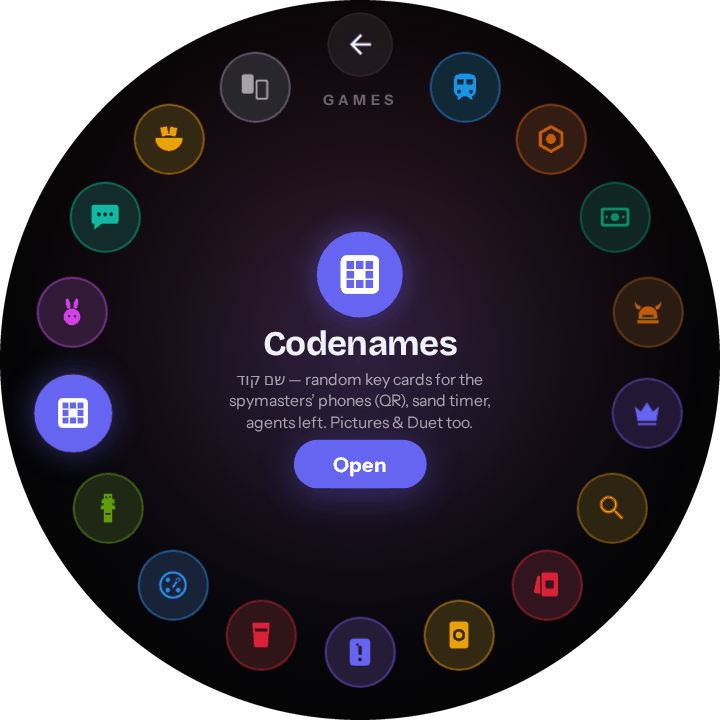<br><sub>17 companions on a ring</sub></td>
    <td align="center">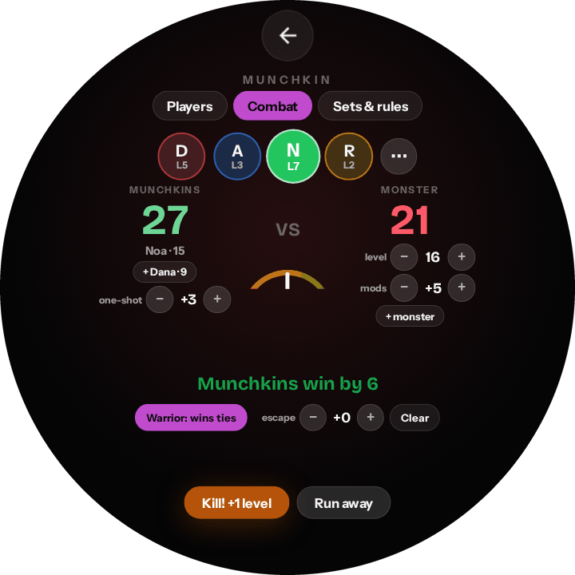<br><sub>Munchkin · combat</sub></td>
    <td align="center">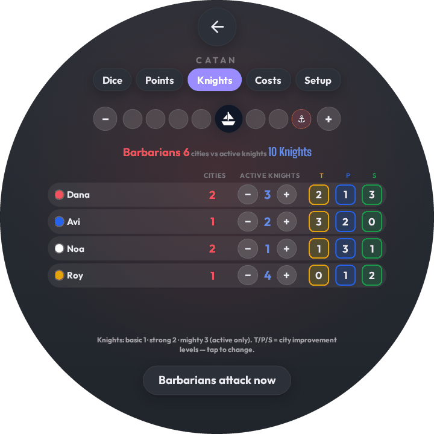<br><sub>Catan · Cities &amp; Knights · Slate</sub></td>
  </tr>
  <tr>
    <td align="center">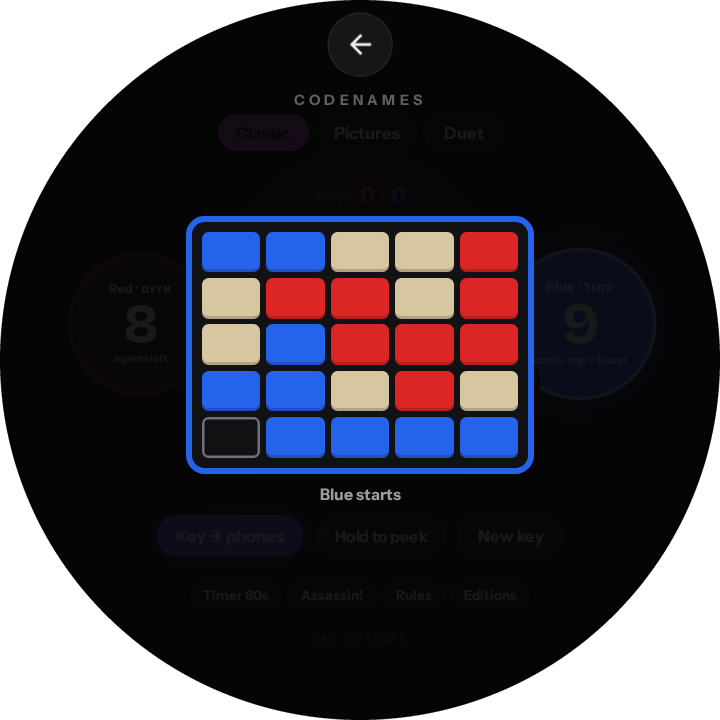<br><sub>Codenames · hold to peek</sub></td>
    <td align="center">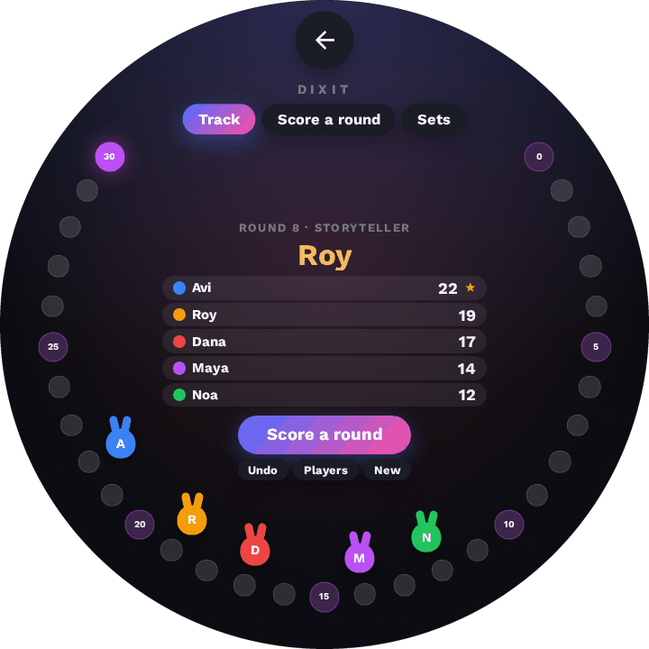<br><sub>Dixit · the rabbit track · Vivid</sub></td>
    <td align="center"><br><sub>Catan · dice chart</sub></td>
  </tr>
  <tr>
    <td align="center">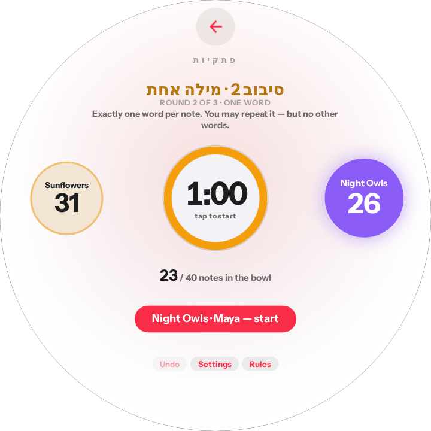<br><sub>פתקיות · Music Red, light</sub></td>
    <td align="center">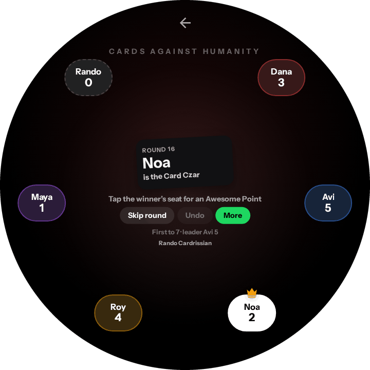<br><sub>Cards Against Humanity (18+) · Music Green, OLED</sub></td>
    <td align="center">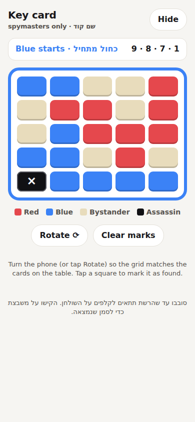<br><sub>Codenames key on a phone</sub></td>
  </tr>
</table>

*Board Games → Games* is a ring of companions for games you play with the box on the table. They keep score and do the sums; the rules are in our own words, and no card text is shown.

| Game | What the companion does |
|---|---|
| **Catan** | Dice with a roll chart (or a balanced event deck), the robber, points to 10 (or your target), building costs and trades. Expansions: **Seafarers** (scenarios), **Cities & Knights** (the event die with its ship and city-gate faces, progress cards on the red die, the barbarian track and the attack (knights against cities), city improvements, metropolis and defender points), **Traders & Barbarians**, **Explorers & Pirates**, and the **5–6 player** extension. |
| **Munchkin** | Level, gear and tags (race, class, curses, steeds…) per player, a **combat calculator** (a helper, one-shot bonuses, several monsters, Warriors win ties, Elves level up for helping), the run-away die, and an **expansions picker** for the core sets and expansions that says what each one adds. Win at 10, or Epic to 20. |
| **Codenames** / שם קוד | Random key cards: **Classic**, **Pictures** and **Duet**. The spymasters scan a QR code and open the key on their phones (a static page, no bridge needed), or hold **Hold to peek** on the display. Agents left per team, whose turn, a sand timer and wins. |
| **Dixit** | The rabbit track to 30 around the screen, and a **scoring wizard**: pick the storyteller, say who voted for whose card, and it works out everyone's points. A picker for the sets and expansions, the Odyssey rules for 7–12 players (two votes each), and *until the deck runs out*. |
| **Alias** | The team race around the board: a turn timer, +1 per word, −1 per skip (can be off), the last word open to everyone, and practice words in English and Hebrew. |
| **פתקיות** (Petakiot) | The bowl counter, turn timer and team scores for describe, one word and charades, plus an optional fourth round. To play it with phones, use the [Notes Game](#games). |
| **Cards Against Humanity** | 18+ (asks once that everyone is 18+). Awesome Points, the Card Czar crown that moves every round, the official house rules as switches (Rando Cardrissian, God Is Dead, Serious Business, Rebooting the Universe, Happy Ending…) and the official boxes and packs. A scoring helper only, with no card text. No box at hand? *Play it on the screen* (on the 18+ notice and under More) opens [Fill the Blank](#games). |
| **Ticket to Ride**, **Monopoly**, **Talisman**, **Clue** | Route points, trains, tickets and longest route; the banker with a log and undo; hero sheets with a battle helper and the movement die; a detective notepad with a hide button. |
| **Taki**, **Uno**, **Rummikub**, **Yahtzee**, **Twister**, **Jungle Speed** | Turn, direction and colour (Taki); round scoring (Uno, Rummikub); the full score sheet (Yahtzee); the spinner with spoken calls (Twister); cards left and a reflex duel (Jungle Speed). |

**Rules** (*Board Games → Rules*) has 45 board and card games in our own words, from Catan and Pandemic to Yaniv and Shithead, with their expansions and editions; search in English or Hebrew.

### Collection

<table>
  <tr>
    <td align="center">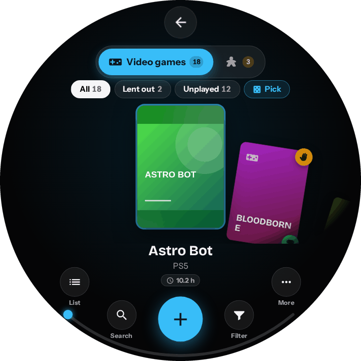<br><sub>Video-game shelf</sub></td>
    <td align="center">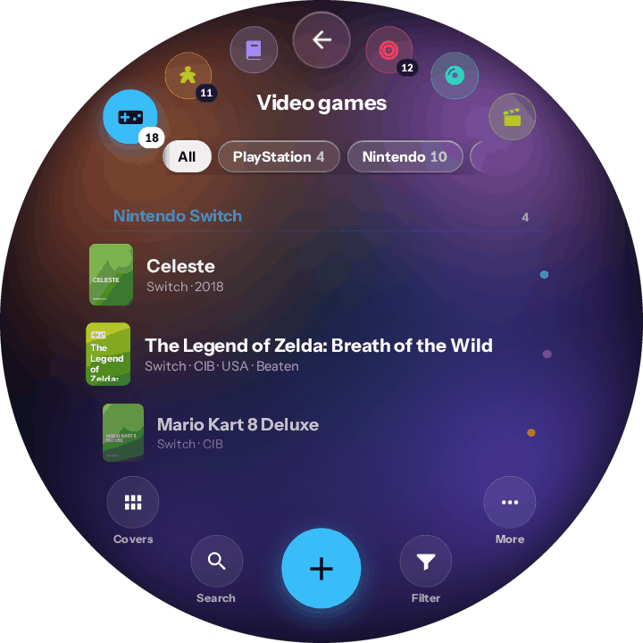<br><sub>Video games by platform · Liquid Glass</sub></td>
    <td align="center">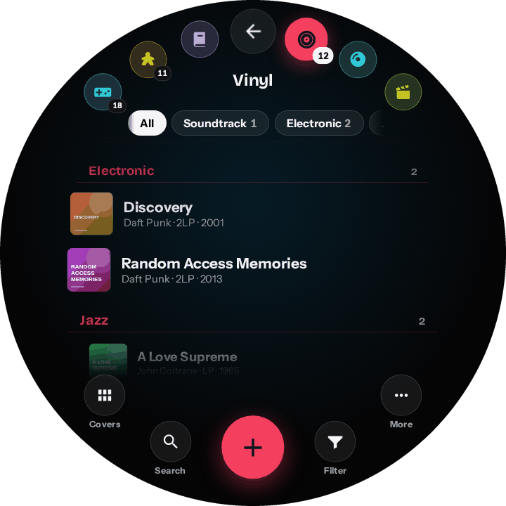<br><sub>Vinyl by genre</sub></td>
  </tr>
  <tr>
    <td align="center">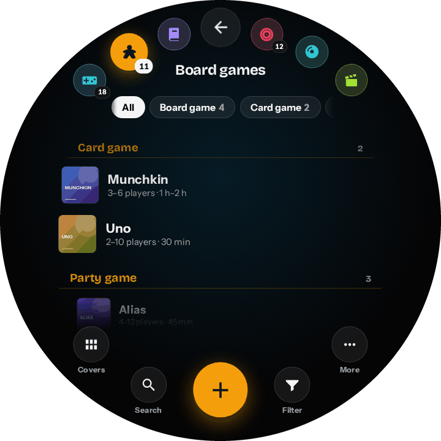<br><sub>Board games by type</sub></td>
    <td align="center">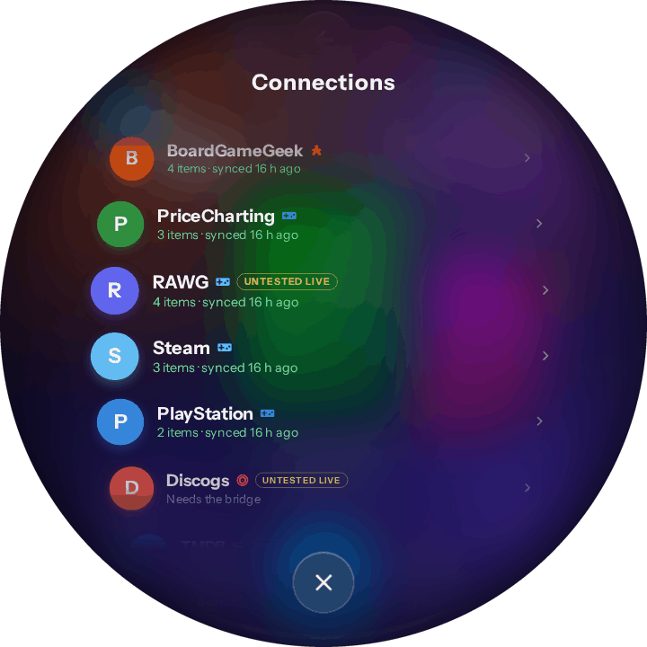<br><sub>Connections · Liquid Glass</sub></td>
    <td align="center">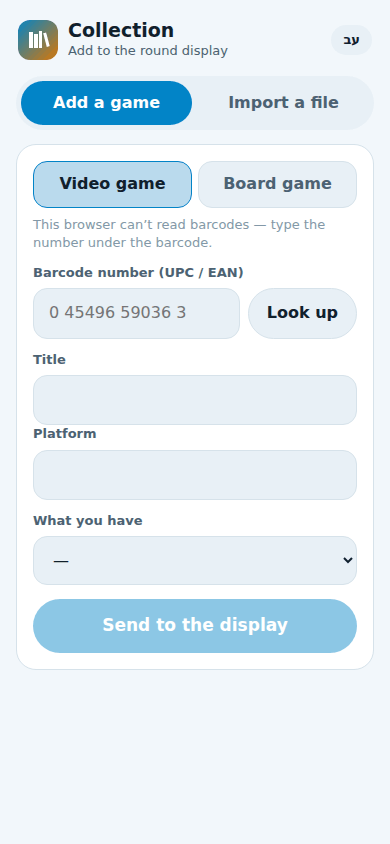<br><sub>Add from your phone</sub></td>
  </tr>
</table>

Your **physical media** (and digital games if you like) on **six shelves** — round buttons along the top rim with a count each: **Video games · Board games · Books · Vinyl · CDs · DVD & Blu-ray** (knob up/down or keys 1–6 switch shelves). Each shelf is a fan of covers you turn with a finger or the knob, a list, or a **grouped list**: video games **by platform** (headers with counts, newest console first inside each family, and **family chips** — PlayStation, Nintendo, Xbox, PC & Mac, Sega, Retro, Mobile — to filter), board games **by type** (*Board game*, *Card game*, *Party game*, *No equipment needed*, from BGG's categories when there are any; editable, plus optional *Cooperative / Strategy / Dice / Dexterity…* tags), books, records, CDs and movies **by genre** (a compact set mapped from Discogs, Open Library, MusicBrainz and TMDB; editable). Sorts include *platform then title*, *type*, *genre*, *artist* / *author*, year, value, pages and length.

What each shelf keeps: video games — platform and edition, complete-in-box / loose / sealed, hours and **Beaten**; board games — players, play time, a **+1 play** button with "last played", expansions inside their base game; **books** — author, ISBN, publisher, hardcover / paperback, pages, *To read / Reading / Read* and **Start reading** (adds it to *Bookmarks*); **vinyl & CDs** — artist, label, catalogue number, year, LP / 2LP / 7″ / 10″ / box set, colour and RPM (CD, SACD, box set…), **Goldmine grades** for the record and the sleeve (M, NM, VG+, VG, G+, G, F, P), and **Play on <your music service>** (searches the service you're using for the album and plays it); **DVD & Blu-ray** — DVD / Blu-ray / 4K UHD / Steelbook, region, director, runtime, and **Play from Plex / Jellyfin** when the same movie is in your library. Everything has notes, tags, value and price paid, and **loans** ("Lent to Dana · 3 weeks") with a *Lent out* filter. Search across shelves, filters, **stats** per shelf (per platform / type / genre, total value) and **Pick** (Decide for games; a quick spin through the shelf for the rest). Items without artwork get a generated cover (a record or a disc for music).

**Games you need nothing for:** *+ → Games you need nothing for* (or the empty board-game shelf) adds classics with one tap — **פתקיות (Petakiot, the notes game)**, Charades, 20 Questions, Two Truths and a Lie, Contact, Mafia / Werewolf, Ghost, I Spy, Would You Rather, Telephone, Who Am I? — as *No equipment needed*; Petakiot also opens the *Notes Game* on this screen.

**Connections** (*⋯ → Connections & import*): **BoardGameGeek** (needs a free registered BGG application token), **PriceCharting** (paid subscription with an API token), **RAWG** (free API key), **Steam**, **PlayStation**, **Discogs** (vinyl & CDs, free personal token), **TMDB** (movie search, free key), **Open Library** and **MusicBrainz** (book and album search, no account) and **spreadsheet import** with presets for **GamEye, CLZ Games / Books / Music / Movies, Grouvee, BGG CSV, BG Stats, Discogs CSV and Goodreads** (or any CSV). Upload a file from your phone by QR code, **scan a barcode** on the phone (games, books by ISBN, records, CDs and discs land on the right shelf), or let the bridge re-import a **watched file** whenever it changes. *Decide → What to play / Video game* spin your collection too (*Pick from → My collection*), and *Wish Lists → Got it* offers **Add to Collection**. Setup: [Collection & platform connections](#collection--platform-connections).

### Decide: games with an app here and draw lists

<table>
  <tr>
    <td align="center"><br><sub>Decide · Music Green, OLED</sub></td>
    <td align="center">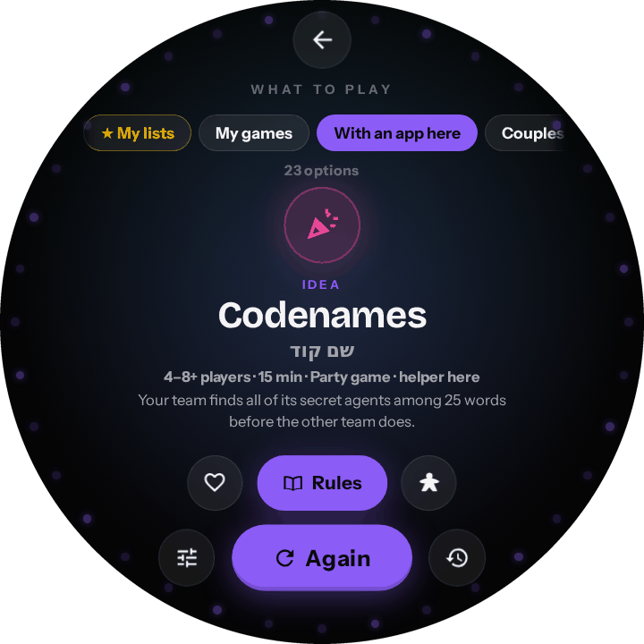<br><sub>Games with an app here · 3–5</sub></td>
    <td align="center">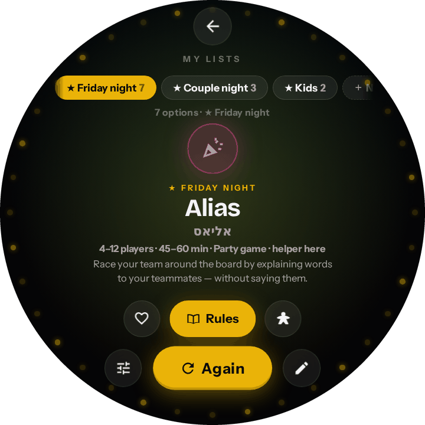<br><sub>My lists · Friday night</sub></td>
  </tr>
</table>

*What to play → With an app here* (or *Pick from → Games with an app here*) spins only games this app helps you play: board games with a **Board Games companion** (read from `apps/bg-games.js` and `apps/bg-rules.js`, including your Collection's games that have one), the **party games and apps** (Truth or Dare, Trivia Night, Notes Game, Code Words, Fill the Blank, Drinking Games — 18+, hidden unless *18+ games → Show*), every **Rhythm** game and the **two-player games** on the Games ring (Tic Tac Toe, Four in a Row, Circle Pong, RPS Battle, Zoo Splash). The pick opens straight away: *Play* starts the game, *Open* the app, *Game helper* the Board Games companion. *Party / couples* narrows any spin to games for 2, 3–5 or 6+ players.

**My lists** (the seventh decider, or *★ My lists* on What to play / Video game): make named lists ("Friday night", "Couple night"…) from every game Decide knows — a picker with search and tabs (*Collection, Board & cards, On this screen, Rhythm, Video games, Mine*) — rename or delete them, and spin just that list. Lists are kept on the display.

### Plants & Pets

<table>
  <tr>
    <td align="center">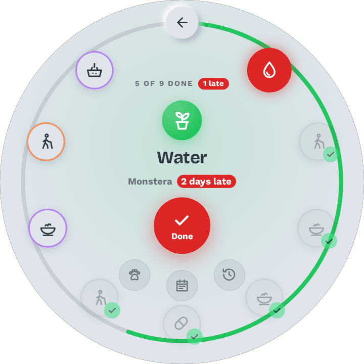<br><sub>Today's care · Soft, light</sub></td>
    <td align="center">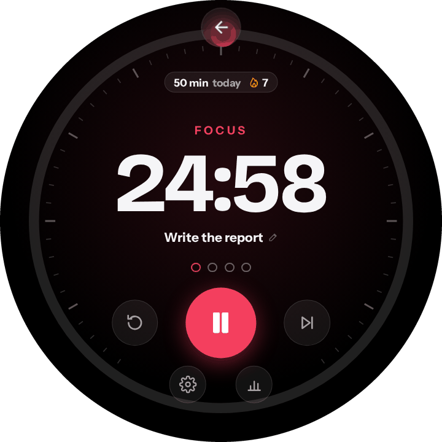<br><sub>Focus · Classic, OLED</sub></td>
    <td align="center">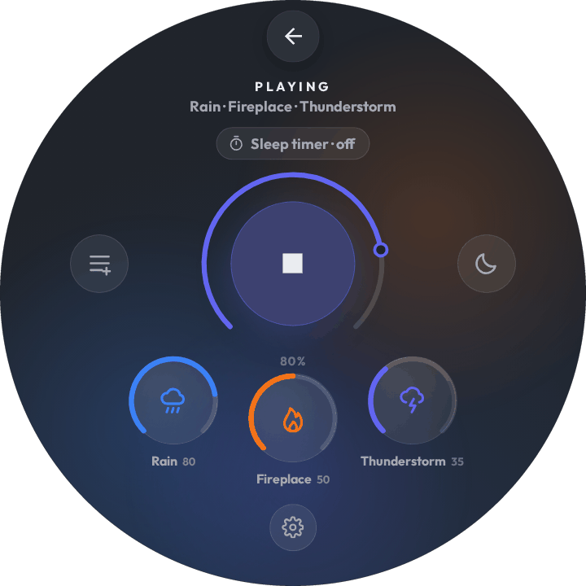<br><sub>Sleep Sounds · Slate</sub></td>
  </tr>
</table>

Care reminders for everyone you look after. A profile per plant or pet (plant, cat, dog, fish, bird, rabbit, reptile, with their own icons, colour and an optional photo URL) with **care tasks**: daily at set times, weekly on chosen days, or every N days / weeks / months / years (water, fertilise, mist, repot, feed, walk, litter, clean tank / cage, grooming, flea treatment, **medicine with its dose**, vet and vaccinations), with sensible presets per kind. **Today** is a round dial of what's due (late in red): tap one, *Done*, pick who did it (your household list) and it goes in the **history**. The upcoming **week**, a **streak**, and **reminders that ring on any screen** at each task's time (*Snooze 1 hour*, *Mark done*; an overdue medicine rings again as a warning) and through *Settings → Alerts*. Optional **Home Assistant soil-moisture sensor** per plant: below your threshold it shows "needs water" and reminds you.

### Focus

A Pomodoro timer: **25 / 5** with a 15-minute long break every 4 (all editable; presets 25/5, 50/10, 90/20), a big progress ring, what you're working on (with a recent list, Hebrew too), session dots, auto-start, pause / skip / reset (hold reset for a new cycle). Optional **focus music** (a playlist from your music service, whatever's on, or **Sleep Sounds** noise), paused on breaks, and **Home Assistant lights per phase** (a scene, or a colour and brightness; put back when you reset). Phase changes chime, flash and notify (*Settings → Alerts*); away from the app they ring on any screen with *Start break*. Focus minutes per day, a **week chart** and a streak. Keeps running when you leave the app.

### Sleep Sounds

White, pink and brown noise, rain, a thunderstorm (random rumbles), ocean waves, a stream, a fan, wind, a fireplace, a heartbeat / womb and a soft drone, all **generated live** (Web Audio, no sound files). Mix up to three with round volume knobs (drag, or the wheel), a master volume ring, presets and your own saved mixes. **Sleep timer** (15 / 30 / 60 / 90 min or until morning) with a gentle fade-out, then it can **pause the music**; optionally **dims Home Assistant lights** slowly over 10 minutes. A calm moving backdrop and a **screen-dim** overlay (tap to wake). The sound keeps playing on other screens until you stop it.

### Party DJ

<table>
  <tr>
    <td align="center">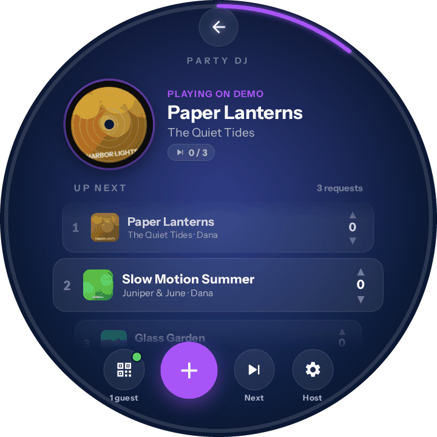<br><sub>Party DJ · XMB</sub></td>
    <td align="center">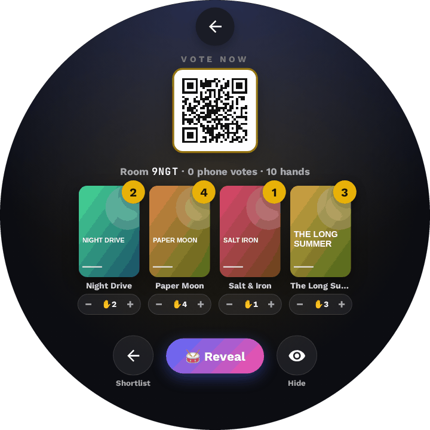<br><sub>Movie Night voting · Vivid</sub></td>
    <td align="center">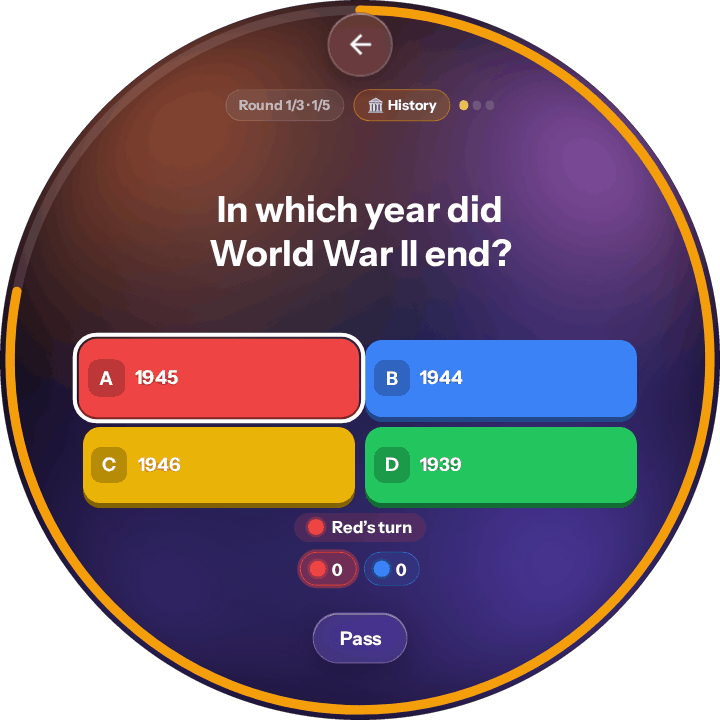<br><sub>Trivia Night · Liquid Glass</sub></td>
  </tr>
</table>

Guests scan the QR code, type their name once and **request songs from their phones**: they search your music service (the display runs the search) or ask for "artist – song" as typed, and **vote requests up or down** (one vote per phone per song). The queue is sorted by votes, then by who asked first; when the current song ends the top request plays on the service that's playing, and the normal playlist carries on when the queue is empty. Now playing with who asked for it, progress around the rim, **skip votes** ("3 guests vote skip → skip"). Host controls: approve requests, requests per guest, block a guest, remove / move to top / play now, requests open or closed, no explicit songs (where the service marks them). Without the bridge: pass the remote (+ searches on the display, ▲ / ▼ vote there).

### Movie Night

Build a shortlist of 3–5 movies or shows from your **Plex / Jellyfin library** (or *Surprise me*: random unwatched movies), your **Wish Lists**, your **Decide favourites**, or typed in. Everyone **votes on their phone** (one vote each, or rank the top three for 3 · 2 · 1 points), or count raised hands on the display. A **drumroll** spotlight reveals the winner (ties go to the wheel). **Start movie night**: a checklist (snacks, drinks, blankets, phones on silent, your own items too), dim the lights with a Home Assistant **scene** or chosen **lights + brightness**, **pause the music**, and **play the winner on the TV** through Plex / Jellyfin (or a QR code to find where it's streaming). Past movie nights are kept with the winner and who came.

### Trivia Night

A quiz with teams (2–6, team colours).

- **Buzzers**: phones are big BUZZ buttons. The bridge stamps every buzz as it arrives, the first team answers out loud and the host marks ✓ / ✗ (a wrong answer locks that team out and re-opens the buzzers).
- **Multiple choice**: everyone answers A–D on their phone before the timer runs out; faster correct answers score more.
- **Pass the remote**: no phones, teams take turns on the display (tap or knob).

Questions: **323 built-in English and 153 Hebrew** questions in 10 categories (general, science, geography, history, music, movies & TV, sports, food, tech, Israel) with three difficulties, **Open Trivia DB** (online), and your own (typed on the display or added from the host's phone). Rounds (or one category per round), a timer ring, scoreboard, a final **podium with confetti**, sounds, Hebrew questions right-to-left, and Home Assistant lights can **flash in the winning team's colour**.

### Countdowns

Days until birthdays, anniversaries, trips, holidays and anything else: the featured one on a round dial (days, then hours · minutes · seconds, live), **confetti on the day**, the list sorted by soonest with big numbers. Yearly events show **"turns 31"** / **"5 years together"**. Quick-add **Jewish holidays** (Rosh Hashana, Yom Kippur, Sukkot, Hanukkah, Tu BiShvat, Purim, Pesach, Yom HaAtzmaut (moved off Shabbat as in Israel), Lag BaOmer, Shavuot) with dates worked out on the device from the Hebrew calendar (no internet needed; it counts to the first full day and shows "begins the evening of …"), plus New Year, Valentine's, Halloween and Christmas. Icons, colours, a photo URL, and **reminders N days before** that ring on any screen and through *Settings → Alerts*.

---

## Settings & themes

<table>
  <tr>
    <td align="center"><br><sub>Settings → Theme · Click Wheel, light</sub></td>
    <td align="center">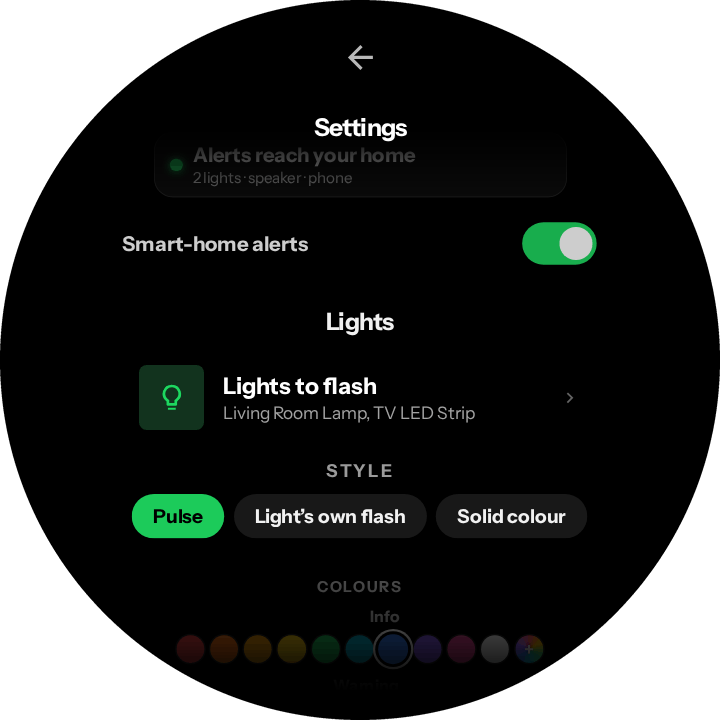<br><sub>Settings → Alerts · Music Green, OLED</sub></td>
    <td align="center"><br><sub>Light mode follows everywhere</sub></td>
  </tr>
</table>

### Themes (Settings → Theme)

Eleven themes change the whole app: Music, Movies & TV, Home, Games, Rhythm, Apps and Settings.

| Theme | Look |
|---|---|
| **Classic** | The original look: dark glass and a soft neon glow. |
| **Liquid Glass** | Frosted glass panels with bright edges, floating over soft blobs of your two colours. |
| **Soft** | Soft UI (neumorphism): moulded, tactile buttons and trays that seem pressed into the surface, like a hardware device. |
| **Slate** | Calm and minimal: slate tones, thin rings, light type, quiet cards. |
| **Vivid** | Modern minimal cards with bold gradients from your main colour to your secondary colour. |
| **Bauhaus** | Swiss style: flat bold colour, big grotesk type, black circles and no effects. |
| **XMB** | Inspired by the PSP menu: a flowing colour wave, light white type and glowing icons. |
| **Console 5** | Inspired by the PS5 home screen: deep navy, crisp rounded cards and white focus rings. |
| **Music Red** | Inspired by Apple Music: big bold titles, soft blur and a red accent. |
| **Music Green** | Inspired by Spotify: near-black, bold type and a round green play button. |
| **Click Wheel** | Inspired by the iPod classic: brushed metal, click-wheel buttons and blue highlights. |

The last five are original designs *inspired by* those looks; they don't use any logos or artwork from Sony, Apple or Spotify.

For each theme you choose:

- **Mode:** *Dark*, *OLED* (true black, good for OLED screens) or *Light*.
- **Main colour** and **secondary colour:** pick a swatch, or **+** for any colour.
- *Colours follow the music*: when on, the accent changes with the service and the album art (the Classic way). When off, the theme's main colour is used everywhere.
- *Reset* puts a theme back to its defaults.

Each theme remembers its own choices.

**Home background** (under the theme, also remembered per theme): the theme's own background, a **solid colour**, a **gradient** (two colours), **colour splashes** (soft, shifting blobs), or a console-inspired backdrop: **PS2**, **PS3**, **PS4**, **PS5**, **PSP · wave** and **PSP · classic**. Each one can be still or **Animated**. The PS3 and PSP styles can take the *colour of the month*, like the originals; turn that off to use your theme colours. Animations are capped at 30 fps (15 fps with *Reduce effects*) to stay light on a Raspberry Pi.

The games follow the theme too. In Light mode the immersive player views (Vinyl, Lyrics, Video, Tone Visual, Fun Facts) stay dark so the artwork and lyrics stand out. Themes are saved with the other settings, so a settings profile copies them to another display.

### Settings

Settings works like a phone's: a list of categories, each with a line saying what's inside — **Theme, Home screen, General, Device** (on the Raspberry Pi only)**, Music, Movies & TV, Smart home, Alerts, Games, Rhythm, Connection** and **Profiles & about**. Tap one for its page: its own switches plus rows for deeper pages (e.g. *Music → Lyrics*, *Alerts → Quiet hours*, *Device → Wi-Fi*), each with **Back** at the top. Back, <kbd>Esc</kbd> or <kbd>Backspace</kbd> go up one level; with a keyboard or the knob, ↑ ↓ (or ← →) move between the rows and controls and Enter opens. **Search settings** at the top finds any setting by name (*wifi*, *subtitles*, *quiet*…) and jumps to it, highlighted; Back returns to the results. Reopened within ten minutes, Settings comes back to the page you left.

**Settings → Device** is the Raspberry Pi's own settings page. It appears only when the bridge says it runs on a Pi; on GitHub Pages, *Screen rotation* and *Battery saver* are pages under *General* instead.

<table>
  <tr>
    <td align="center">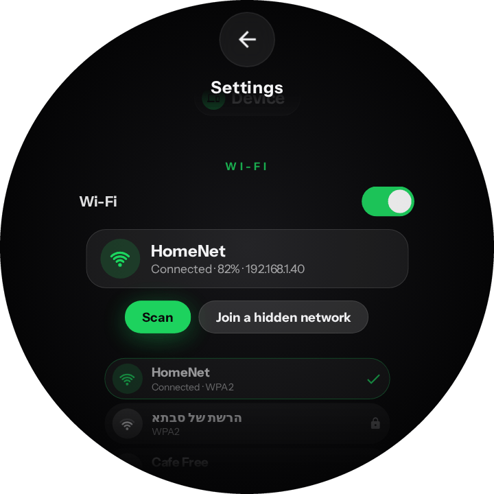<br><sub>Device → Wi-Fi</sub></td>
    <td align="center">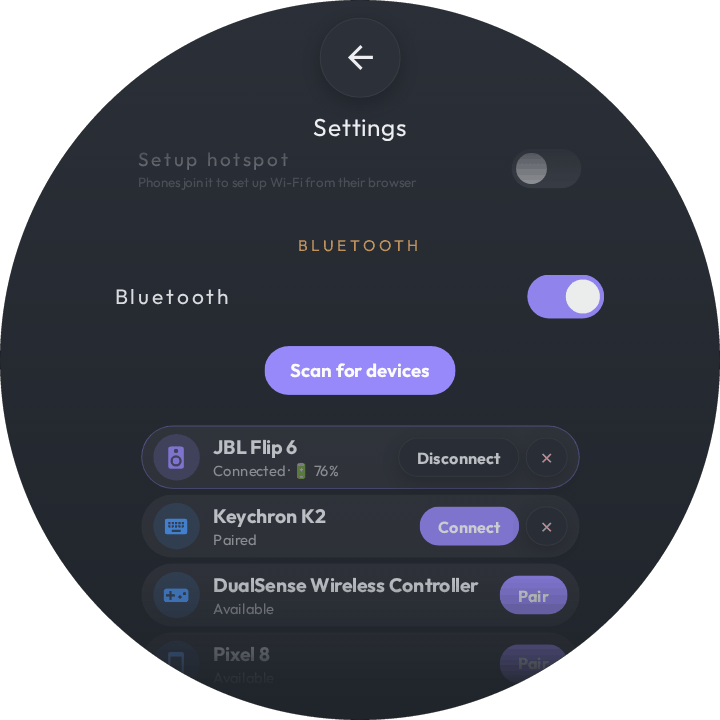<br><sub>Device → Bluetooth · Slate</sub></td>
    <td align="center">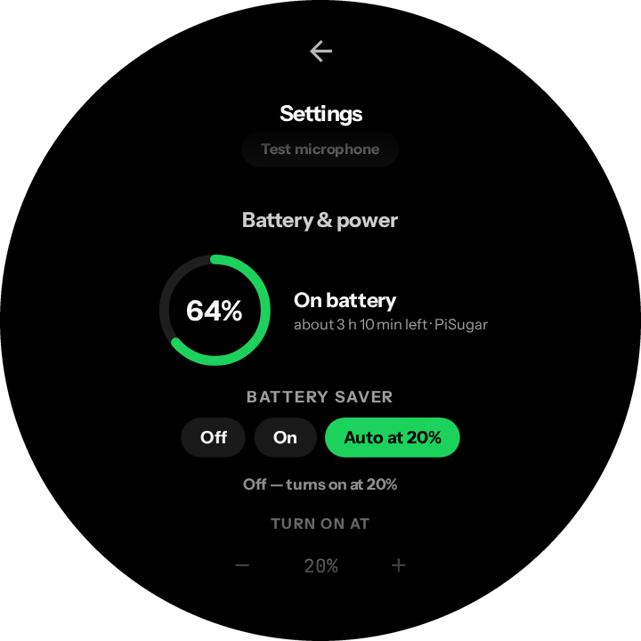<br><sub>Device → Battery &amp; power · Music Green, OLED</sub></td>
  </tr>
  <tr>
    <td align="center">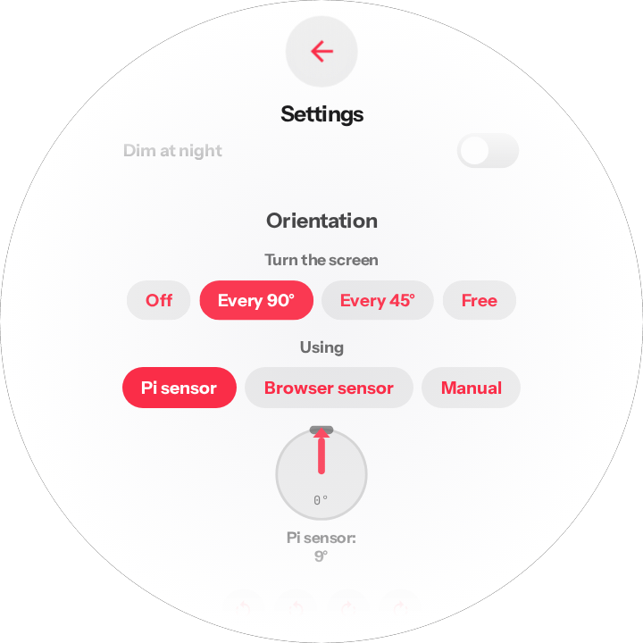<br><sub>Device → Orientation · Music Red, light</sub></td>
    <td align="center">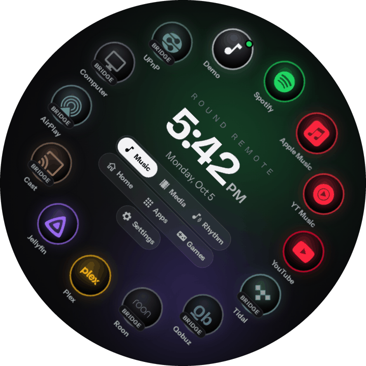<br><sub>The whole app turned 45° (manual)</sub></td>
    <td></td>
  </tr>
</table>

| Setting | What it does |
|---|---|
| Home screen → Services | *Show only signed-in services* (only the ones you've signed in to or that the bridge can reach), *Show the Demo service*, and every service per mode (Music, Movies & TV, Home) with a switch to show or hide it on the ring and ↑ ↓ to reorder them. Hiding never signs you out |
| Home screen → Battery level on Home | The battery level and charging bolt next to the date (on by default; shown only when there is a battery) |
| Theme | Classic, Liquid Glass, Soft, Slate, Vivid, Bauhaus, XMB, Console 5, Music Red, Music Green or Click Wheel, each in Dark, OLED or Light mode with your own main and secondary colours, plus the Home background (see [Themes](#themes-settings--theme)) |
| Control size | XS, S, M, **L** (default), XL: scales the players, the games and the Home screen (tiles, clock and category buttons) |
| Start in view | Info, Vinyl, Lyrics, Video, Tone Visual or Fun Facts |
| Show the service & device line | The *Spotify · Living Room* line near the top |
| Auto-hide controls | Hide the controls after a few seconds |
| Colours from artwork | Accent colour follows the album art |
| Classic: when the controls hide, show | Artwork (clear or milky blur) or song info (on black or on blurred art) |
| Classic: show the artwork / hide the controls by themselves | Round artwork in the middle; Classic-only auto-hide |
| Video: background / video types / prefer the official clip / song info when the controls hide / show the artwork | Music video or photo slideshow; any mix of official clip, abstract, live, fan made, album cover and lyric video |
| Fun Facts: next fact every | 6, 8, 12, 20, 30 or 60 seconds |
| Reduce effects | Fewer blur effects for slower GPUs |
| Open last service on start | Go straight to the last service |
| Dim screen when idle | Dims when nothing is playing (never / 2 / 10 / 30 min) |
| General → Startup animation | The logo animation while the app loads: *Always*, *First load only* (default: reloads in the same session only show the logo for a moment) or *Off*. It never holds the app back (it speeds up once the app is ready, and a tap skips it); with *Reduce effects* it's a simple fade. In light themes on phones and computers it's a dark logo on a light disc. *Preview* plays it again |
| General → Startup animation → Mouse pointer | *Auto* (hidden while you use touch and 2 s after the mouse stops; a moving mouse brings it back), *Always hide* or *Never hide* |
| General → Screen rotation (phones, tablets, computers) | Turn the whole round app: *Off*, *Every 90°*, *Every 45°* or *Free*, following **this device's motion sensor** (iOS asks for permission; lock the phone's own rotation) or turned by hand with the ↺ / ↻ buttons (±45° / ±90°) and *Back to upright*. Snapped modes switch only once the device is clearly past half-way, and animate; *Free* follows smoothly. A turn waits while your finger is on the screen. On the Pi this is under *Device → Orientation* |
| General → Battery saver (phones, tablets, computers) | *Off*, *On* or *Auto at ≤ N %* (5–50 %, default 20 %, with the battery the browser reports), optionally off again while charging. It works like *Reduce effects* (no blur, still Home backgrounds, services polled every 4 s at most) without changing that setting, and can dim the screen with a dark layer. On the Pi it's under *Device → Battery & power* with more savings |
| On-screen keyboard | Auto (touch screens), on or off |
| Keyboard language | English or עברית (Hebrew). You can also switch with the **עב / EN** key on the keyboard; the last choice is remembered |
| Lyrics style / Kinetic Type variant / timing offset | See the Lyrics view |
| Random includes | Which Kinetic Type variants the Random variant picks from (tap to include or leave out; at least one stays on; *Include all* resets) |
| Tone Visual style / Sound | See the Tone Visual view (Simulated or Microphone) |
| Vinyl · Tape · CD: player | What the Vinyl view plays on: *Vinyl*, *Cassette*, *CD · back* or *CD · top*. Also in the Vinyl view under ⋯ |
| Cassette / CD · data side / CD · label side | Cassette *Classic*, *Clear* or *Chrome / Metal*; CD data side *Silver*, *Gold CD-R* or *Black*; CD label side *Full print*, *CD-R marker* or *Ring* |
| Vinyl: record / record colour / tone arm | Record design *Classic* (grooves), *Clear* (see-through, swirled) or *Flat*; any record colour (swatches or **+**); tone arm *Classic*, *S-arm* or *Minimal*. Also in the Vinyl view under ⋯ |
| Centre artwork / Hide the arm with the controls / Show the title / Record speed | See the Vinyl view (Show the title and the speed also apply to the cassette / CDs) |
| Music player: show these controls | Every button, the ring, the times and the view buttons (also under ⋯ → Customize controls) |
| Movies & TV: background / slideshow speed | Poster, Photo, Blurred, Black, Slideshow, Content aware or Moving colours; seconds per picture |
| Movies & TV: skip back / skip forward | 5–30 s back, 10–60 s forward |
| Movies & TV: buttons | Turn on or off: previous / next episode, skip, seasons & episodes list, info, cast, fun facts, suggestions from your library, more from the collection, audio & subtitles, stop |
| Movies & TV: while watching | Auto-hide controls, "Ends at" time, the *Skip intro / Skip credits* button, skip intros & recaps automatically, title & time left, clock, fun facts while the controls are hidden |
| Movies & TV: library | Play button resumes or starts over; hide what you've watched; no spoilers (blurs summaries and stills of episodes you haven't seen; tap to reveal) |
| Movies & TV: library view | List, Posters, Grid, Cover Flow, Rings, Watch, DVD, Disc, DVD + disc |
| Movies & TV: show these parts | Every part of the Now playing screen (also under ⋯ → Customize controls) |
| Movies & TV: subtitles from the internet | Your subtitle languages (the first is the default) and whether to switch to downloaded subtitles straight away |
| Smart home | Set up Home Assistant and Google Home |
| Alerts | Smart-home alerts: lights, speaker (with *Resume what was playing*), phone, script / scene and Google Home per alert level, per app, quiet hours and a test (see [Smart-home alerts](#smart-home-alerts)) |
| Games: sound / player name / clear scores | Game sound effects, the name suggested for new top-5 scores, and clearing every game's top 5 |
| Rhythm | Learn songs from (Auto, song file, microphone, bridge computer, tempo / tap, chart library), audio latency calibration, Hitster language and *Update songs*, forget learned songs |
| Device: Wi-Fi | Raspberry Pi only (the group shows when the bridge says it runs on a Pi; `?device=1` shows it anyway for testing). The network you're on with its signal, a scan list with signal bars and 🔒 for secured networks, connect with the password on the on-screen keyboard (a wrong password says so), join a hidden network, forget saved networks, Wi-Fi on / off, and the **setup hotspot** (*RoundRemote-Setup*) with its password and a QR code to join it or open the setup page |
| Device: Bluetooth | On / off, **Scan** (with a progress ring), the devices with their icons (speaker, headphones, keyboard, mouse, controller, phone…) and battery % when they report it: *Pair* (then connects), *Connect*, *Disconnect*, remove (✕, tap twice) |
| Device: Sound | Speakers / outputs (tap one to make it the default), its volume (up to 150 %) and mute, *Test sound*; microphones with their level and a live **level meter** (*Test microphone*, when the kiosk allows the microphone) |
| Device: Battery & power | The battery ring with % and charging (PiSugar or a UPS HAT, through the bridge), and **Battery saver**: *Off*, *On*, *Auto at ≤ N %* (checked every minute; off again while charging if you like). What it does, each on or off: reduce effects, the CPU *powersave* governor, Wi-Fi power saving, Bluetooth off (back on afterwards), screen off after 2 minutes, and a **dim layer** with its strength (the panel's backlight is set only by its own buttons) |
| Device: Screen | **Screen off after** *Never*, 1, 2, 5, 10 or 30 min without a touch, key or knob turn (music playing doesn't keep it on); the first touch only wakes it and never presses anything; alarms and timers wake it too. *Turn off now*, and an optional **dim at night** (from / until, strength) |
| Device: Orientation | As *Screen rotation* above, with the **Pi's motion sensor** (MPU-6050, ICM-20948, BNO055 or LSM6DS3 through the bridge) as a source: which angle turns the screen (roll, pitch or heading), *Reverse direction* and *Set current as upright* |
| Device: Updates / Restart / Shut down | The app and bridge versions, the Pi model, system and temperature; *Check for updates* → *Install update* (the bridge updates and restarts, then the display reloads); *Restart* and *Shut down* ask first |
| Bridge address / Refresh rate | Where the bridge is, and how often remote services are polled |
| Service keys | Spotify Client ID, Play Spotify on this display, Apple developer token, Jellyfin server, YouTube API key, Google Client ID |
| Accounts | Sign in or out of each service |
| Profiles | Save all of these settings as a **profile** (on the bridge or as a file) and load it on another round display. *Include sign-ins* also copies your service accounts (keep such a file private). A new display can start with a profile straight away: open the app with `?profile=NAME` at the end of its address, or set `ROUNDREMOTE_PROFILE="NAME"` for `pi/kiosk.sh`. It's applied again whenever you re-save that profile on the bridge. |
| Reset everything | Clears all settings and sign-ins in this browser |

Adding `?service=demo` (or any service id: `spotify`, `apple`, `youtube`, `ytmusic`, `plex`, `jellyfin`, `roon`, `plexvideo`, `homeassistant`, `playstation`, `steam`, `streamer`, …) to the address opens that service directly.

---

## Setup

### Put it on GitHub Pages

The app is published from the existing **RoundSpotify** repository, at **[royborkin.github.io/RoundSpotify](https://royborkin.github.io/RoundSpotify/)**.

1. Replace the old files in [github.com/RoyBorkin/RoundSpotify](https://github.com/RoyBorkin/RoundSpotify) with **the contents** of this folder. Either:
   - on the web: delete the old `spotifyround.html`, `applemusicround.html`, `Vinyl1.png` and `Vinyl2.jpg`. Then choose *Add file → Upload files*, drag everything from this folder in (it replaces `index.html`) and click *Commit changes*; or
   - with git (from the `music remote` folder):

     ```bash
     cd RoundSpotify
     git rm -q spotifyround.html applemusicround.html Vinyl1.png Vinyl2.jpg
     cp -r ../RoundRemote/. .
     git add -A && git commit -m "Round Remote 2"
     git push
     ```

2. Check that Pages is on: in the repository, open **Settings → Pages → Build and deployment → Source: Deploy from a branch → Branch: `main`, folder `/ (root)` → Save**.
3. After about a minute, the app is live at **<https://royborkin.github.io/RoundSpotify/>**.
4. Optional: in Chrome/Edge, click the *Install* icon in the address bar. It then opens full-screen like an app and also works offline.

To publish an update, upload the changed files again (or `git push`). If you still see the old version, reload once more; the offline cache refreshes in the background.

Tap **Demo** to try every screen straight away.

Settings are saved in the browser you use. The GitHub Pages site and the Pi each keep their own copy; on the Pi you can pre-fill them from `bridge/config.json` (see [Bridge config](#bridge-config)), or copy everything with a settings **profile**.

### Raspberry Pi kiosk

Turn a Raspberry Pi and the round screen into an appliance. It starts straight into Round Remote, with no desktop, and gets its own Wi-Fi, Bluetooth, sound, battery and motion-sensor settings under **Settings → Device**.

#### What you need

| | Recommended | Notes |
|---|---|---|
| Computer | **Raspberry Pi 4 Model B** (2 GB or more; 4 GB is best) | A **Pi Zero 2 W** works as a *light companion* of a Round Remote server (see [Pi 4 or Pi Zero 2 W?](#pi-4-or-pi-zero-2-w)). |
| Screen | **Waveshare 4inch HDMI round LCD, 720×720** (HDMI picture, USB touch) | The **DSI** version (4inch DSI LCD (C)) works too: install with `--display=waveshare-4-dsi`. |
| Cables | micro-HDMI → HDMI (Pi 4) or mini-HDMI → HDMI (Zero 2 W), and a USB cable for the touch | On the Pi 4 use **HDMI0**, the micro-HDMI port next to the USB-C power socket. |
| Power | the official 5.1 V / 3 A USB-C supply for the Pi, plus a 5 V USB-C supply (or a free USB port) for the panel's own power socket | A weak supply shows up as "under-voltage" in *Settings → Device → Updates*. |
| Storage | microSD card, 16 GB or more | |
| Optional | a USB or I2S speaker, a USB microphone, a battery board (PiSugar 3 / Waveshare UPS HAT) or a power bank, a motion sensor (IMU) | See below. |

#### Pi 4 or Pi Zero 2 W?

**Get the Pi 4 Model B** for a stand-alone display. The Zero 2 W can drive the same HDMI panel through its mini-HDMI port, but with 512 MB of memory it fits best as a **light companion** of a Round Remote server (the Docker container on your NAS, or a Pi 4): then the bridge's work happens on the server and the Zero only runs the browser and a small proxy — see [Pi as a companion of a Round Remote server](#pi-as-a-companion-of-a-round-remote-server).

| | Raspberry Pi 4 Model B (recommended) | Raspberry Pi Zero 2 W ("lite") |
|---|---|---|
| Smoothness | Smooth, with all effects | Slow: screens take a while to open and animations stutter. Turn on *Settings → General → Reduce effects* (or Battery saver). |
| Memory | 2–8 GB | **512 MB**. As a light companion the Pi's own service is small (see below), but Chromium still draws the whole app on the Zero, so heavy screens (Tone Visual, the rhythm games, big libraries) stay slow. The installer adds zram swap and lighter Chromium settings, and the app starts with *Reduce effects* on. |
| Screen | micro-HDMI → the panel's HDMI | mini-HDMI → the panel's HDMI. Touch needs a micro-USB OTG adapter or hub, because the Zero has only one USB data port. |
| Power | 5.1 V / 3 A USB-C | 5 V / 2.5 A micro-USB. It draws much less, which suits a battery. |
| Battery boards | PiSugar 3 Plus, UPS HAT (B) | PiSugar 3, UPS HAT (C) |

#### 1. Put Raspberry Pi OS Lite on the card

1. Install **[Raspberry Pi Imager](https://www.raspberrypi.com/software/)** on your computer and insert the card.
2. **Choose device:** Raspberry Pi 4 (or Raspberry Pi Zero 2 W).
3. **Choose OS:** *Raspberry Pi OS (other)* → **Raspberry Pi OS Lite (64-bit)**. Both the current release (Trixie, Debian 13) and the previous one (Bookworm, Debian 12) work.
4. **Choose storage:** your card. Then **Next → Edit settings**:
   - **Hostname:** `roundremote`. The Pi is then reachable at `roundremote.local`.
   - **Username and password:** pick your own. The installer uses this user.
   - **Wireless LAN:** your Wi-Fi name and password, plus the **Wi-Fi country**. You can skip Wi-Fi: the Pi then opens a setup hotspot for it (step 5).
   - **Locale settings:** time zone and keyboard.
   - **Services:** turn on **SSH** (password authentication is fine).
5. **Save → Yes** and wait until Imager has written and verified the card.

#### 2. Connect the screen

The Waveshare 4inch HDMI round LCD has three connections:

1. **HDMI** (the picture): from the panel's HDMI socket to the Pi. On the Pi 4 use **HDMI0**, the micro-HDMI port next to the USB-C power socket; the Zero 2 W has a single mini-HDMI port.
2. **Touch** (USB): from the panel's *Touch* USB port to any USB port on the Pi (on the Zero 2 W, through an OTG adapter). The touch works as a plain USB touch screen, with no driver to install.
3. **Power**: the panel's own USB-C power socket, from a 5 V USB-C supply or a free USB port.

Then put the card in the Pi and power it up. The first start takes a minute or two, and the screen shows only a text console until the install is done.

The panel's **brightness is set only with the buttons on the panel**; software can't change the backlight. The app dims with a dark layer instead (Battery saver, *Dim at night*), and turns the HDMI output off after the idle time you choose.

#### 3. Install (one command)

From your computer, `ssh <your user>@roundremote.local` (or plug a keyboard into the Pi), then run:

```bash
curl -fsSL https://raw.githubusercontent.com/RoyBorkin/RoundSpotify/main/pi/install.sh | bash
```

It takes 10 to 20 minutes on a Pi 4 (longer on a Zero 2 W) and asks no questions. When it's finished, run `sudo reboot`. You can run it again at any time: it only changes what's missing and keeps your settings. The full log is in `~/roundremote-install.log`.

The installer:

- installs Chromium, the **cage** kiosk compositor (or labwc), NetworkManager, BlueZ, PipeWire, i2c-tools, avahi (for `roundremote.local`), playerctl, Node.js 18 or newer, and optionally shairport-sync (AirPlay) and pyatv (Apple TV);
- clones the app to `~/RoundRemote` (or uses the checkout it runs from), installs the bridge and creates `bridge/config.json`;
- sets up the round screen for the KMS graphics driver (see [Display modes](#display-modes-rotation-and-a-black-screen)), turns on I2C and sets the hostname to `roundremote` if it is still `raspberrypi`;
- adds three services: `roundremote-bridge` (the app server and device APIs), `roundremote-kiosk` (cage + Chromium on the screen, logged in as you, with no desktop) and `roundremote-netcheck` (the Wi-Fi setup hotspot);
- adds narrow `sudo` rules (`/etc/sudoers.d/roundremote`): restart and shut down, restart its own services, NetworkManager, and a small root helper (`/usr/local/sbin/roundremote-helper`) that only accepts a fixed list of actions;
- sets up a quiet boot with the Round Remote **boot splash** (Plymouth) and hides the mouse pointer on the touch screen (see [Boot splash and the mouse pointer](#boot-splash-and-the-mouse-pointer));
- remembers the options you used (`/etc/roundremote/install-args`), so `--same-options` (and `pi/update.sh --apply-system`) can repeat them.

Options (add them after `bash -s --` when you use the one-liner, for example `curl -fsSL …/install.sh | bash -s -- --no-airplay`, or pass them to `bash ~/RoundRemote/pi/install.sh` when you run it from the checkout):

| Option | What it does |
|---|---|
| `--display=auto\|waveshare-4-hdmi\|waveshare-4-dsi\|none` | The screen. `auto` picks DSI if its overlay is already set, otherwise HDMI. |
| `--display-mode=auto\|edid\|cvt\|none` | How the HDMI mode is set (see [Display modes](#display-modes-rotation-and-a-black-screen)). |
| `--rotate=0\|90\|180\|270` | Turns the whole screen and the touch at system level. Usually you don't need this, because the app can turn itself. |
| `--wifi-country=US` | Sets the Wi-Fi country. Only needed when Imager didn't set it, because Wi-Fi stays blocked until a country is set. |
| `--hostname=NAME` | Uses another hostname (the default is `roundremote`). |
| `--audio-hat=OVERLAY` | Turns on an I2S sound HAT, e.g. `hifiberry-dac`, `hifiberry-dacplus`, `iqaudio-dacplus`, `max98357a`, `googlevoicehat-soundcard`. |
| `--hdmi-audio=auto\|on\|off` | `auto` hides HDMI sound when a USB or I2S speaker is found. |
| `--no-airplay`, `--no-pyatv`, `--with-roon` | Skips the AirPlay receiver or the Apple TV library, or adds the Roon libraries. |
| `--no-kiosk`, `--compositor=labwc` | Installs without the screen service, or uses labwc instead of cage. |
| `--no-splash` | Leaves the boot screen as Raspberry Pi OS has it (no boot splash). On a Pi that has the splash, it removes it again. |
| `--verbose-boot` | Shows the boot messages instead of the splash, to see what goes wrong at boot. Run the installer again without it to hide them. |
| `--mode=full\|companion` | `full` (the default): the whole Round Remote on this Pi. `companion`: a light companion of a Round Remote server, for a Pi Zero 2 W (see [Pi as a companion](#pi-as-a-companion-of-a-round-remote-server)). Run the installer again with the other mode to switch; without `--mode` it keeps the installed kind. |
| `--server=URL` | The Round Remote server, e.g. `http://192.168.50.108:8765` (or `192.168.50.108`; port 8765 is the default). With `--mode=full` the Pi starts connected to it (*Settings → Connection → Server* switches back). |
| `--same-options` | Starts from the options of the last run; options you add after it win (e.g. `--same-options --verbose-boot`). |
| `--interactive` | Asks about the main choices. |
| `--dry-run` | Prints every action, including file diffs, and changes nothing. |
| `--uninstall` | Removes the services and system files. The app folder and packages stay. |
| `--readonly` | Makes the card read-only (overlay file system). Everything you change after that is lost at each reboot, so use it only for a finished appliance. |

`pi/setup.sh` from older instructions still works: it now runs `pi/install.sh`. On a Pi OS **desktop** image, the kiosk starts from the desktop's autostart, as before.

#### Pi as a companion of a Round Remote server

When Round Remote runs on a server — the [Docker container on your NAS](#run-it-on-a-server-docker), or another Pi or PC with the bridge — a round display only has to *show* it. The Pi then becomes a **companion**: the kiosk still opens `http://127.0.0.1:8765/` (so Spotify's sign-in and the app's saved settings work exactly as before), and the Pi passes everything that isn't its own business on to the server — the app's files, the APIs, the phone pages, live updates (SSE) and WebSockets, streamed both ways. What stays on the Pi: its own **Wi-Fi, Bluetooth, sound, battery, screen and motion sensor** (*Settings → Device*), its updates, and the setup hotspot. Phones scan the QR codes and talk to the server directly.

There are two ways to be a companion:

1. **Light companion** — for a **Pi Zero 2 W** (or any Pi that only shows the app):

   ```bash
   bash ~/RoundRemote/pi/install.sh --mode=companion --server=http://192.168.50.108:8765
   ```

   (or with the one-liner: `curl -fsSL …/install.sh | bash -s -- --mode=companion --server=http://192.168.50.108:8765`). It installs the kiosk, the boot splash, the setup hotspot and the small `roundremote-companion` service (`bridge/companion.js`) instead of the bridge: no media adapters, no npm packages, no AirPlay. It starts in about 0.15 s. Without `--server` the round screen asks for the address at the first start.
2. **Full install + "Connect to a server"** — on a Pi 4 with the normal install, open ***Settings → Connection → Server***: *Round Remote comes from* **This Pi's own bridge** (the default) or **Round Remote server**. Type the address (or **Find servers**: servers and bridges announce themselves on the LAN as `_roundremote._tcp`; a Docker server is found only with host networking), **Test**, **Connect**. The switch happens at once, without a restart. The Pi's own media adapters don't start while it's connected (after a switch at runtime they keep running in the background until the next restart, unused). Pick *This Pi's own bridge* → **Use this Pi's own bridge** to switch back instantly; the address is kept for next time. (`install.sh --mode=full --server=URL` starts a new install connected.)

**When the server is offline**, the round screen shows a round **"Server offline"** page served by the Pi itself: the RB logo in a ring that counts down to the next automatic retry (every 5 s), the server's address, how long ago it last answered, and **Retry**, **Wi-Fi** (a small Wi-Fi picker with an on-screen keyboard, in case the Pi lost the network), **Server** (change the address, Find servers, Test) and, on a full install, **Use this Pi's own bridge**. If the app was open, the same page appears over it (with *Continue offline* for the clock, timers and other things that need no server). As soon as the server answers again, the app comes back by itself. A home-screen dot next to *Round Remote* shows the connection: green online, orange offline. *Settings → Device → Updates* shows the companion's version and the server's.

**Updates:** a companion updates its own files exactly as before (*Settings → Device → Updates* or `pi/update.sh`); the server is updated on the NAS (see [Updating](#updating)). **Good to know:** the server sees the companion's address, not each phone's; the rhythm games' *learned songs* are saved in the browser of each display (not on the server), so a song learned on the PC browser isn't known on the Pi.

**Pi Zero 2 W: what to expect.** The light companion takes the bridge's work off the Zero, but not the browser's: **all rendering and the app's JavaScript still run in Chromium on the Zero**. Measured on the test machine (x86-64, Node 22): the companion service uses about **20 MB of its own memory** (≈ 70 MB RSS including the shared Node runtime; capped with `--max-old-space-size=48`) and starts in ~0.15 s, against the full bridge's media adapters, discovery and npm packages. The app's own JavaScript heap stays small (≈ 4–5 MB after visiting Home, Apps, Games, Settings and the player); Chromium's processes are what fill the 512 MB. So the installer, on a Pi with less than 1 GB: turns on **zram swap** (`zram-tools`, zstd, half the RAM — unless Raspberry Pi OS already has it, as Trixie does with `rpi-swap`), and sets lighter Chromium flags in `/etc/roundremote/kiosk.env`: one renderer process, *low-end device mode*, a 192 MB JavaScript heap limit, a 32 MB disk cache and no back-forward cache; the app turns on *Reduce effects* the first time it starts on such a Pi (you can turn it off again). Expect Home, the player, Settings and the remotes to work fine but not snappy; Tone Visual, the canvas games and Rhythm are slow, and **learning a song for Rhythm** (which analyses the audio in the browser) is too heavy for a Zero.

#### 4. First boot

After the reboot, the screen goes black, then shows the Round Remote logo with a ring that fills as the Pi boots, and then Round Remote itself, within about half a minute. From another device, it's at `http://roundremote.local:8765/`.

- No network yet? About 45 seconds after the start the Pi opens the **setup hotspot** (see step 5).
- **Settings → Device** appears only on the Pi. It has Wi-Fi, Bluetooth, Sound, Battery & power, Screen, Orientation, Updates, and Restart / Shut down (see [Settings](#settings)).
- Spotify needs `http://127.0.0.1:8765/` as a Redirect URI (see [Spotify](#spotify)). Spotify and Apple Music sign-in need typing once: use the round on-screen keyboard or plug in a USB keyboard. Plex and Jellyfin sign in with a code.
- Keys such as the Spotify client ID or Jellyfin server go in `~/RoundRemote/bridge/config.json` → `"app"` (see [Bridge config](#bridge-config)).

#### 5. Getting on Wi-Fi (and Bluetooth)

There are four ways to connect the Pi to Wi-Fi:

1. **Imager:** if you entered Wi-Fi in step 1, there's nothing to do.
2. **On the round screen:** *Settings → Device → Wi-Fi*. Tap a network and type the password on the on-screen keyboard. Hidden networks are supported too.
3. **With your phone (setup hotspot):** if the Pi has no network about 45 seconds after starting, it opens its own Wi-Fi network called **`RoundRemote-Setup`**.
   - The password is on the round screen under *Settings → Device → Wi-Fi*, along with a QR code that joins it. You can also read it with `sudo cat /etc/roundremote/hotspot.env`.
   - Join it with your phone. The setup page opens by itself; if it doesn't, go to **`http://10.42.0.1:8765/system/wifi`**. The page is in English and Hebrew.
   - Pick your network and enter its password. The hotspot closes and the Pi joins your network. If the password was wrong, `RoundRemote-Setup` comes back after a few seconds and the page says so.
   - You can also turn the hotspot on yourself (*Setup hotspot* in the same screen).
   - If your router was simply off when the Pi started, the Pi retries your saved networks every few minutes while nobody is using the hotspot.
4. **Ethernet:** plug in a cable. The hotspot turns itself off.

**Bluetooth** speakers, headphones, keyboards and game controllers pair in *Settings → Device → Bluetooth*: tap **Scan for devices**, then **Pair** (it connects straight away). Paired devices can be connected, disconnected or removed there later. A Bluetooth speaker then shows up as an output in *Settings → Device → Sound*.

#### Updates

**How to update the Raspberry Pi.** There are two kinds of changes, and most updates only have the first:

1. **The app and the bridge** (everything the screen shows, the bridge's features). Install them in either of two ways:
   - On the round screen: *Settings → Device → Updates → Check for updates → Install update*.
   - Over SSH (`ssh <your user>@roundremote.local`):

     ```bash
     bash ~/RoundRemote/pi/update.sh
     ```

   Either way, it pulls from GitHub (fast-forward only), runs `npm install` when the bridge's packages changed, and restarts the bridge (or the light companion); the screen then reloads by itself. Your `bridge/config.json`, `companion.json` and other saved files aren't in git and stay untouched. If tracked files were changed on the Pi, the update puts those changes aside first — on a branch `local-changes/<date>` and in `git stash list` — so nothing is lost and the update never gets stuck. Changed file permissions (the installer makes `pi/*.sh` executable) don't count as changes (`git config core.fileMode false`; older installs showed "local changes" because of that).
2. **System-level changes**: the installer itself, the services, the `sudo` rules and root helper, the boot splash theme (`pi/plymouth/`), `config.txt` / `cmdline.txt` settings. These only take effect when the installer runs again, which needs `sudo`, so it can't happen from the round screen. When an update contains such changes, *Settings → Device → Updates* and `update.sh` say so. Apply them over SSH with:

   ```bash
   bash ~/RoundRemote/pi/update.sh --apply-system
   ```

   It updates (if needed) and then runs `bash ~/RoundRemote/pi/install.sh --same-options --no-update`, so the installer repeats the options you used last time. You can also run the installer yourself with any options, e.g. `bash ~/RoundRemote/pi/install.sh --same-options`. Then `sudo reboot` if it asks for one (boot settings and the boot splash need a reboot). The installer is safe to run again: it only changes what differs, and keeps your settings.

   For example, the boot splash and the hidden mouse pointer came in a system-level update: after updating, run `bash ~/RoundRemote/pi/update.sh --apply-system` and `sudo reboot` once.

**After you push to GitHub** (if you change the code yourself): the Pi only gets what's on the branch it was installed from (`main` unless you used `--branch=…`). Push, then update the Pi as above. The GitHub Pages web app updates itself a minute or two after the push (it checks for a new version when it opens; a reload picks it up). Changes to files under `pi/` that the installer copies into the system (services, `pi/conf/`, `pi/plymouth/`, the helper) still need `--apply-system`; `pi/kiosk.sh`, `pi/boot.html` and `pi/rr-tool.py` are used straight from `~/RoundRemote` and only need the kiosk to restart, which `update.sh` does when they change (by hand: `sudo systemctl restart roundremote-kiosk`).

#### Boot splash and the mouse pointer

The installer sets up a quiet boot: no rainbow square, no Raspberry Pi logos, no scrolling text and no blinking cursor. The screen goes black, then shows the Round Remote logo with a ring that fills clockwise as the Pi boots (a [Plymouth](https://www.freedesktop.org/wiki/Software/Plymouth/) theme in `pi/plymouth/roundremote`, installed to `/usr/share/plymouth/themes/roundremote`). When Plymouth hands over, the kiosk shows the same logo and ring in the same place (`pi/boot.html`, while the bridge starts), and the app's startup animation carries on from there into Home. At shutdown and restart a short arc circles round the logo instead.

What it changes (originals are kept as `config.txt.rr-orig` and `cmdline.txt.rr-orig`):

- packages `plymouth`, `plymouth-themes` and `plymouth-label`; `plymouth-set-default-theme -R roundremote` makes it the boot theme and rebuilds the initramfs (`/boot/firmware/initramfs8` on a Pi 4, loaded by `auto_initramfs=1`, which Raspberry Pi OS already has; the installer adds it if it's missing);
- `config.txt`: `disable_splash=1` (no rainbow square);
- `cmdline.txt`: `quiet splash plymouth.ignore-serial-consoles logo.nologo vt.global_cursor_default=0 loglevel=3 udev.log_level=3`, and the kernel console moves from `console=tty1` to `console=tty3` so no text appears on the screen;
- a drop-in for `plymouth-quit.service` that quits Plymouth with `--retain-splash`, so its last frame stays up until the kiosk draws.

To see the boot messages (when something goes wrong at boot), run `bash ~/RoundRemote/pi/install.sh --same-options --verbose-boot` and reboot; run it again without `--verbose-boot` to hide them. `--no-splash` removes the splash and the extra `cmdline.txt` settings again. If you can't log in at all, edit `cmdline.txt` on the card's boot partition from a computer: change `console=tty3` back to `console=tty1` and remove `quiet splash`. To change the logo or the ring, edit `logo/logo-white.svg` and run `python3 pi/plymouth/make-theme.py` (needs Pillow), then `--apply-system`.

**Mouse pointer.** The touch screen needs no pointer, but cage shows one whenever any pointer device exists, and most USB touch panels (the Waveshare round one too) add a "mouse" interface next to the touch one. That's why an arrow could sit in the middle of the screen. Setting a cursor theme by name didn't help, because cage 0.1.x (Bookworm) always loads the theme called `default`. Now the kiosk handles it at two levels:

- **System:** `pi/kiosk.sh` gives the kiosk its own cursor path (`~/.local/share/roundremote-cursors`), where both `default` and `roundremote-hidden` are invisible, unless a real mouse or trackpad is plugged in when the kiosk starts (`python3 ~/RoundRemote/pi/rr-tool.py has-mouse` shows what it finds; the touch panel's own "mouse" doesn't count). Force it with `ROUNDREMOTE_CURSOR=hide` or `show` in `/etc/roundremote/kiosk.env`. If you plug in a mouse later, restart the kiosk: `sudo systemctl restart roundremote-kiosk`.
- **App** (the Pi, the web app and any browser): *Settings → General → Startup animation → Mouse pointer*. *Auto* hides it while you use touch and 2 s after the mouse stops, and shows it again when a real mouse moves.

Chromium starts with `--force-dark-mode`, so its background before the first page paints is dark grey instead of white, and `pi/boot.html` is black from its first byte. (`--default-background-color` only exists in headless Chromium.) Set `ROUNDREMOTE_BOOT_PAGE=0` in `kiosk.env` to open the app directly instead (the screen then stays black until the bridge answers).

#### Display modes, rotation and a black screen

Raspberry Pi OS Bookworm and Trixie use the **KMS** graphics driver. It ignores Waveshare's old `config.txt` lines (`hdmi_group=2`, `hdmi_mode=87`, `hdmi_timings=720 0 40 40 200 720 0 24 4 12 0 0 0 78 0 59400000 0`). The installer keeps those lines in `config.txt` only as comments. Under KMS, the mode is set on the kernel command line, in `/boot/firmware/cmdline.txt`:

| `--display-mode=` | Added to `cmdline.txt` | When to use it |
|---|---|---|
| `auto` (default) | `video=HDMI-A-1:720x720e` | Uses the panel's own 720×720 mode from its EDID. The `e` keeps HDMI on even if the panel isn't detected at boot (like `hdmi_force_hotplug=1`). Without an EDID, it uses standard 720×720 60 Hz timings. |
| `edid` | `drm.edid_firmware=HDMI-A-1:edid/roundremote-720x720.bin video=HDMI-A-1:720x720e` | Use this if the picture is missing, shifted or flickers with `auto`. It installs an EDID file with Waveshare's exact timings (720×720 at 59.4 MHz, about 78 Hz) in `/lib/firmware/edid/`. |
| `cvt` | `video=HDMI-A-1:720x720M@60e` | Standard CVT 60 Hz timings, ignoring the panel's EDID. |
| `none` | nothing | You manage it yourself. |

The installer also adds `disable_fw_kms_setup=1` to `config.txt`, so the firmware doesn't pass its own mode to the kernel. The original files are kept as `config.txt.rr-orig` and `cmdline.txt.rr-orig`. To switch modes, run `bash ~/RoundRemote/pi/install.sh --display-mode=edid`, then `sudo reboot`.

- **Black screen:**
  - Check that the cable is in **HDMI0**, then try `--display-mode=edid`.
  - `cat /sys/class/drm/card*-HDMI-A-1/modes` lists the modes the panel reports, and `journalctl -u roundremote-kiosk -b` shows the kiosk's log.
  - If you can't log in at all, put the card in a computer and edit `cmdline.txt` on the boot partition (it must stay **one line**).
- **Rotation:** normally the app turns itself (*Settings → Device → Orientation*: by the motion sensor, every 90° or 45°, or by hand). To turn the whole screen and its touch at system level instead, use `--rotate=90` (it sets `ROUNDREMOTE_TRANSFORM` in `/etc/roundremote/kiosk.env`).
- **Kiosk settings:** `/etc/roundremote/kiosk.env` holds the start address, a settings profile (`ROUNDREMOTE_PROFILE`), the compositor, a forced mode and extra Chromium flags. Run `sudo systemctl restart roundremote-kiosk` after editing it.
- **Screen off:** *Settings → Device → Screen* turns the HDMI output off after the idle time you choose (`wlr-randr` in the kiosk's Wayland session). A touch wakes it: the bridge also watches the touch screen directly, in case the compositor stops passing touches while the output is off.
- **DSI version:** use `--display=waveshare-4-dsi` (`dtoverlay=vc4-kms-dsi-waveshare-panel,4_0_inchC`). Its backlight *can* be set by software.

#### Sound: speakers and microphones

- **USB speakers, USB microphones and USB sound cards** work once plugged in. Pick them in *Settings → Device → Sound*, which also has a microphone test.
- **I2S HATs and amplifier boards:**
  - Install with `--audio-hat=<overlay>`, using the overlay name from the board's documentation: `hifiberry-dac` (HiFiBerry DAC / MiniAmp, Adafruit I2S bonnet), `hifiberry-dacplus`, `iqaudio-dacplus`, `max98357a`, `googlevoicehat-soundcard`.
  - Boards that need their maker's own driver, such as some microphone HATs, need that driver installed first.
- **HDMI sound** is hidden when a USB or I2S speaker is present, so sound doesn't go to a panel without speakers. Change this with `--hdmi-audio=on|off`.
- **AirPlay:** shairport-sync makes the Pi an AirPlay speaker called "Round Display". The `apt` version gives classic AirPlay. For AirPlay 2, build shairport-sync from source with `--with-airplay-2 --with-dbus-interface --with-metadata`, plus `nqptp`, following the shairport-sync documentation, and keep the metadata and D-Bus settings that the installer writes to `/etc/shairport-sync.conf`.

#### Battery boards

To run the round display without a cable, use a battery board on the Pi or simply a **USB power bank** (one that can give 3 A for a Pi 4; the panel needs its own USB-C power too). *Settings → Device → Battery & power* shows the charge and time left for the boards below, and Battery saver can switch on by itself at a level you choose. A power bank works too, but it can't tell the Pi its charge, so turn Battery saver on by hand. Supported boards:

| Board | How it's read | Setup |
|---|---|---|
| **PiSugar 3 / 3 Plus** (also PiSugar 2) | `pisugar-server` on TCP port 8423 (`get battery`, `get battery_charging`, `get battery_power_plugged`) | Install PiSugar's software: `wget https://cdn.pisugar.com/release/pisugar-power-manager.sh && bash pisugar-power-manager.sh -c release` |
| **Waveshare UPS HAT (B)** (2 × 18650) | INA219 at I2C **0x42**: voltage and current | Nothing to install (the installer turns on I2C). |
| **Waveshare UPS HAT (C)** (for the Zero) | INA219 at I2C **0x43** | Same as above. |

The bridge finds the board by itself (`"system": { "battery": "auto" }`; set `"pisugar"`, `"ups-hat"` or `"none"` to choose).

- **UPS HAT:**
  - The percentage comes from the battery voltage (a typical Li-ion curve; `"upsHat": { "curve": "linear" }` uses Waveshare's straight line).
  - Positive current means charging.
  - Time left comes from the current and `"capacityMah"` (2600 mAh for (B), 1000 mAh for (C) by default).
- **PiSugar:** time left is estimated from how fast the charge drops.
- **Accuracy:** these are estimates.

#### Motion sensor (IMU): automatic screen rotation

A motion sensor is optional: without one, the screen can still be turned by hand (*Settings → Device → Orientation → Manual*). If you add a gyro / accelerometer board later, the app turns itself as you turn the display. Connect it to the Pi's GPIO header over I2C:

| Sensor pin | Pi pin |
|---|---|
| VCC / VIN | **3.3 V**, pin 1 (not 5 V, unless the breakout board says it accepts 5 V) |
| GND | GND, pin 6 |
| SDA | **GPIO2 (SDA)**, pin 3 |
| SCL | **GPIO3 (SCL)**, pin 5 |

- **Supported sensors** (found automatically): MPU-6050 / MPU-6500 / MPU-9250 (0x68 / 0x69), ICM-20948 (0x68 / 0x69), LSM6DS3 / LSM6DSL / LSM6DSOX (0x6A / 0x6B) and BNO055 (0x28 / 0x29).
- **Check the wiring:** `i2cdetect -y 1` lists the addresses it can see.
- **PiSugar 3 together with a sensor:** the PiSugar uses 0x57 and 0x68, so set your MPU / ICM sensor to **0x69** (tie its AD0 pin to 3.3 V).
- **Mounting:**
  - Mount the board **flat behind the screen** and choose **Roll** in *Settings → Device → Orientation*.
  - If it stands at a right angle to the screen, choose **Pitch**.
- **Calibration:** *Set current as upright* on the same screen stores the offset.
- **Advanced:** `"system": { "imu": { … } }` in `bridge/config.json` sets the bus, address, chip, rate (20 Hz) and smoothing.
- **How it runs:** the bridge starts `pi/imu.py` only while the screen listens, and stops it otherwise.

#### Useful commands

| Command | What it does |
|---|---|
| `systemctl status roundremote-bridge roundremote-kiosk roundremote-netcheck` | Shows whether the three services are running (`roundremote-companion` instead of `roundremote-bridge` on a light companion). |
| `journalctl -u roundremote-bridge -f` | Shows the bridge's log (`-u roundremote-kiosk` for the screen). |
| `sudo systemctl restart roundremote-kiosk` | Restarts the screen. Use `roundremote-bridge` to restart the bridge. |
| `sudo systemctl stop roundremote-kiosk` | Frees the screen for a text console (Ctrl+Alt+F2 also works while it runs). |
| `bash ~/RoundRemote/pi/install.sh --dry-run` | Shows what the installer would change. |
| `bash ~/RoundRemote/pi/install.sh --uninstall` | Removes Round Remote's services and system files (see [Uninstall](#uninstall)). |

#### Uninstall

```bash
bash ~/RoundRemote/pi/install.sh --uninstall
sudo reboot
```

This stops and removes the three services, the root helper, the `sudo`, polkit, PAM and udev rules, the hotspot's DNS file, the HDMI-sound rule and the EDID file, and deletes the `RoundRemote-Setup` hotspot connection. It also takes its own block out of `config.txt` and its `video=` / `drm.edid_firmware=` / `consoleblank=` settings out of `cmdline.txt` (the untouched originals are still there as `config.txt.rr-orig` and `cmdline.txt.rr-orig`). It keeps the app folder `~/RoundRemote`, `/etc/roundremote` (the hotspot password and `kiosk.env`) and the installed packages; delete those yourself if you like. On a desktop image, `sudo systemctl set-default graphical.target` brings the desktop back at boot.

#### Security

- **Who can change the Pi:** the Pi's settings (Wi-Fi, Bluetooth, power, updates, restart) can be changed only from the Pi itself. Other devices can read them but not change them, unless you set `"system": { "allowRemote": true }`.
- **The setup hotspot:** while it's on, phones that joined it may only scan and choose a Wi-Fi network.
- **Root access:** the bridge runs as your user. The only things it can do as root are the `sudo` rules listed in [step 3](#3-install-one-command).

### The bridge

Browsers can't find devices on your home network by themselves. The bridge is a small Node.js program (in `bridge/`) that does this for **Roon, UPnP/DLNA, Google Cast, AirPlay, Tidal, Qobuz, YouTube on your TV, the Google TV remote, Apple TV, Google Home, PlayStation, Steam, the music streamer, and the apps on the computer it runs on** (Cider, Sidra, the Apple Music app, Spotify desktop, YouTube in the browser…). It also lets an `https` page reach `http` Plex / Jellyfin / Home Assistant servers, signs Apple tokens, serves the [phone pages](#phone-pages), stores settings profiles, and records the computer's sound for the Rhythm games.

**On your computer (to use with GitHub Pages):**

1. Install [Node.js](https://nodejs.org) (LTS, version 18 or newer).
2. Start the bridge:
   - **Windows:** double-click **`start-bridge.bat`** in this folder.
   - **Mac / Linux:** run `./start-bridge.sh`.
3. Open the GitHub Pages app and tap Roon / UPnP / Cast / Tidal / Qobuz. When Chrome asks about **local network access**, click **Allow**. The app then finds the bridge at `http://127.0.0.1:8765` automatically.
4. To use a bridge on another machine (e.g. the Pi), enter its address under *Settings → Connection → Bridge*, e.g. `http://192.168.1.50:8765`.

AirPlay needs shairport-sync, so it only works when the bridge runs on Linux / the Pi.

**Apps on this computer (the Computer tile).** The bridge also controls media apps on the computer it runs on, with nothing to install:

- **Windows** (10 1809 or newer): every app in the Windows media flyout: the Apple Music app, iTunes, Spotify, Cider, TIDAL, Amazon Music, Chrome / Edge / Firefox playing YouTube or YouTube Music, VLC… It uses the built-in Windows PowerShell 5.1 (`bridge/tools/winmedia.ps1`). Windows doesn't expose per-app volume there, so the volume slider isn't offered for these.
- **Linux / the Pi:** every MPRIS player: Sidra, Cider, Chromium tabs (YouTube, YouTube Music, SoundCloud…), Spotify, VLC, Rhythmbox, Strawberry… Needs `playerctl` (`sudo apt install playerctl`; the Pi installer `pi/install.sh` installs it).
- **Cider** on any system, through its own API (see [Apple Music](#apple-music)).

They show up on the **Computer** tile. Apple Music apps also appear under the **Apple Music** tile, and browsers playing YouTube under **YouTube / YouTube Music → Devices**.

**Testing without devices:** `cd bridge && npm run mock` adds two fake zones.

**Keep the bridge's secrets out of git.** The repository's `.gitignore` files already exclude the bridge's own settings, sign-ins and saved state: `bridge/config.json`, Apple `*.p8` keys, `psn.json`, `steam.json`, `googlehome.json`, `youtube-tv.json`, `androidtv.json`, `appletv.json`, `streamsdk.json`, `roon-state.json`, the Tasks and Collection data (`tasks.json`, `collection.json`), settings `profiles/`, the chart `cache/` and `node_modules/`. If you copy the bridge somewhere else, keep these files private. With `RR_DATA_DIR` (the Docker image: `/data`) they all live in that folder instead.

### Bridge config

Copy `bridge/config.example.json` to `bridge/config.json` and edit it. The main parts (see the example file for every key):

```json
{
  "port": 8765,
  "allowedOrigins": ["https://royborkin.github.io"],
  "adapters": { "roon": true, "upnp": true, "cast": true, "youtubetv": true, "androidtv": true, "appletv": true, "googlehome": true,
                "cider": true, "mpris": true, "winmedia": true, "airplay": true, "psn": true, "steam": true, "streamsdk": true, "mock": false },
  "cider": { "host": "127.0.0.1", "port": 10767, "token": "your Cider app token" },
  "apple": { "teamId": "ABCDE12345", "keyId": "XYZ987", "privateKeyPath": "AuthKey_XYZ987.p8" },
  "app": {
    "spotifyClientId": "…",
    "jellyfinServer": "http://192.168.1.20:8096",
    "appleDeveloperToken": "",
    "youtubeApiKey": "AIza…",
    "googleClientId": "…apps.googleusercontent.com"
  }
}
```

- **`port`**: the bridge's port (default 8765; the `PORT` environment variable overrides it). `RR_CONFIG` can point to another config file.
- **`allowedOrigins`**: the bridge answers only pages on the same machine, your LAN, or the origins listed here. **`lanOrigins`**: `false` stops accepting pages from other LAN addresses (default `true`: a server is opened from the Pi companions, phones and computers).
- **`mdns`**: `false` stops the bridge announcing itself as `_roundremote._tcp` (for *Find servers* on companions); **`name`** is the name it announces. **`companion`** (a Pi as a companion): `checkEverySec` (how often the server is checked, default 5) and `name` (how the Pi introduces itself to the server, `X-RR-Companion`; default its hostname). The server address itself is in `companion.json` next to `config.json` (set by *Settings → Connection → Server* or `install.sh --server=`).
- **`update`** (Docker server): `check` (`false` = never look online), `checkHours` (default 6) and `url` (where the newest `sw.js` is read; default GitHub `main`).
- **Environment variables:** `RR_DATA_DIR` keeps all state (config, sign-ins, lists, profiles, cache, keys) in another folder; the default is the `bridge/` folder, and the Docker image uses `/data`. `RR_ROLE` is `standalone` (default), `server` (the Docker image) or `companion`. `RR_PUBLIC_URL` sets the address phones open from every QR code (instead of each app's `publicUrl`). In a fresh `RR_DATA_DIR`, `config.json` is created from `config.example.json`.
- **`adapters`**: turn each part on or off. `mpris` only runs on Linux and `winmedia` only on Windows, so leaving both on is fine.
- **`app`** pre-fills the app's settings on first run, so you never have to type keys on the round screen.
- **`apple`** lets the bridge sign Apple Music developer tokens.
- **`cider`** is where Cider's API is and its app token (see [Apple Music](#apple-music)).
- **`psn`**: `language` (e.g. `en-US`, `de-DE`), `npsso` (sign in from the config instead of the app), `playactor` (`{ "bin", "ip", "hostId", "ps4": true }`, or `false` to never use it).
- **`steam`**: `apiKey` + `steamId` (SteamID64), `language` (achievement names, e.g. `german`), `control` (`false` = no starting games), `owned` (list owned games for the Collection), `opener` (the command that opens `steam://` links, if not the system's).
- **`streamsdk`**: `host` (the music streamer's address, e.g. `192.168.50.156`; the app can also send it), `pingSec` (how often the bridge checks the streamer for the Home tile's dot, default 60). Turn it off with `"adapters": { "streamsdk": false }`.
- **`airplay`**: `metadataPipe`, `bus` and `name` for shairport-sync.
- **`tasks`**: `file` (where the Tasks list is kept) and `publicUrl` (the address in the QR code).
- **`collection`**: `file`, `publicUrl`, `bgg` (`username`, `token`), `pricecharting` (`token`), `rawg` (`username`, `key`), `discogs` (`username`, `token`), `tmdb` (`key`), `watchFile` + `watchPreset`, `upcLookup`, `userAgent`.
- **`party`** (or `dj`, `movienight`, `trivia` per app): `publicUrl` for the party apps' QR codes.
- **`setup`**: `publicUrl` (the address in the phone-setup QR code) and `spotifyRelay` (the https page a phone's Spotify sign-in returns to, default `https://royborkin.github.io/RoundSpotify/`). See [Set up from your phone or computer](#set-up-from-your-phone-or-computer).
- **`audio`**: recording the computer's sound for the Rhythm games (see [below](#rhythm-let-the-bridge-hear-your-music)).
- **`charts`**: the Rhythm chart library (see [below](#rhythm-the-chart-library)).
- **`system`** (Raspberry Pi only): `allowRemote` (let other devices change Wi-Fi, power… — default `false`), `battery` (`auto` / `pisugar` / `ups-hat` / `none`), `pisugar` (`host`, `port`), `upsHat` (`bus`, `address`, `capacityMah`, `curve`), `imu` (`enabled`, `bus`, `address`, `chip`, `hz`, `alpha`, `plane`, `offset`, `invert`, `swapXY`), `hotspot`, `output` (the screen's output name, default automatic) and `wakeOnInput`. See [Raspberry Pi kiosk](#raspberry-pi-kiosk).

---

## Run it on a server (Docker)

Round Remote can also run as a **Docker container** on an always-on machine such as a NAS (for example a TerraMaster with TOS 6 or TOS 7). The container runs the bridge with all its adapters, serves the app and the phone pages, and keeps all data. Round displays connect to it as **Raspberry Pi companions**, and phones and computers just open it in a browser. GitHub Pages and the Raspberry Pi install keep working as before. This is a fourth way to run it.

### What runs where

| Where | What runs there | What it keeps |
|---|---|---|
| **NAS**: the `roundremote` container at `http://192.168.50.108:8765` | The bridge: Roon, UPnP / DLNA, Google Cast, Google TV, YouTube on your TV, Google Home, PlayStation, Steam, the music streamer, and Apple TV (in an image with pyatv). It also runs the app at `/`, the phone pages, phone setup (`/setup`) and diagnostics (`/diag`). | Everything in one data folder: `config.json`, sign-ins, Tasks, Collection, Fill the Blank packs, settings profiles and caches |
| **Raspberry Pi** with the round screen | The kiosk (Chromium) plus the small companion. The Pi's own Wi-Fi, Bluetooth, sound, screen and battery stay on the Pi (*Settings → Device*). Everything else is passed on to the server. | Only its own device settings |
| **Phones, tablets, computers** | A browser: the app, the phone pages from the QR codes, `/setup`, `/diag` | Nothing (browser storage only) |

```text
   phones / PCs ──browser──┐
                           ▼
 Pi (round screen) ──► NAS: Docker "roundremote" (host network, :8765) ──► TVs, speakers, Roon, Plex, PSN, Steam…
   kiosk + companion        bridge + app + /data  (mDNS · SSDP · Cast · Roon discovery on your LAN)
```

### Before you start

- **Docker on the NAS.** On TOS 6, install *Docker Engine* and *Docker Manager* from the App Center. On TOS 7 the app is called **Container Manager** (renamed from Docker Manager in v2.2.025) and works the same way. **Portainer** works too, if you use it.
- **A fixed address for the NAS** (a DHCP reservation in your router), e.g. `192.168.50.108`. Phones and the Pi find the server there.
- **A folder for the data**, e.g. `/Volume1/docker/roundremote/data` (create it in File Manager).
- **Your user and group numbers** (optional): over SSH, `id <your TOS user>` shows `uid=… gid=…`. Use them as `PUID` / `PGID` so you can read and back up the data folder. If you don't set them, the defaults are `1000` / `1000`.
- **Port 8765** must be free on the NAS. To use another port, set `PORT`.

The compose file (`docker-compose.yml` in this repository):

```yaml
services:
  roundremote:
    image: ghcr.io/royborkin/roundremote:latest
    container_name: roundremote
    network_mode: host            # required, see below
    restart: unless-stopped
    environment:
      PUID: "1000"
      PGID: "1000"
      TZ: "Asia/Jerusalem"
      RR_PUBLIC_URL: "http://192.168.50.108:8765"
    volumes:
      - /Volume1/docker/roundremote/data:/data
    logging:
      driver: json-file
      options: { max-size: "5m", max-file: "3" }
```

**Why host networking?** The bridge finds your devices with multicast and broadcast: mDNS for Google TV, Cast and Apple TV, SSDP for UPnP / DLNA players, and Roon's discovery. Cast and Google TV also connect back to it. In Docker's default *bridge* network none of that reaches your LAN, so devices would never be found. With `network_mode: host` the container uses the NAS's own address and port 8765, and no `ports:` mapping is needed. The image reports `role: "server"` in `/api/info`. In that role the Raspberry Pi system API stays off, and nothing like `nmcli` is ever run inside the container.

### Option A: TerraMaster Docker Manager / Container Manager (Projects)

1. **App Center** → install **Docker Engine** and **Docker Manager** (TOS 7: **Container Manager**).
2. **File Manager** → create `docker/roundremote/data` on Volume 1.
3. Open Docker Manager → **Projects** → **Add** (or **Add Now**).
   - *Project name*: `roundremote`
   - *Project path*: `/Volume1/docker/roundremote`
   - *Configuration*: **Create a YAML file**. Paste the compose file above and set `PUID` / `PGID` / `TZ`.
4. **Validate YAML** → **Apply**. The image is downloaded and the container starts. After about 30 s its health check shows *healthy*.
5. Open **http://192.168.50.108:8765/** to get the app.

Without Projects, you can set the container up by hand with the container wizard: **Images** → pull `ghcr.io/royborkin/roundremote:latest` → **Start**. Then:
- *Network*: **host**
- *Volume*: `/Volume1/docker/roundremote/data` → `/data`
- *Environment*: `PUID`, `PGID`, `TZ`, `RR_PUBLIC_URL`
- *Restart*: always / unless stopped

If the image can't be pulled, the package on GitHub is still private. The owner makes it public once (see [Publishing the image](#publishing-the-image-once)). Otherwise, add `ghcr.io` under the registry settings (TOS 7: **Add Registry**) with your GitHub user name and a token that has `read:packages`.

### Option B: Portainer stack

1. Portainer → **Stacks** → **Add stack** → name `roundremote`.
2. **Web editor**: paste the compose file and **Deploy the stack**. Use a **full path** for the volume (`/Volume1/docker/roundremote/data:/data`). A relative `./data` would end up inside Portainer's own folder.
3. Or **Repository**: URL `https://github.com/RoyBorkin/RoundSpotify`, reference `refs/heads/main`, compose path `docker-compose.yml`. Turn on *GitOps updates* (polling) with **Re-pull image** if you like.
   - The repository's compose file uses the GHCR image. Its `build:` lines (commented out) would build from the `Dockerfile` instead. Portainer CE only partly supports building in Git stacks, so the ready-made image is the safer choice.

### First run

1. Open `http://192.168.50.108:8765/`. *Settings → Profiles & about → **Diagnostics*** shows **Role: Server (Docker)**, the data folder and its free space, the adapters, and what mDNS and SSDP found.
2. Put in your keys from a phone: open *Settings → General → Set up from phone or computer* and scan the QR code (or open `http://192.168.50.108:8765/setup`). Everything you enter is saved in the data folder on the NAS.
3. **Round displays:** on each Pi, set it up as a companion of this server:
   - either run `pi/install.sh --mode=companion --server=http://192.168.50.108:8765`,
   - or, on an installed Pi, use *Settings → Connection → Server*.
4. **The GitHub Pages app** (or any browser elsewhere): set *Settings → Connection → Bridge* to `http://192.168.50.108:8765`. Allow *local network access* when Chrome asks.
5. **Roon:** enable *Round Remote* in Roon → Settings → Extensions.

Moving over from a Pi or PC bridge? Stop the old bridge and copy its `bridge/config.json`, the `*.json` state files (`psn.json`, `steam.json`, `androidtv.json`, `tasks.json`, `collection.json`, …), `profiles/` and any `AuthKey_*.p8` into the data folder. Then restart the container.

### Your data and backups

The container keeps everything in `/data` (= `/Volume1/docker/roundremote/data`):

- `config.json`: created from `config.example.json` on the first start
- the sign-ins and lists: `psn.json`, `steam.json`, `googlehome.json`, `youtube-tv.json`, `androidtv.json`, `appletv.json`, `streamsdk.json`, `roon-state.json`, `tasks.json`, `collection.json`, `blanks.json`
- `profiles/`, `cache/`, Apple `AuthKey_*.p8` keys
- `home/` (pyatv's Apple TV pairings)

Back up that one folder: include it in your NAS backup, or stop the container and copy it. To restore, put the folder back and start the container. The folder holds sign-in tokens, so keep it private. The image itself contains no data.

### Updating

The server checks every 6 hours whether GitHub has a newer version, by comparing `sw.js` on the `main` branch. When there is one, **Settings → Profiles & about → Diagnostics** says **"A new version is available — update the container"**. You can also see it in `GET /api/system/update` → `{ mode: "docker", current, latest, updateAvailable }`. The container never updates itself. Update it with whichever tool you set it up with:

- **Portainer:** *Stacks → roundremote → Editor →* **Update the stack** with **Re-pull image and redeploy** on. For a Repository stack, use **Pull and redeploy**.
- **TOS Docker Manager / Container Manager:** pull `ghcr.io/royborkin/roundremote:latest` again (*Images*). Then stop the `roundremote` project and start / rebuild it so it uses the new image. Button names differ a little between Docker Manager versions.
- **Command line:** `docker compose pull && docker compose up -d`.
- **Automatically** (optional), with Watchtower next to Round Remote in the same compose file. The original `containrrr/watchtower` was archived in December 2025, so this uses the maintained fork [nicholas-fedor/watchtower](https://github.com/nicholas-fedor/watchtower):

```yaml
  watchtower:
    image: nickfedor/watchtower
    restart: unless-stopped
    volumes: [ "/var/run/docker.sock:/var/run/docker.sock" ]
    command: --cleanup --schedule "0 0 4 * * *" roundremote   # every night at 4:00, only this container
```

Your data in `/data` stays untouched across updates. To stay on one version, use a release tag instead of `latest`. Each `vX.Y.Z` tag pushed to GitHub publishes e.g. `ghcr.io/royborkin/roundremote:5.3.0`, and every build is also tagged `sha-<commit>`.

### Publishing the image (once)

`.github/workflows/docker.yml` builds the image for `linux/amd64` and `linux/arm64` on every push to `main` and on `v*` tags. It pushes the image to `ghcr.io/<owner>/roundremote` (always lowercase) with the tags `latest`, `sha-…` and the version numbers. It signs in with the workflow's own `GITHUB_TOKEN`, so there are no secrets to add.

After the first run, make the package public:

**GitHub → your profile → Packages → roundremote → Package settings → Change visibility → Public.**

Build options (`docker build --build-arg …`, or `args:` under `build:` in the compose file):

| Option | What it does |
|---|---|
| `WITH_PYATV=1` | Adds Python and pyatv for the Apple TV remote (it isn't in the default image) |
| `WITH_AVAHI=1` | Adds `avahi-browse`, an extra Google TV search. It needs `- /var/run/dbus:/var/run/dbus:ro`; the bridge's own mDNS search works without it |
| `WITH_ROON=0` | Leaves out RoonLabs' extension packages |

The image uses Node.js 24 LTS on Debian 13 (slim), with `tini` as PID 1. It drops root to `PUID:PGID` and checks its own health through `/api/info`.

### Troubleshooting the server

| Problem | Fix |
|---|---|
| Nothing is found (no TVs, Cast or UPnP) | The container must use **host networking** (`network_mode: host`; in the TOS wizard, *Network → host*). Check *Diagnostics → mDNS*: "listening · N heard". If it shows 0 heard, a firewall or the switch is dropping multicast. |
| The TOS firewall is on | Allow TCP **8765** (the app and API), UDP **5353** (mDNS) and UDP **1900** (SSDP) from your LAN. |
| mDNS on the NAS | TOS runs its own avahi on port 5353. The bridge shares the port and also asks devices directly, so both work side by side. |
| Port 8765 already used | Set `PORT: "8766"` (and use that port everywhere). |
| Log says "data folder /data is NOT writable" | Set `PUID` / `PGID` to the owner of the data folder, or give the folder to that user. A NAS share with ACLs may refuse `chown`. |
| Phones open a wrong address from the QR code | Set `RR_PUBLIC_URL` to `http://<NAS address>:8765`. |
| `denied` / `unauthorized` when pulling the image | The GHCR package is still private. Make it public, or log in to `ghcr.io` on the NAS. |
| Apple TV says "pyatv not installed" | Use an image built with `WITH_PYATV=1`. |
| The container is *unhealthy* or keeps restarting | Look at its log (Docker Manager → Containers → roundremote → Log, or Portainer → Logs). Then open **`http://192.168.50.108:8765/diag`**: it shows the whole report and has a **Copy** button. |

Sources: TerraMaster [Docker Manager (TOS 6)](https://help.terra-master.com/docs/TOS6/application/docker-manager) and [Container Manager (TOS 7)](https://help.terra-master.com/docs/TOS7/application/container-manager) help, Portainer [Add a stack](https://docs.portainer.io/user/docker/stacks/add) and [Edit a stack](https://docs.portainer.io/user/docker/stacks/edit), GitHub [Publishing Docker images](https://docs.github.com/en/actions/tutorials/publish-packages/publish-docker-images), Docker [multi-platform builds](https://docs.docker.com/build/ci/github-actions/multi-platform/), [Node.js release dates](https://endoflife.date/nodejs), [Watchtower end of maintenance](https://linuxiac.com/docker-update-tool-watchtower-reaches-end-of-maintenance/).

---

## Connecting your services

### Set up from your phone or computer

Typing tokens, keys and passwords on a round touch screen is no fun, so every service below can be set up from a phone or a computer's browser instead:

1. On the round display open **Settings → General → Set up from phone or computer**, or tap **Set up on your phone** on any service's setup screen (on a fresh display Home offers **Set up with your phone**). It shows a QR code, a short address such as `http://roundremote.local:8765/setup` and a 6-digit code.
2. Scan the QR code with the phone's camera, or open the address on any phone or computer on the same Wi-Fi and type the code. The display shows **Phone connected — <name>** with a ✕ to disconnect it.
3. The page lists every service with its live status (**Connected** / **Not set up**) and a guide and form for each: Spotify (Client ID + sign-in), Apple Music (upload your MusicKit `.p8` key to the bridge, or paste a developer token), YouTube keys, Plex (sign in on plex.tv, or the plex.tv/link code), Jellyfin (username & password or Quick Connect), Home Assistant (address + long-lived token, with a link to your HA profile page), Google Home (OAuth client), PlayStation (NPSSO, with the links to get it), Steam (key + profile), the music streamer, Google TV / Apple TV pairing codes and the YouTube TV code, the Collection connections (BoardGameGeek, PriceCharting, RAWG, Discogs, TMDB), a test alert, the Pi's Wi-Fi, **Keys & advanced** (the bridge's `config.json` `"app"` defaults) and **Copy setup to another device**.
4. What you send goes to the bridge and on to the display, which signs in with its own setup code exactly as if you had typed it there, and reports back on the phone (*Signed in as …*, *Wrong username or password*, …). Things the bridge keeps itself (the Apple key, Steam, PlayStation, Google Home, Collection tokens, `config.json`) are saved on the bridge.

**Copy setup to another device:** save the display's setup as a settings profile on the bridge (optionally with its sign-ins), download it as a file, upload one, or load one onto this display. On the other device (the PC web app or another Pi) use *Settings → Profiles → Load*, or open it with `?profile=NAME`.

**Security:** the setup page and its API answer only phones and computers on your home network (or the bridge computer itself). A code works for 15 minutes and the QR's built-in token works once. A paired phone controls only that one display and is disconnected after 15 idle minutes, when the display taps ✕ or **End setup**, or when the bridge restarts. Secrets are never written to the bridge's log and are dropped from its memory as soon as the display has picked them up. Too many wrong codes are slowed down, then the code changes.

**Needs the bridge.** The page is served by the bridge the display uses (on the Pi it's always running). On the GitHub Pages app, start the bridge on your computer (`start-bridge.bat`) or point *Settings → Connection → Bridge* at the Pi; without a bridge the display explains this and offers the on-screen keyboard instead. If the QR code shows an address phones can't reach (a VPN or Docker interface), set `"setup": { "publicUrl": "http://192.168.1.50:8765" }` in `bridge/config.json`. On Windows, allow Node.js through the firewall for private networks.

**Spotify from a phone:** since 2025 Spotify only accepts `https` redirect addresses, or `http` with the loopback IP `127.0.0.1` (never `localhost` or a LAN address like `http://192.168.1.50:8765`) — see Spotify's [redirect URI rules](https://developer.spotify.com/documentation/web-api/concepts/redirect_uri). So the phone signs in with PKCE using the web app's own address as the redirect, `https://royborkin.github.io/RoundSpotify/` — the same Redirect URI the GitHub Pages app already needs, so there is nothing new to add in the Spotify dashboard. That page (`js/setup-handoff.js`) passes the one-time code straight back to the phone's setup page on your network, and the display swaps it for its tokens. (A fork on its own GitHub Pages address: when the display itself runs there, its own address is used; otherwise set `"setup": { "spotifyRelay": "https://you.github.io/RoundSpotify/" }` in `bridge/config.json` and register that address.)

### Spotify

At [developer.spotify.com/dashboard](https://developer.spotify.com/dashboard), open your app. The Client ID from the old RoundSpotify project is already filled in; you can change it under *Settings → Connection → Service keys*.

1. **Redirect URIs:** add exactly the address shown on the app's Spotify screen, then *Save*:
   - GitHub Pages: `https://royborkin.github.io/RoundSpotify/`. This replaces the old `…/RoundSpotify/spotifyround.html` address.
   - Raspberry Pi: `http://127.0.0.1:8765/`. Spotify only accepts a loopback IP here, not `localhost`.
   - Signing in **from your phone** (*Set up from phone or computer*) uses the GitHub Pages address above, even for the Pi, so keep it in the list.
2. **User Management:** add the Spotify account you'll sign in with. Development-mode apps allow up to 5 users, and the app owner needs **Premium**.
3. In Round Remote, tap **Spotify → Sign in with Spotify**.

You can control any device running Spotify (phone, PC, speakers) and pick one under **Devices**. If nothing is active, pressing Play wakes the last device you used.

**This display as a speaker:** the page also appears in Spotify as a device called **"Round Remote"**, so you can play on it without opening Spotify anywhere else. This uses Spotify's Web Playback SDK and needs Premium. If you signed in before this feature existed, the Spotify screen shows **Sign in again**; tap it once. You can turn this off under *Settings → Play Spotify on this display*.

**Several accounts:** Spotify has no family profiles, so save each person's account under *Settings → Spotify accounts → Add an account* (Spotify asks which account to use). Each one must be on the app's User Management list. With two or more saved, the avatar at the top of the Spotify screen switches between them.

*Spotify's February 2026 API changes are already handled:* search returns at most 10 results, and playlists use `items`.

### Apple Music

There are two ways, and you can use both (switch under **Devices**):

**A. Control Apple Music on a computer (no developer token).** Play Apple Music in one of these on the computer (or the Pi) that runs the bridge, then open the **Apple Music** tile and tap **Control** next to it:

- **[Cider](https://cider.sh)** (Windows, macOS, Linux): the most complete: now playing, artwork, play/pause, next/prev, seek, volume, shuffle, repeat, **your library playlists and search**. In Cider open *Settings → Connectivity*, turn on the API, and either create an app token under *Manage External Application Access* and put it in `bridge/config.json → "cider": { "token": "…" }`, or turn off *Require API tokens*. For Cider on another computer set `"host"` to its address.
- **[Sidra](https://github.com/wimpysworld/sidra)** (Linux, including the Pi): through MPRIS: now playing, artwork, play/pause, next/prev, seek, volume, shuffle, repeat.
- **The Apple Music app for Windows** or **iTunes**: through Windows media controls: now playing, artwork, play/pause, next/prev, seek, shuffle, repeat.

Playlists and search need Cider; with Sidra or the Windows app, pick music in the app itself.

**B. Play Apple Music on this display (MusicKit).** This needs a **developer token**, which requires an Apple Developer Program membership.

1. At developer.apple.com, go to *Certificates, IDs & Profiles → Keys*. Create a key with **Media Services (MusicKit)** and download the `AuthKey_XXXX.p8` file. Note your **Team ID** and the **Key ID**.
2. Make a token, choosing one of:
   - `cd bridge && npm run apple-token -- TEAMID KEYID path/to/AuthKey_XXXX.p8`, then paste the output into *Settings → Apple developer token*.
   - Or, on the Pi, put `teamId`, `keyId` and `privateKeyPath` in `bridge/config.json → apple`, and the bridge signs tokens automatically.
3. In the app, tap **Apple Music → Sign in with Apple Music**.

With MusicKit, Apple Music plays on the display itself; to control another device use option A.

### YouTube and YouTube Music

Both play through the official YouTube player on this display. The same free **API key** also powers the music videos in **Video** view for every other service.

**Get the API key (free, about 5 minutes):**

1. Open [console.cloud.google.com](https://console.cloud.google.com) and create a project (e.g. "Round Remote").
2. Go to *APIs & Services → Library*, search for **YouTube Data API v3**, and click **Enable**.
3. Go to *APIs & Services → Credentials → Create credentials → API key*.
4. Recommended: edit the key and set these restrictions:
   - *Application restrictions → Websites*, adding `https://royborkin.github.io/*`, `http://127.0.0.1:8765/*` and `http://localhost:8765/*`.
   - *API restrictions → YouTube Data API v3*.
5. Paste the key into Round Remote → **YouTube** tile (or *Settings → YouTube Data API key*).

**Optional: your playlists and liked videos (Google sign-in).** Google now calls the consent screen the **Google Auth Platform**, and "External" is part of its setup wizard.

1. In the same project, open **APIs & Services → OAuth consent screen** (or search for "Google Auth Platform" in the top search bar).
2. If you see *"Google Auth Platform not configured yet"*, click **Get started** and go through the wizard:
   1. **App information:** app name "Round Remote", and your email as the support email → *Next*.
   2. **Audience:** choose **External** → *Next*.
   3. **Contact information:** your email → *Next*.
   4. **Finish:** tick the agreement → **Create**.

   If there's no *Get started* button, the setup was already done. Open **Audience** in the left menu. If it says *User type: External* and *Publishing status: Testing*, you're fine. If it says *Internal*, click **Make external**.
3. In the left menu, go to **Audience → Test users → + Add users**, add your own Google (Gmail) address, then **Save**. Leave the app in *Testing*.
4. Go to **Clients** in the left menu → **+ Create client** → *Application type:* **Web application** → Name: "Round Remote".
5. Under **Authorized JavaScript origins**, click *+ Add URI* for each of these (no path, no trailing slash): `https://royborkin.github.io`, `http://127.0.0.1:8765` and `http://localhost:8765`. You can leave **Authorized redirect URIs** empty. Click **Create**.
6. Copy the **Client ID** (ends in `.apps.googleusercontent.com`; you don't need the client secret). Paste it into the YouTube tile, then tap **Sign in with Google**. Google may say *"Google hasn't verified this app"*; that's normal in Testing mode, so click **Continue**.

**Notes:**

- The free quota is 10,000 units a day. A search costs 100, so that's about 100 searches or music-video lookups a day. Found videos are remembered, so each song is only looked up once.
- Some videos can't be played outside YouTube (the owner's choice); these are skipped automatically.
- YouTube's rules don't allow hiding the player. With YouTube as the source, Video view uses it as the background, Info and Vinyl use it as the artwork, and Lyrics shows it as a small bubble at the top.
- Something you **cast** from your phone to a Chromecast also shows up in the **Google Cast** tile.

#### YouTube on your TV (Google TV, Android TV, smart TVs, consoles)

The YouTube or YouTube Music tile can control the **YouTube app on your TV**, just like the YouTube phone app does. You get play/pause, seek on the ring, next/previous and volume, plus the video's title and picture. Search on the round screen and the result plays on the TV. This needs the **bridge** running on a computer (`start-bridge.bat`) or on the Pi.

1. Start the bridge (see [The bridge](#the-bridge)).
2. On the **TV**, open **YouTube → Settings (gear) → Link with TV code**. A code appears, e.g. `123 456 789 012`.
3. In Round Remote, tap the **YouTube** tile. Under **YouTube on your TV**, enter the code and tap **Link TV**.
4. Tap **Control** (or open the YouTube remote → **Devices** → pick your TV). Choose **This display** to play on the round screen again.

The TV stays linked; the bridge remembers it in `bridge/youtube-tv.json`. It works through youtube.com, so the TV doesn't have to be on the same network as the bridge. In **Video** view, the TV's video plays muted in the background, in sync with the TV.

This uses YouTube's own TV-linking protocol, the one the YouTube phone app uses. It isn't officially documented, so a YouTube update could break it.

### Plex / Plexamp

1. Tap **Plex → Link with a code**.
2. On your phone, open **plex.tv/link** and enter the 4-character code. Or use **Sign in here** to log in on the display.
3. Start Plexamp (or any Plex player) and it appears under **Devices**.

Plexamp headless on a Pi works too. The same sign-in powers the Plex tile in **Media** (Movies & TV).

**Users / who's watching:** with Plex Home, tap the avatar at the top of the Plex screens (or *Settings → Plex users*) and pick who's using Plex. PIN-protected users get a PIN pad. Both Plex tiles then act as that user: Continue watching, watched state, ratings, playlists and history are theirs, managed users only see the libraries they're allowed, and what you start on the TV reports progress as them. The choice is remembered (default: the account that signed in). Turn on *Ask who's watching when opening Movies & TV* for a "Who's watching?" screen every time.

### Jellyfin

1. Tap **Jellyfin** and enter your server address, e.g. `http://192.168.1.20:8096` or `https://jellyfin.example.com`.
2. Tap **Quick Connect**. In Jellyfin, open *your profile → Quick Connect* and enter the code shown. Or use **Username & password**.
3. Open any Jellyfin app (web, Finamp, Jellyfin Media Player, Kodi…) and it appears under **Devices**.

**Users / who's watching:** tap the avatar at the top of the Jellyfin screens (or *Settings → Jellyfin users*) to switch user. Each person signs in once, with their password on the on-screen keyboard or with Quick Connect (an administrator signed in here can approve Quick Connect for another user without their password). After that, switching is instant, and resume points, Next up, playlists, favourites and played state follow the user. *Ask who's watching when opening Movies & TV* works here too.

**http servers from GitHub Pages:** an `https` page can normally only reach `http` servers through the bridge. **Chrome and Edge** can reach a plain `http://192.168.x.x` server directly once you click **Allow** when asked about *local network access*. Other browsers need an `https://` address or the bridge.

### Tidal and Qobuz

Neither offers an API for controlling playback. Play them through **Roon**, by casting from their app to a **Chromecast**, on a **UPnP** renderer, or over **AirPlay**. The Tidal/Qobuz tile then finds and controls that stream through the bridge.

### Roon

1. Install the Roon extension libraries once: `cd bridge && npm run roon`, or `bash ~/RoundRemote/pi/install.sh --with-roon` on the Pi.
2. In Roon, go to **Settings → Extensions → Round Remote → Enable**.

### Google TV remote (Media → Google TV)

Controls the TV itself, like the Google TV app on a phone. Works with anything running Google TV or Android TV: Chromecast with Google TV, Google TV Streamer, Sony / TCL / Hisense / Philips TVs, Nvidia Shield…

1. The bridge needs the `androidtv-remote` add-on. `start-bridge.bat` / `start-bridge.sh` install it automatically; otherwise run `npm run androidtv` in the `bridge` folder and restart the bridge.
2. Turn the TV on, then tap **Google TV** (in Media). TVs on the network are listed. Tap **Pair**, or type the TV's IP address (TV Settings → Network & Internet → your network, or System → About → Status) and tap **Check & pair**.
3. The TV shows a 6-character code. Type it in and tap **Pair**. Pairing is kept in `bridge/androidtv.json`, so you only do it once.

**If it says "No Google TV found".** Google TVs announce their remote service over mDNS (`_androidtvremote2._tcp`, remote on TCP port 6466, pairing on 6467). The bridge searches in several ways at once, because one often fails: one-shot mDNS queries sent from every network adapter (the TV answers straight back, so this works next to avahi or Bonjour and through the Windows firewall), a normal mDNS listener on port 5353, `avahi-browse` on Linux, Chromecast-style devices (`_googlecast._tcp`) that turn out to have the pairing port open, and, if all that finds nothing, a quick scan of your local network for port 6467. TVs found once (or added by IP) are remembered and checked every time. **Details** shows which adapters were searched (VPN / WSL / Hyper-V / Docker adapters are marked and skipped for the scan) and what each method found, with hints:

- **Windows:** allow Node.js on *Private* networks when Windows asks, and make sure your Wi-Fi isn't set to *Public*. The page shows the two PowerShell lines to copy (run PowerShell as administrator): a firewall rule for UDP 5353 and one for `node.exe`, plus `Set-NetConnectionProfile … -NetworkCategory Private` if a network is Public.
- **Raspberry Pi:** `sudo apt install avahi-utils` adds the `avahi-browse` search; avahi-daemon must be running. The TV and the Pi must be on the same network (not a guest Wi-Fi, no "AP / client isolation").
- **Any system:** typing the IP address always works. **Check & pair** first tests the TV's ports and whether it's on the same network as the bridge, and says what's wrong.

The screen is the remote: a round D-pad with OK around the middle, Back and Home on the sides, Power, Mute and **Apps** (YouTube, YouTube Music, Spotify, Netflix, Prime Video, Disney+, Plex, Twitch) at the top, and volume and play/pause at the bottom. Hold an arrow or a volume key to repeat it. Tap the TV's name at the top to pick another TV.

The protocol reports which app is open, but not the song or video. For what's playing in YouTube on that TV, also link it under **YouTube → YouTube on your TV** (above).

#### Google TV without the bridge

A web page can't talk the TV's remote protocol or ADB itself (browsers can't open raw network sockets). So without the bridge, something else has to hold that connection. There are two ways.

**A. Home Assistant (nothing to install on the TV).** Home Assistant has an official [Android TV Remote](https://www.home-assistant.io/integrations/androidtv_remote) integration. It pairs with the TV the same way the Google TV phone app does, and Round Remote controls the TV through it.

1. Set up **Home → Home Assistant** in Round Remote (see [Home Assistant](#home-assistant)).
2. In Home Assistant: **Settings → Devices & services → Add integration → Android TV Remote**. Enter the TV's IP address and the code the TV shows.
3. For typing on the TV, open the integration's **Configure** and turn on **Enable IME**.
4. Open **Google TV** in Round Remote. The TV is listed under **Without the bridge: Home Assistant**. Tap **Control**.

You get the full remote, the Apps launcher (by app link), typing, the Assistant button, the volume dial, and which app is open. The Netflix, Disney+ and YouTube tiles follow the app that's open, and YouTube's *Play* opens the chosen video on the TV.

**B. The TV Remote app on the TV.** The free **TV Remote** app ([Legvan/tv-remote](https://github.com/Legvan/tv-remote), `com.porter.tvremote`) runs a small web server on the TV and turns web requests into key presses through the TV's Network debugging. It isn't in every TV's Play Store, so install it from its download link:

1. On the TV install **Downloader** (by AFTVnews) from the Play Store. Allow it to install apps: **TV Settings → Apps → Security & restrictions → Unknown sources → Downloader**.
2. In Downloader type `https://github.com/Legvan/tv-remote/releases/download/v1.6/tv-remote-v1.6.apk` and install it. You can also send the file from your phone with *Send files to TV*.
3. Turn on Developer options: TV Settings → System → About → press **Android TV OS build** 7 times. Then in Developer options turn on **Network debugging** (also called *ADB over network*).
4. Open TV Remote on the TV and press **Start Server**. When the TV asks to *Allow debugging*, choose **Allow** and tick **Always allow**.
5. In Round Remote open **Google TV**. Under **Without the bridge: an app on the TV**, type the TV's IP address (port `8080`), tap **Add TV**, then **Test**: the TV should jump to its Home screen. Tap **Control**.

This way you get the remote, the Apps launcher, typing (letters, digits and basic symbols) and the Assistant button. The page can't read the app's replies, so it shows no app name and no now playing. Keep it on your home network only: like ADB, it has no password.

On the GitHub Pages address, Chrome asks once to allow **local network access**. Choose **Allow**. Both ways are saved with the settings, so a settings profile copies them to your other displays.

### Apple TV (Media → AirPlay · Apple TV)

Uses [pyatv](https://pyatv.dev), the library Home Assistant uses for Apple TV.

1. Install it on the computer that runs the bridge: install [Python](https://www.python.org), then `pip install pyatv`. `start-bridge.bat` does this for you when Python is installed; the Pi installer (`pi/install.sh`) does it on the Pi unless you pass `--no-pyatv`.
2. On the Apple TV: **Settings → AirPlay and HomeKit → Allow Access → Anyone on the Same Network** (or Everyone).
3. Tap **AirPlay · Apple TV**, then **Pair** next to your Apple TV (or type its IP address). Type the code the Apple TV shows. On tvOS 15 and newer it shows a second code (for AirPlay); type that one too. pyatv keeps the keys in `~/.pyatv.conf`, and the bridge lists your TVs in `bridge/appletv.json`.

You get the title, series, season and episode, the app, the artwork, the progress ring, skip, seek, previous / next, volume, stop, a **TV remote** button (D-pad, Menu = Back, Home, power) and your apps (the Apps list opens any app on the Apple TV).

### Home Assistant

1. In Home Assistant, open your **profile** (bottom left) → **Security** → **Long-lived access tokens** → **Create token**, and copy it.
2. Tap **Home → Home Assistant**, type its address (for example `http://homeassistant.local:8123`, or your `https://…ui.nabu.casa` address), paste the token, and tap **Connect**.

With an `https://` address the app connects straight to Home Assistant over its WebSocket API, so changes show instantly. On the Pi the app is served by the bridge over `http`, so it connects directly too.

From the GitHub Pages app, an `http://` Home Assistant can be reached **without the bridge** once Home Assistant allows the page's address. Add this to Home Assistant's `configuration.yaml` and restart it:

```yaml
http:
  cors_allowed_origins:
    - https://YOUR-NAME.github.io
```

Chrome then asks once to allow local network access; choose **Allow**. The app talks to Home Assistant's REST API and refreshes every couple of seconds. Without that setting, an `http://` address goes through the bridge.

### Google Home

Google doesn't offer a web API that lists and controls every Google Home device. Its Home APIs are for Android and iOS apps only. So Round Remote does what Home Assistant's *Google Assistant SDK* integration does: it sends your commands to **Google Assistant** as text, and the Assistant controls anything in your Google Home, runs routines and broadcasts.

One-time setup (about 10 minutes, free):

1. At [console.cloud.google.com](https://console.cloud.google.com) create a project and enable the **Google Assistant API**.
2. Set up the **OAuth consent screen** (External, add your Google account as a test user). Then under **Credentials** create an **OAuth client ID** of type **Desktop app**.
3. In the app: **Home → Google Home**, paste the Client ID and secret, and tap **Save client**.
4. **On the computer running the bridge**, open `http://localhost:8765/api/adapters/googlehome/signin` and sign in with the Google account your Google Home uses. The bridge keeps the sign-in in `bridge/googlehome.json`. A `credentials.json` from `google-oauthlib-tool` works too: copy it there.

### PlayStation

Sony has no official public API for this, so the bridge talks to the same PlayStation Network endpoints the PlayStation App uses, the way the open-source [psn-api](https://github.com/achievements-app/psn-api) library does (no extra packages to install). You sign in once with an **NPSSO token**:

1. In a browser on your phone or computer, sign in at [playstation.com](https://www.playstation.com) with your PSN account.
2. In the same browser open **<https://ca.account.sony.com/api/v1/ssocookie>**. It shows `{"npsso":"…"}`.
3. Copy the 64-character value (pasting the whole line works too), then in the app tap **Home → PlayStation**, paste it and tap **Sign in**.

The bridge swaps the token for the PlayStation App's own sign-in, keeps it in `bridge/psn.json` and renews it by itself. The renewal lasts about two months; after that (or if you change your password) the screen asks for a fresh token. Treat the NPSSO like a password. Signing out of playstation.com in that browser makes a new one.

The screen asks the bridge every 20 seconds while it's open (never in the background), and the bridge keeps each answer for a while (presence 15 s, friends 1 min, games and trophy totals 5–10 min, trophy lists for a day) so Sony isn't asked too often.

**Wake / rest mode (optional).** A power button appears on the Now page when either of these is set up:

- **Home Assistant** with the [ps5-mqtt](https://github.com/FunkeyFlo/ps5-mqtt) add-on (or [PlayStation2MQTT](https://github.com/jzucker2/PlayStation2MQTT), or HA's *PlayStation 4* integration). Set up Home Assistant in Home → Home Assistant; the PlayStation screen finds the console's power switch by itself. This is the best option: it's live.
- **playactor** on the bridge computer. Install it with Node.js and pair once (*Remote Play* must be on: PS5 Settings → System → Remote Play):

  ```bash
  npm i -g playactor
  playactor login --ps5
  ```

  `login` shows a link to sign in with your PSN account and asks for the code the PS5 shows. Restart the bridge afterwards. With more than one console, or if discovery doesn't find it, set its address: `"psn": { "playactor": { "ip": "192.168.1.60" } }` in `bridge/config.json`.

Without either, the button stays hidden. The PS5 can only be woken from **rest mode**, not when it's fully off.

### Steam

1. Get a free **Steam Web API key** at [steamcommunity.com/dev/apikey](https://steamcommunity.com/dev/apikey) (sign in with Steam; any domain name works, e.g. `localhost`).
2. In the app tap **Home → Steam**, paste the key and your profile: the link of your Steam profile (`steamcommunity.com/id/yourname` or `…/profiles/7656…`), its custom URL name, or your SteamID64. Tap **Connect**.
3. In Steam: **Profile → Edit Profile → Privacy Settings** → set *My profile* and *Game details* (and *Friends list*) to **Public**. Otherwise Steam hides your games, achievements and friends from the Web API.

The key stays on the bridge (`bridge/steam.json`); the app never sees it. You can also put it in `bridge/config.json` (`"steam": { "apiKey": "…", "steamId": "7656…" }`).

**Start a game / Big Picture:** the ▶ next to a recent game, the button on the Now page, and **Big Picture** open Steam **on the computer running the bridge** (`steam://rungameid/<id>` and `steam://open/bigpicture` through `start` / `open` / `xdg-open`). Steam must be installed and signed in there. To turn this off: `"steam": { "control": false }`.

### Music streamer: Fosi S3

The Fosi Audio S3 runs StreamUnlimited's *StreamSDK*, the same software as other StreamUnlimited-based streamers, which you can recognise by their web page at `http://<ip>/webclient`. Its web page talks to a small JSON API on the streamer, and so does the app (no account, no pairing).

1. Find the streamer's IP address: the address its web page opens at (e.g. `http://192.168.50.156/webclient/#/main`), or your router's list of devices. Giving it a fixed address in the router (a DHCP reservation) keeps it from changing.
2. In the app tap **Home → Fosi S3**, type the address (`192.168.50.156`; pasting the whole web-page link works too) and tap **Test connection**. It shows the streamer's name, model and firmware. Tap **Open**.

The page reaches the streamer **through the bridge** (an https page such as GitHub Pages can't call a plain-http device on your network, and the streamer sends no CORS headers). The bridge relays the calls (`/api/streamsdk/…`), proxies the album art, and passes on the streamer's own change events, so volume, track and source changes made elsewhere (the Fosi app, Spotify, the remote) show up at once. When the app itself is opened over http on your network and the streamer answers it directly, it talks to the streamer **directly** and polls instead.

On the screen: **turn the ring** around the rim for volume (it moves relative to where you put your finger, so a stray tap never jumps the volume; the number shows over the artwork), or use the knob / mouse wheel / arrow keys; tap the **volume pill** at the bottom to mute; tap the artwork (or Space) to play / pause. **Sources** (bottom left, or the name at the top) shows the streamer's own list: inputs switch straight away; the music services and AirPlay / Cast / UPnP are started from the app on your phone, and the tile tells you how. **Settings** (bottom right) has the output (RCA/XLR or optical), shuffle / repeat when the service allows it, the microphone mute and standby; the power button (top right) puts the streamer in standby or wakes it. The green dot on the Home tile means the bridge can reach the streamer.

If the streamer's web page is password-protected, turn the password off; the app can't sign in to it yet.

For a fixed streamer you can also set its address on the bridge: `"streamsdk": { "host": "192.168.50.156" }` in `bridge/config.json` (otherwise the bridge remembers the last address the app used, in `bridge/streamsdk.json`).

### Rhythm: let the bridge hear your music

When music plays on the computer running the bridge (Spotify desktop, Apple Music, a browser…), the bridge records that computer's sound with **ffmpeg** and streams it to the round display, so the Rhythm games can learn a song by listening to it once. The bridge also looks up song tempos online (ReccoBeats and Deezer, no keys needed) and downloads Plex/Jellyfin tracks for the offline analysis when the server doesn't allow it directly.

1. Install ffmpeg. Windows: `winget install Gyan.FFmpeg`; macOS: `brew install ffmpeg`; Linux / Pi: `sudo apt install ffmpeg`. Restart the bridge.
2. Give it something to record:
   - **Windows:** enable **Stereo Mix** (Sound settings → More sound settings → Recording → right-click → *Show disabled devices* → Stereo Mix → Enable). No Stereo Mix? Install the free **VB-Audio Virtual Cable**, make *CABLE Input* the playback device and turn on *Listen to this device* on *CABLE Output* so you still hear it. The bridge picks it automatically.
   - **macOS:** install **BlackHole 2ch** (`brew install blackhole-2ch`), create a **Multi-Output Device** (your speakers + BlackHole) in Audio MIDI Setup and choose it as the sound output. Allow microphone access for Terminal (or whatever runs the bridge) in System Settings → Privacy & Security.
   - **Linux / Pi:** PulseAudio or PipeWire is used automatically (the monitor of the default output; needs `pactl`: `sudo apt install pulseaudio-utils`). Run the bridge as the logged-in desktop user, not as root.
3. Check it: open `http://<bridge>:8765/api/audio/status?devices=1`. It shows the chosen device or what to fix.

Config (`bridge/config.json` → `audio`): `device` (the capture device's name), `input` (full ffmpeg input arguments, e.g. `["-f","pulse","-i","my.monitor"]`), `enabled`, `ffmpeg` (path), `sampleRate`, `maxFetchMB` (default 80), `tempo` (false turns off the online tempo lookups).

### Rhythm: the chart library

The *Chart library* way of learning (Rhythm screen → Learn from) needs only the bridge and internet on the bridge computer; no setup. The bridge searches **Chorus Encore** (`POST https://api.enchor.us/search`) for the song and reads the chosen chart from `https://files.enchor.us/<md5>.sng` with HTTP range requests: first the package's header and file list (a few hundred bytes), then only the bytes of `notes.mid` / `notes.chart`. The audio, video and album art in the package are never downloaded (a server that ignores range requests is refused rather than sending the whole package). Note charts are cached in `bridge/cache/charts/`. Routes: `GET /api/charts/search?artist=&title=` (or `?q=`), `GET /api/charts/notes?md5=`, `GET /api/charts/status`. Config (`bridge/config.json` → `charts`): `enabled`, `api`, `files`, `cacheDir`, `maxNotesMB`, `timeoutMs`; the env variables `RR_CHARTS_API` / `RR_CHARTS_FILES` override `api` / `files`. The charts are made by fans for Clone Hero and friends; the app shows their charters' names.

### Collection & platform connections

The **Collection** app keeps your games, books, records and discs on the display (in its settings, like the other apps). Its connections live in **Collection → ⋯ → Connections & import**; each one has the setup steps, **Sync now** (or *Try a search* for the search-only ones), the last sync time and how many items came from it. Syncs follow simple rules: an item is matched by the service's own id, else by title + platform (games) or title + author / artist (books, music); a service only fills empty details or updates the ones it set itself, **never what you edited** (notes, plays, loans, platform…); a game a service stops listing is removed only if nobody else knows it and you never touched it. **Disconnect** asks whether to keep that service's games or remove them. Tokens and keys are kept by the bridge (`bridge/collection.json` or `bridge/config.json → "collection"`) and are only ever sent to their own service.

1. **BoardGameGeek** (board games). BGG's XML API now needs a registered application: sign in at [boardgamegeek.com/applications](https://boardgamegeek.com/applications), register a free non-commercial app and create a token. In *Connections → BoardGameGeek*, enter your BGG username and paste the token. *Sync now* reads your owned games and expansions (covers, players, play time, your rating or the average, number of plays); expansions show inside their base game. BGG often answers "queued, try again"; the bridge waits and retries by itself.
2. **PriceCharting** (physical video games with prices). Needs a paid subscription with API access: copy the API token from your PriceCharting account and paste it in *Connections → PriceCharting*. *Sync now* imports your PriceCharting collection with today's value per game (loose / CIB / new); the stats add it up.
3. **RAWG** (video games). Get a free API key at [rawg.io/apidocs](https://rawg.io/apidocs), mark games as *Owned* in your RAWG library, and enter your username and key. The key also lets **+ Add** search RAWG for covers. *(Not yet tested against the live RAWG service.)*
4. **Steam** (digital). Set up *Home → Steam* first; *Sync now* lists every game you own (your profile's "Game details" must be public) as **Digital · PC** with your hours. Use **Hide digital** in the filters to see only your shelf.
5. **PlayStation**. Sign in on *Home → PlayStation* first. *Sync now* brings in **every PS4 / PS5 game you've played** (the bridge's `GET /api/adapters/psn/titles`, read page by page and cached for 30 minutes; an older bridge without it gives the 12 most recent). PlayStation only reports games you've played, not whether you own the disc, so they come in as "disc or digital?", and games bought but never started aren't included. Syncs add and update; they never remove older ones. Turn on **Count as digital** if you buy everything from the PlayStation Store.
6. **Discogs** (vinyl & CDs). Make a free **personal access token** at discogs.com → Settings → Developers and enter it with your username in *Connections → Discogs*. *Sync now* reads your whole collection (folder 0, 100 a page, every page; the bridge keeps under Discogs' 60 requests a minute and waits when it answers 429): artist, title, year, label, catalogue number, format (LP / 2LP / 7″ / box set, colour, RPM; CD / SACD), genres and styles, your rating and your media / sleeve grades. The token also lets **+ Add** and barcodes search Discogs. *(Not yet tested against the live Discogs service.)*
7. **TMDB** (DVD & Blu-ray). A free API key from themoviedb.org → Settings → API (the v3 key or the longer *API Read Access Token*) in *Connections → TMDB* lets **+ Add** find movies and shows with posters, genres, runtime and director. *(Not yet tested live.)*
8. **Open Library** (books) and **MusicBrainz** (albums): no account. **+ Add** on Books searches Open Library by title, author or **ISBN**; on Vinyl / CDs it searches MusicBrainz (with Cover Art Archive covers) when Discogs isn't connected. Through the bridge when there is one (it sends a User-Agent and keeps MusicBrainz to one request a second); straight from the browser otherwise. *(Not yet tested live.)*
9. **Spreadsheet import**: **GamEye** (it has no public API: in GamEye export your collection as CSV), **CLZ Games / Books / Music / Movies** (Export to CSV — columns matched by name: Title, Author, ISBN, No. of Pages, Read It; Artist, Format, Label, Cat. No., Media Condition, Package / Sleeve Condition, Vinyl Color, Vinyl RPM; Director, Runtime, Region, Edition…), **Grouvee** (Export), **BoardGameGeek** (Collection → Export, CSV), **BG Stats** (Export → JSON; plays are counted), **Discogs** (Collection → Export: Catalog#, Artist, Title, Label, Format, Rating, Released, release_id, Collection Media / Sleeve Condition, Collection Notes), **Goodreads** (My Books → Import and export → Export library; books with *Owned Copies* are your shelf, *to-read* goes to Wish Lists) or **any CSV** (pick the Title / Platform / Artist or author / Players columns). Tap **Upload from phone**, scan the QR code, pick the file and the app it came from, check the preview and send; the games appear on the display within a few seconds. GamEye keeps CIB / Loose / New, the price you paid, its price estimate, Beat, notes and tags; its *Wishlist* rows (and CLZ / Grouvee / BGG wish-list rows) go to **Wish Lists**. Imports add and update; they never remove. On a desktop browser you can also *Choose a file here*. **Watched file:** set `"collection": { "watchFile": "exports/gameye.csv", "watchPreset": "gameye" }` (a path relative to `bridge/`) and the bridge re-imports it whenever it changes, which is handy with a synced folder.

**Add one game from your phone:** *⋯ → Add from your phone* (or *+ → Scan a barcode*) shows a QR code for `http://<bridge>:8765/collection`. On the phone, **Scan barcode** uses the camera where the browser can read barcodes (Chrome on Android; live scanning needs the page over https, otherwise take a photo of the barcode or type the number). Pick the shelf (game, board game, book, vinyl, CD, DVD / Blu-ray) or let the barcode decide: a book's ISBN is looked up on Open Library; other numbers in UPCitemdb's free trial database (about 100 lookups a day, a few a minute; if it fails, just type the title; `"upcLookup": false` turns it off), whose category puts a disc, a CD or a record on the right shelf — records and CDs then get their artist, label and format from Discogs (with a token) or MusicBrainz. **Send to the display** adds it. English and Hebrew.

- If the QR code shows the wrong address, set `"collection": { "publicUrl": "http://192.168.1.50:8765" }`.
- API: `GET /api/collection/info`, `POST /api/collection/config`, `GET /api/collection/bgg | pricecharting | rawg | discogs`, `GET /api/collection/search?src=rawg|bgg|discogs|musicbrainz|openlibrary|tmdb&kind=&q=`, `GET /api/collection/tmdb?id=&type=`, `GET /api/collection/upc?code=`, `POST /api/collection/parse`, `GET|POST /api/collection/inbox` (see `bridge/lib/collection.js`); Steam: `GET /api/adapters/steam/owned`; PlayStation: `GET /api/adapters/psn/titles`.

---

## Smart-home alerts

**Settings → Alerts.** Anything that rings or wants your attention (Clock alarms, Timer, Hourglass, Play Time, Bookmarks, Focus, Plants & Pets, Countdowns, and Drinking Games' water breaks and Power Hour) can reach you through your home as well as on the round screen:

- **Lights** (Home Assistant): pick the lights to flash, the style (*Pulse*, the light's own *flash*, or a *solid* colour) and a colour per level (info, warning, alarm). Afterwards every light goes back exactly as it was.
- **Speaker** (Home Assistant): a chime and/or the message spoken with text-to-speech (`tts.speak`, or an older `tts.*_say` service) on a media player, at a volume of your choice that is put back afterwards. The built-in chime is served from the app's own address; when that is `localhost`, use your own chime URL (for example a file in Home Assistant's `www` folder: `http://homeassistant.local:8123/local/chime.mp3`).
  - **Resume what was playing** (on by default): if the speaker was playing music, it gets it back. A speaker that supports *announcements* plays the chime over the music, which simply carries on. Otherwise, after the alert the app tries, in order: *play* (when the speaker still holds what it was playing), the same content again from where it was, then switching back to the source / app it was on. The alert log shows what worked.
- **Phone**: a `notify.*` service (the Home Assistant companion app). Alarms use the alarm channel / a critical alert and are cleared when you stop them.
- **Script or scene**: runs a script (it gets `title`, `message`, `level` and `source` as variables) or a scene.
- **Google Home**: broadcasts the message on your Google speakers through Google Assistant (bridge, signed in; see [Google Home](#google-home)).

Choose what each level does, which apps may alert (one switch each: Clock alarms, Timer, Hourglass, Play Time, Bookmarks, Focus, Plants & Pets, Countdowns, Drinking Games), how often an alarm repeats until you stop it, and quiet hours (alarms can still go through). **Test info / warning / alarm** tries it out and shows what each step did.

---

## Phone pages

<table>
  <tr>
    <td align="center">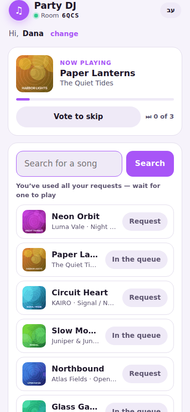<br><sub>Party DJ on a phone</sub></td>
    <td align="center">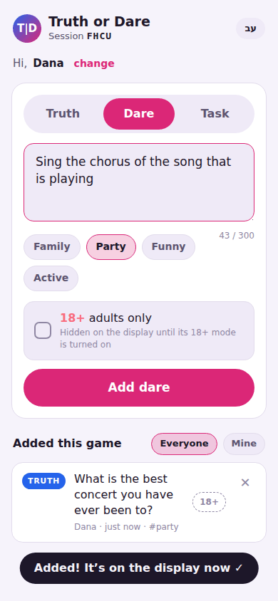<br><sub>Truth or Dare / Tasks on a phone</sub></td>
    <td align="center"><br><sub>Collection: add a game by barcode</sub></td>
  </tr>
  <tr>
    <td align="center"><br><sub>Notes Game: the explainer's note</sub></td>
    <td align="center"><br><sub>Code Words: the spymaster's key</sub></td>
    <td align="center">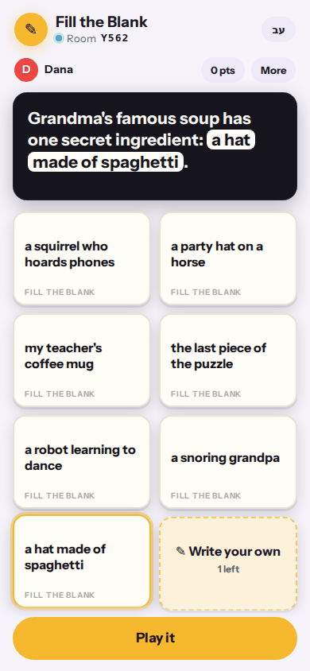<br><sub>Fill the Blank: your hand</sub></td>
  </tr>
</table>

Several apps let guests join from their phones by scanning a QR code on the round display. The phone pages are small self-contained pages **served by the bridge** (English / עברית switch, no internet needed, no app to install). Phone and display must be on the same network; without the bridge each app says so and works on the display alone.

**Tasks / Truth or Dare.** Tap **Phones** in the Tasks app: the round display shows a QR code for `http://<bridge LAN address>:8765/tasks?s=<session>`. Players scan it, type their name once, and add items in English or Hebrew (tick **18+ adults only** for an adult one; tap *18+* on your own items to mark or unmark them); they pop up on the display within a few seconds with the player's name. **New game session** (Tasks → Options, or on the QR page) starts a new session, and the **All / This session** filter picks between everything ever added and what this game added.

- The bridge keeps everything forever in `bridge/tasks.json`, including the displays' edits of the built-in items (e.g. one marked 18+), so every display learns them (deleted items stay as small tombstones so every display learns about the deletion). The display keeps its own copy too, so the lists and the game work without the bridge.
- If the QR code shows the wrong address (e.g. a VPN or Docker interface), set it in `bridge/config.json`: `"tasks": { "publicUrl": "http://192.168.1.50:8765" }` (`"file"` changes where the list is stored).
- API: `GET /api/tasks/info`, `GET /api/tasks?since=<rev>[&session=<id>]`, `POST /api/tasks`, `PUT|DELETE /api/tasks/<id>` (see `bridge/lib/tasks.js`).

**Collection.** Upload a spreadsheet export or scan a barcode at `http://<bridge>:8765/collection` (see [Collection & platform connections](#collection--platform-connections)).

**Party DJ, Movie Night and Trivia Night.** The round display shows a QR code for `http://<bridge LAN address>:8765/dj` (or `/movienight`, `/trivia`) with the display's room code. The pages reconnect by themselves when a phone wakes up.

- The display is in charge: it keeps the queue, votes and scores (so it also works without phones) and publishes a public state; each phone gets its own view of it over Server-Sent Events (or by polling). Phone actions go to the bridge, which stamps them with its own clock and relays them to the display. **Trivia buzzers are ranked by when they reach the bridge**, and multiple-choice speed points are measured from when the bridge published the question, so a slow display can't change who was first.
- **Party DJ searches on the display**: a phone's search is relayed to the display, which searches the music service that's playing and sends the results back to that phone only (service sign-ins never leave the display). Requests typed as "artist – song" are looked up when it's their turn.
- Rooms live in the bridge's memory for the evening; the display keeps its own copy and claims its room again after a bridge restart. Artwork from Plex / Jellyfin is shrunk on the display before it's sent, so server tokens never reach guests' phones.
- Wrong address in the QR code (VPN, Docker)? Set `"party": { "publicUrl": "http://192.168.1.50:8765" }` in `bridge/config.json` (`"dj"`, `"movienight"` or `"trivia"` override it per app).
- Trivia host mode: *My questions → Add from a phone* shows a host-only QR code (`/trivia?r=<room>&host=<key>`) with a form for adding your own questions.
- No bridge? Each app runs in "pass the remote" mode on the display.
- Code: `bridge/lib/party.js` (rooms, relay, SSE, shared phone-page shell), `bridge/lib/dj.js`, `movienight.js`, `trivia.js`; display side `apps/party-link.js`. Routes: `GET /<app>?r=<room>`, `/api/<app>/info|room|state|host|inbox|reply|events|act`.
- **Fill the Blank** (Games) uses the same rooms at `/blanks?r=<room>`; each phone only ever receives its own hand. Its packs API (`bridge/lib/blanks.js`, stored in `bridge/blanks.json`, `"blanks": { "file": … }` to move it): `GET /api/blanks/packs`, `GET /api/blanks/pack?id=house|<id>`, `POST /api/blanks/packs` (`{ pack }` or `{ url }` — public links only), `POST /api/blanks/house` (add a card from a phone); removing packs or house cards needs the display's room key.

**Notes Game and Code Words** (Games) use the same rooms too, at `/petakiot?r=<room>` and `/codewords?r=<room>` (`bridge/lib/petakiot.js`, `bridge/lib/codewords.js`).

- **Notes Game:** type your name, pick a team (or *Any team*, and the game balances them), then write your notes or tap ideas from the starter pack. Each phone sees only its own notes. On your turn your phone shows the note with big **✓ Got it** and **⤼ Skip** buttons; only the explainer's phone ever gets the note, and the others see the timer and whose turn it is.
- **Code Words:** pick a team and a role. Only **spymasters'** phones get the key, and the spymaster types the clue and its number there. Operatives tap the cards on the display, or vote on their phones when *Guessing* is set to *Phones vote*.

**Key pages that need no bridge.** Two small static pages rebuild a key from the code in their link, so they work anywhere, GitHub Pages included: `games/phone/codewords-key.html` (Code Words in *One device* mode: the spymasters scan the key QR) and `apps/phone/codekey.html` (the key cards of the Board Games **Codenames** companion).

---

## Controls: touch, keyboard and knob

| Where | What to do |
|---|---|
| Edge ring | Drag around the circle to seek |
| Bottom row | Previous · Play/Pause · Next; below them the view buttons (Info, Vinyl, Lyrics, Video, Tone Visual, Fun Facts) |
| Top buttons | Services (Home) · Playlists · Search · Devices |
| Left button | Volume dial (drag around, −/+, or mouse wheel) |
| Right button | **⋯** in Info/Vinyl/Video, **Aa** in Lyrics (see [Search, volume, playlists and devices](#search-volume-playlists-and-devices)) |
| Info / Lyrics / Video | Swipe left or right to change view |
| Vinyl | Spin the record (or CD) to scrub; flick for momentum. Cassette: drag sideways or turn a reel to wind |
| Any view | The controls hide after a few seconds; tap to show them. Tapping lyrics doesn't skip |
| On-screen keyboard | **עב / EN** switches between English and Hebrew; **123** shows numbers and symbols |
| Home | ← → step through the buttons, ↑ ↓ move between the menu rows, Enter opens |
| Games, Rhythm, Apps | Arrows, Space and Enter; games that turn something around the circle also take ← → or the scroll wheel |

**Keyboard / rotary encoder in the music player** (a rotary encoder can be mapped to keys, e.g. with `gpio-keys`):

- <kbd>Space</kbd> (or <kbd>K</kbd>) play/pause
- <kbd>←</kbd>/<kbd>→</kbd> ±10 s
- <kbd>↑</kbd>/<kbd>↓</kbd> volume
- <kbd>N</kbd>/<kbd>P</kbd> next/previous
- <kbd>1</kbd> … <kbd>6</kbd> Info / Vinyl / Lyrics / Video / Tone Visual / Fun Facts
- <kbd>L</kbd> next lyric style
- <kbd>V</kbd> volume
- <kbd>/</kbd> search
- <kbd>B</kbd> playlists
- <kbd>Esc</kbd> back

In **Movies & TV**, <kbd>←</kbd>/<kbd>→</kbd> skip back / forward by your skip settings, <kbd>L</kbd> opens the Library, and the rest work as in the music player. Media keys (play/pause, next, previous) work too.

---

## Troubleshooting

| Problem | Fix |
|---|---|
| Spotify: **INVALID_CLIENT: Invalid redirect URI** | Add exactly the address shown on the Spotify screen to *Redirect URIs* in the dashboard, then save. |
| Spotify: sign-in works but nothing loads / **403** | Add your account under *User Management* in the Spotify dashboard. The app owner needs Premium. |
| Spotify: "No active device" | Open Spotify on any device, pick one under **Devices**, or play on "This display". |
| "This browser can't play Spotify audio" | The browser lacks Widevine DRM. Remote control still works. On the Pi, install `libwidevinecdm0`. |
| YouTube: "That code wasn't accepted" | Codes expire after a few minutes. Get a new one from the TV (YouTube → Settings → Link with TV code) and enter it straight away. |
| A bridge tile says **Bridge not found** | Start the bridge (`start-bridge.bat` / `.sh`, or the Pi service). In Chrome, allow *local network access*. If you blocked it, re-enable it via the lock icon → *Site settings*. |
| Plex (Movies & TV): "… didn't take the command" while the TV is playing | Open **⋯ → Test the player**: it tries reaching the Plex app through your server and directly (through the bridge) and shows which way works. If neither does, open the Plex app on the TV → **Settings → Advanced** and turn on **Advertise as player** (called *Remote control* / *Network discovery* in some versions), then restart the Plex app. Meanwhile, if the TV is paired under Media → Google TV (or Apple TV), play/pause, next/previous and skip go through the TV's own remote. |
| Jellyfin/Plex on `http://` doesn't connect from GitHub Pages | Use Chrome/Edge and allow local network access, use an `https://` address, or run the bridge. |
| YouTube: "Add a YouTube API key" | See [YouTube](#youtube-and-youtube-music). |
| YouTube: "quota used up" | The free daily quota resets at midnight Pacific time. |
| Video view shows only the blurred artwork | No embeddable music video was found for that song, or no API key is set. |
| Icons show initials | The logos haven't been downloaded yet (first run while offline, or a blocker stopping jsDelivr/unpkg). They appear once they've loaded; after that they work offline. |
| Computer tile: Cider not found | In Cider: *Settings → Connectivity* → turn on the API; put its app token in `bridge/config.json → cider.token` (or turn off *Require API tokens*); restart the bridge. |
| Computer tile: nothing listed on the Pi | `sudo apt install playerctl`, then start playing something in the app. |
| Computer tile: nothing listed on Windows | Play something first; apps only appear in the Windows media flyout while they have something loaded. |
| PlayStation asks for a new token | The sign-in lasts about two months, and changing your PSN password ends it. Get a fresh NPSSO (see [PlayStation](#playstation)). |
| Steam shows no games or friends | Set *My profile*, *Game details* and *Friends list* to **Public** in Steam's privacy settings. |
| A phone can't open the QR code page | Phone and display must be on the same network. If the address in the QR code is wrong (VPN, Docker), set `publicUrl` for that app in `bridge/config.json` (see [Phone pages](#phone-pages)). |
| Rhythm: "Needs the bridge" / nothing to listen to | Start the bridge, or pick another way under **Learn from** (microphone, tempo / tap). For the bridge to hear the computer, see [Rhythm: let the bridge hear your music](#rhythm-let-the-bridge-hear-your-music). |
| The site still shows an old version | Reload once or twice; the offline cache updates itself in the background. |
| Something's wrong with the bridge, the network or a service | Open *Settings → Profiles & about → **Diagnostics***, or `http://<bridge>:8765/diag` on any browser. It reports the role, versions, data folder, every adapter, the network interfaces, what mDNS / SSDP found, whether your Plex / Jellyfin / Home Assistant answer and, on a Pi, Wi-Fi, Bluetooth, sound, display and update state. It never shows passwords or tokens. **Copy** gives the whole report (JSON: `GET /api/diag`). |
| Docker server problems | See [Troubleshooting the server](#troubleshooting-the-server). |

---

## Honest limits

- **Netflix and Disney+** have no public API. The tiles show what the TV reports: full titles and episodes on an Apple TV, what the app casts on a Chromecast, and only the app's name on a Google TV. They can open the app, but can't search or start a particular title.
- **Google Home** has no public web API for listing or directly controlling your devices, so the Google Home tile works through Google Assistant commands. For device-by-device control, the same devices usually have a Home Assistant integration (or can be shared to Home Assistant over Matter).
- **Movies & TV control depends on the app on the TV.**
  - Plex: the Plex app must allow remote control ("Advertise as player", on by default in Plex for Android/Google TV, Apple TV and Plex HTPC). The Plex web app in a browser can't be controlled.
  - Jellyfin: any client that shows up as remote-controllable.
  - Chromecast: shows what the casting app reports. Netflix, for example, sends only a title.
  - Netflix, Disney+ and other streaming apps opened *directly on the TV* don't report what's playing to Google TV. On an Apple TV they do.
- **AirPlay to the Pi** is audio only (the Pi becomes a speaker). Movies AirPlayed to an **Apple TV** show up in *AirPlay · Apple TV*.
- **Spotify Canvas** (the short looping videos) and **Apple Music motion artwork** aren't available to third-party apps through the official APIs. Video view uses the song's official music video from YouTube instead.
- **Tidal and Qobuz** have no public remote-control API; they're controlled through Roon, Cast, UPnP or AirPlay.
- **YouTube on a TV** uses YouTube's undocumented TV-linking protocol and could stop working after a YouTube update. It hasn't been tested with a real TV yet.
- **AirPlay:** no seeking. **Cast:** next/previous depends on the casting app.
- **Apple Music with MusicKit** plays on the display itself. To control Apple Music elsewhere, use Cider, Sidra or the Apple Music app for Windows through the bridge (the Computer tile).
- **The Computer tile** (Cider API, Windows media controls, MPRIS) was tested with stand-ins that follow each interface, not yet with the real apps.
- **Rhythm games and streaming services:** Spotify, Apple Music and YouTube Music don't give apps the audio or (any more) an analysis of a song, so the app can't learn those songs faster than real time: it listens once (microphone or bridge) or works from the tempo. Timing follows the service's reported play position, which is less exact than local audio; the judgement windows widen a little for remote services, and *Settings → Rhythm → latency* fine-tunes it. Plex, Jellyfin and the Demo are learned from the audio itself.
- **Hitster years** were checked by hand but not yet against an online database (it was unreachable while building); a wrong year or two is possible, more likely among the Israeli songs, which were added from memory. To check them all against MusicBrainz (both decks, Hebrew and Latin spellings), run `node bridge/tools/verify-hit-years.mjs > report.txt` from the RoundRemote folder (takes about 15 minutes). The songs' genre and language tags were also written by hand. Songs from *Update songs* come from Wikidata as they are there (the earliest publication date of the song or single, the genres mapped by keyword), the most popular ones (most Wikipedia articles) first.
- **PlayStation** uses the PlayStation App's own (unofficial) endpoints, like psn-api, PSN-tracking sites and Home Assistant's PlayStation Network integration; Sony could change them. Waking the PS5 needs Home Assistant (ps5-mqtt) or playactor, and only works from rest mode. PlayStation and Steam were built against the documented endpoints and tested with mock servers, not yet with real accounts.
- **The music streamer (Fosi S3)** uses StreamUnlimited's StreamSDK web API, the one its own web page uses; it isn't a documented public API. It was built from the S3's live answers and its web page, and tested with a mock streamer: volume, mute, play/pause/skip and the source list follow the S3's real data, but switching the output, standby (`powermanager:target`), shuffle / repeat and the live change events haven't been tried on the real S3 yet. A password-protected web page isn't supported. There's no seeking (the streamer's apps don't seek either for most sources).
- **Steam** shows only what your privacy settings make public. Unlocking achievements (as some third-party tools do) is deliberately not included.
- **Collection connections** were built against each service's documented API and tested with mock servers; RAWG in particular hasn't been tried against the live service yet. The barcode lookup uses UPCitemdb's free trial, which allows about 100 lookups a day.
- **The Raspberry Pi system layer** (installer, Wi-Fi / hotspot, Bluetooth, sound, battery boards, motion sensor, screen off, updates) was built from the tools' documented output formats and tested with stand-ins that replay them (nmcli, bluetoothctl, wpctl, wlr-randr, i2c-tools, pisugar-server, simulated sensors) and an installer dry run, not yet on a real Pi with the round screen. The HDMI mode, the captive-portal pop-up on phones, Bluetooth pairing with real devices and the battery curves are the parts most likely to need tuning.
- The Demo and the bridge were tested with fake zones. The Roon, UPnP, Cast, shairport-sync and YouTube paths follow each service's documented API but haven't been tested against real accounts and hardware yet.

---

## Project structure

```text
index.html, css/app.css         round UI (everything sized in cqmin → scales to any circle); css/themes.css = the 11 themes (js/core/theme.js sets their colours);
                                css/vinyl.css, decks.css, consoles.css, streamer.css for the vinyl / cassette / CD players, the console and streamer screens
js/main.js                      boot, sign-in redirects, shortcuts, idle dimming
js/core/                        settings/tokens (store), player controller, router, colours, theme, YouTube helper, sound (Tone Visual), songinfo (facts, photos, year),
                                mediainfo (movie & show facts), profiles (settings profiles), languages (subtitle languages), alerts (smart-home alerts), tvapp, nav,
                                device (the Pi system API client), orientation (screen rotation), power (Battery saver, screen off),
                                companion (a Pi that goes through a Round Remote server: "Server offline" overlay, Home dot)
js/providers/                   one file per service + the bridge client (common interface in base.js); plex-media.js / jellyfin-media.js add the Movies & TV library;
                                streaming.js = Netflix / Disney+ / YouTube; homeassistant.js / googlehome.js / playstation.js / steam.js / streamer.js are the Home services
js/views/                       info, vinyl (+ vinyl-styles.js; decks.js + deck-styles.js: the cassette and CD players), lyrics (+ lyrics-extra.js, lyrics-kinetic2.js,
                                lyrics-kinetic3.js, lyrics-crt.js), video, tone (+ tone-visuals.js), facts, media-library + media-views (the 9 library views), ha-controls
js/lyrics/                      lrc.js (LRC parser + LRCLIB lookup), bidi.js (right-to-left lines)
js/screens/                     home, player, media (Movies & TV) + media-panels, smarthome (Home), consoles (PlayStation & Steam), streamer (the music streamer),
                                panels, connect, setup-remote (set up from a phone / computer), settings + settings-alerts + settings-device (Settings → Device, Screen rotation, Battery saver),
                                settings-diagnostics (Profiles & about → Diagnostics), settings-server (Connection → Server: own bridge or a Round Remote server)
js/ui/                          dom helpers, icons, overlay (panels, toasts), the round on-screen keyboard, Home backgrounds (backdrops*.js)
games/                          the Games category: index.js (the list), hub.js (the Games ring), shell.js (start card, pause, game over, top 5), kit.js (sound + drawing
                                helpers), scores.js, games.css, and one file per game (+ level / generator helpers); the party games petakiot.js (Notes Game),
                                codewords.js and blanks.js (Fill the Blank) with their word lists and card packs, and phone/codewords-key.html (the static key page)
rhythm/                         the Rhythm category: index.js (the list), hub.js (the Rhythm screen), library.js (the Library of learned songs), session.js + store.js
                                (learned songs & versions, IndexedDB), clock.js (song time), kit.js (rhythm-game runtime), analyzer.js + dsp-*.js (song analysis),
                                chart.js + charts*.js (levels, the chart library), synth.js (Demo music), bridge-audio.js, hits*.js (Hitster), and one file per game
apps/                           the Apps category: index.js (the list), hub.js (the Apps ring), shell.js (the app screen), qr.js (QR codes), party-link.js (phone rooms),
                                clock-ring.js (the shared ringing screen), and one file per app with its helpers and css; Board Games: bg-games.js (the 17 companions),
                                bg-*.js (one per companion), bg-rules.js (the 45 rules) and phone/codekey.html (the Codenames key page)
bridge/                         Node bridge: server.js + adapters/ (roon, upnp, cast, youtubetv, androidtv, appletv, googlehome, psn, steam, streamsdk, airplay, cider,
                                mpris, winmedia, mock) + lib/ (tasks, collection, party, dj, movienight, trivia, petakiot, codewords, blanks, audio, charts, hub, util, system + system-* = the Pi system API, setup + setup-page = phone / computer setup, paths = where state lives (RR_DATA_DIR) and the role, diag + diag-page = /api/diag and /diag, server-role = the Docker update check, proxy + companion + companion-page = a Pi as a companion of a server (proxy, /api/companion, the "Server offline" page), discovery = _roundremote._tcp over mDNS) + companion.js (the light companion for a Pi Zero 2 W) + tools/ + settings profiles
pi/                             the Pi appliance: install.sh (one-shot installer; setup.sh runs it), kiosk.sh (cage + Chromium), netcheck.sh (Wi-Fi
                                setup hotspot), update.sh, roundremote-helper.sh (the root helper), imu.py (motion sensor), rr-tool.py (EDID, hidden cursor,
                                touch wake), systemd units (roundremote-companion.service for --mode=companion) and conf/ (sudoers, polkit, PAM, WirePlumber, captive-portal DNS)
sounds/, icons/                 the alert chime; app icons
sw.js, manifest.webmanifest     offline support + installable app
screenshots/                    images used in this README
start-bridge.bat / .sh          run the bridge on a Windows / Mac / Linux computer
Dockerfile, .dockerignore       the server image (bridge + app; state in the /data volume); docker/entrypoint.sh drops root to PUID:PGID
docker-compose.yml              the server for a NAS / Portainer stack (host networking); .github/workflows/docker.yml publishes ghcr.io/royborkin/roundremote
```

Plain ES modules with no build step and no front-end libraries: the folder is the app.

---

## Privacy & security

- **Your accounts stay with you.** Service sign-ins (Spotify, Apple Music, Google, Plex, Jellyfin, Home Assistant) are kept in the browser of the display that signed in, and talk to each service directly (or through your own bridge). There is no Round Remote server, account or analytics.
- **Keys and tokens for bridge services stay on the bridge.** The PlayStation sign-in (`bridge/psn.json`), the Steam Web API key (`bridge/steam.json`), Google Home (`bridge/googlehome.json`), the Collection tokens for BoardGameGeek, PriceCharting, RAWG, Discogs and TMDB (`bridge/collection.json`), YouTube TV links, TV pairings and settings profiles are files on the computer that runs the bridge. The app never sees the Steam key, and each Collection token is only ever sent to its own service. The repository's `.gitignore` keeps these files (and `bridge/config.json`) out of git (see [The bridge](#the-bridge)); treat the NPSSO token like a password.
- **The bridge only answers your own pages:** the same machine, your LAN, and the origins in `allowedOrigins`.
- **Guests' phones get only what they need.** Phone pages are served on your LAN by the bridge. Party DJ searches run on the display, so service sign-ins never leave it, and Plex / Jellyfin artwork is shrunk on the display before it's sent, so server tokens never reach guests' phones.
- **Settings profiles** can include your sign-ins only when you tick *Include sign-ins*; keep such a profile file private.
- **The TV Remote app** (Google TV without the bridge) has no password, like ADB: keep it on your home network.
- **Online look-ups** send only what they need to: song titles and artists to LRCLIB, Wikipedia, MusicBrainz, Deezer and YouTube; book titles to Open Library; barcodes to UPCitemdb; song names to Chorus Encore (through your bridge).

---

## Credits & third-party notes

- **Fonts** (loaded from Google Fonts; each keeps its own license, the SIL Open Font License 1.1 unless noted): Inter, JetBrains Mono, Space Grotesk, Playfair Display, Oswald, League Spartan, Permanent Marker (Apache License 2.0), Amatic SC, Rubik, Karantina, Frank Ruhl Libre, Alfa Slab One, Suez One, Rubik Dirt, Bangers, VT323, Outfit, Manrope, Plus Jakarta Sans, Figtree and Archivo.
- **Platform logos:** [Simple Icons](https://simpleicons.org) (CC0), downloaded at run time from jsDelivr / unpkg. The logos themselves are trademarks of their owners.
- **Loaded at run time from their owners, under their own terms:** the Spotify Web Playback SDK, Apple MusicKit JS, the YouTube IFrame player and Google Identity Services.
- **Data and services:** [LRCLIB](https://lrclib.net) (lyrics), Wikipedia, Wikimedia Commons and Wikidata, MusicBrainz, Deezer, ReccoBeats, the YouTube Data API, Open Library, the iTunes Search API, [Open Trivia DB](https://opentdb.com), [Chorus Encore](https://enchor.us) (fan-made charts, credited to their charters), UPCitemdb, BoardGameGeek, PriceCharting, RAWG, the Steam Web API and the PlayStation Network. Each is used under its own terms.
- **Bridge dependencies:** `castv2-client` and `multicast-dns` (npm), optional `androidtv-remote`, the Roon extension API (`node-roon-api`), and external tools when you install them: [pyatv](https://pyatv.dev), shairport-sync, playerctl, ffmpeg and playactor. Each keeps its own license.
- **The Demo** songs, lyrics, artwork and music are original and generated by the app. Game names, characters and art are original; several games are round takes on well-known classics, and Zoo Splash and RPS Battle are inspired by the classic ICQ games Zoopaloola and RPS. The board-game rules are written in our own words.
- **Screenshots** were taken in Demo mode with generated sample data and mock services.

---

## Copyright & license

© 2026 Roy Borkin. All rights reserved.

This project (the source code, its design and the documentation) is proprietary. **No permission is granted** to copy, modify, merge, publish, distribute, sublicense, sell or otherwise use any part of it, except for viewing it on GitHub and for personal use by the author. See [LICENSE](LICENSE).

Spotify, Apple Music, iTunes, Apple TV, AirPlay, YouTube, YouTube Music, Google, Google Home, Google TV, Chromecast, Plex, Plexamp, Jellyfin, Roon, TIDAL, Qobuz, Netflix, Disney+, Home Assistant, PlayStation, PS5, Steam, BoardGameGeek, PriceCharting, RAWG, GamEye, CLZ, Grouvee, BG Stats, Hitster, Fosi Audio, StreamUnlimited, Cider and all other product names, logos and brands mentioned here are trademarks or registered trademarks of their respective owners. They are used only to describe what the app works with. **Round Remote is not affiliated with, endorsed by or sponsored by any of them.**

The fonts, logos, libraries and services listed under [Credits & third-party notes](#credits--third-party-notes) keep their own licenses and terms.
