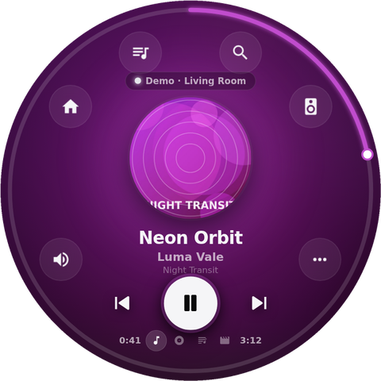
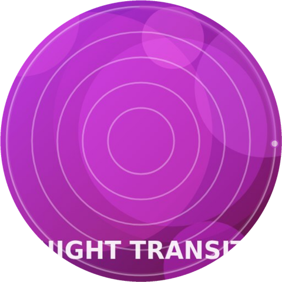
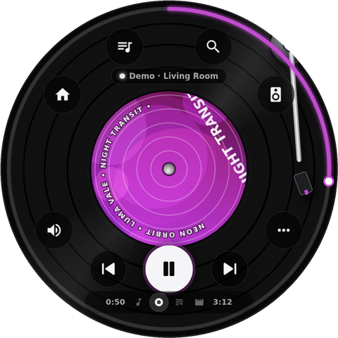
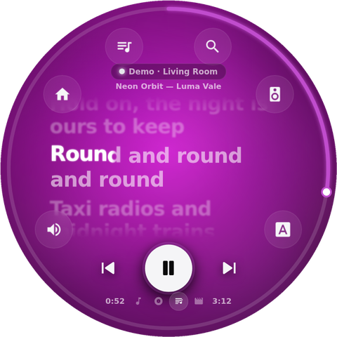
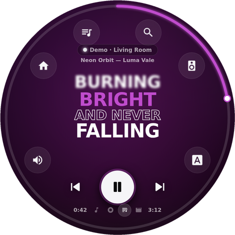
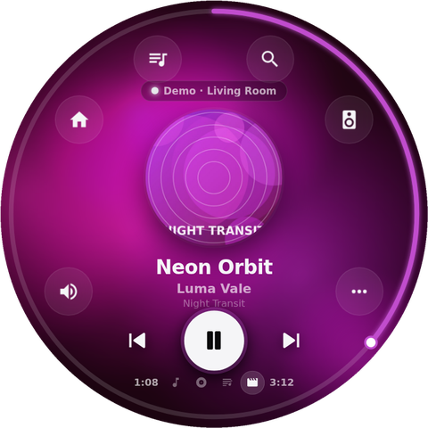
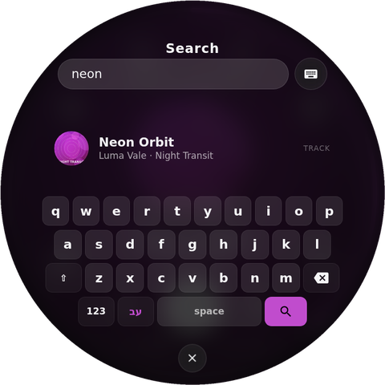
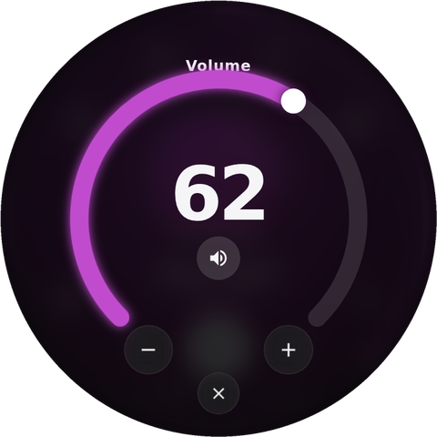
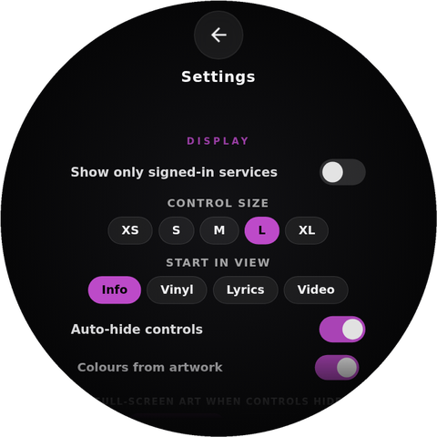

# Round Remote

A circular touch remote for your music services, built for a Raspberry Pi with a 4" round 720×720 touch display. It also runs as an ordinary web page, for example on GitHub Pages.

**▶ Try it: [royborkin.github.io/RoundSpotify](https://royborkin.github.io/RoundSpotify/)** (tap **Demo** to try it without an account)

## Screenshots

| Info | Info, controls hidden | Vinyl |
|:---:|:---:|:---:|
|  |  |  |
| **Lyrics: Fluid** | **Lyrics: Kinetic Type (Stack)** | **Video** |
|  |  |  |
| **Search + round keyboard** | **Volume dial** | **Settings** |
|  |  |  |

*Screenshots show Demo mode on a 720×720 round screen.*

Sign in to each service once. After that, one round screen lets you:
- control volume and seek
- skip forward and back
- pick playlists and devices
- search

The current song can be shown **six ways**:

1. **Info (classic):** round artwork, title, artist and album. The accent colour is taken from the artwork. When the controls hide, you choose what fills the screen:
   - the artwork, *clear* or as a *milky blur*, or
   - a **song info card** with the song, artist, album, year and time left, on *black* or on the *blurred artwork*.

   You can also hide the round artwork in the middle, and turn off the controls hiding by themselves in Classic view only.
2. **Vinyl:** the whole screen becomes a record.
   - Spin it with your finger to scrub back or forward; a flick keeps it coasting.
   - The tone arm follows the song and hides with the controls. To keep it visible, turn off *Hide the arm with the controls* in the ⋯ panel or in Settings.
   - **Record speed** (45 / 33⅓ / 16 / 8 / 4 rpm) sets both the spin and how far one turn scratches, so the record always moves with the music.
   - A slider sets the centre artwork size, from none to full screen.
   - The song title around the label can be turned off.
3. **Lyrics:** synced lyrics in six styles:
   - **Basic**, **Typing** (typewriter) and **Roll** (3D drum).
   - **Fluid**, in the spirit of Lyricify / BetterLyrics: a flowing album-art colour field, lines that glide in a staggered cascade, and words that fill with a soft glow and lift as they're sung. Long notes glow letter by letter.
   - **Kinetic Type**, lyric-video typography with thirteen variants:
     - **Stack:** full-width words stacked like a poster.
     - **Camera:** the view pans, zooms and turns 90° between phrases.
     - **Slam:** one huge word at a time.
     - **Mosaic:** each word snaps onto the edge of the block, some turned sideways, in mixed typefaces, building an interlocking word puzzle (classic After Effects lyric-video style).
     - **Black & White:** heavy caps on black with a new scene for every line: giant words the camera flies through, words ticking along a rule, words around a planet or riding a wave, a block inside a ring, and black-on-white blocks with an hourglass wipe.
     - **Hand-drawn:** flat mint / indigo / pink palettes that change with a paint-splash wipe; small hand-lettered words over one big brush word that writes itself on, staircases and little planets; everything jitters like frame-by-frame animation.
     - **Pop:** flat bright colour screens that change with a circular wipe; one huge striped-3D word with the small words stacked beside it, single-word slams with paint drops, and mixed-typeface stacks.
     - **Pastel:** pink, lavender and yellow with rough brush letters; the line arrives as chat bubbles, with a highlighter swiped behind each word, over a repeating word wallpaper, inside pulsing hearts, or in a grid of tiles with doodles.
     - **Comic:** Spider-Verse-style comic caption boxes with hard black shadows on a night halftone sky; big words get a burst and an RGB glitch, and it all moves "on twos" like the film.
     - **Neon Drive:** synthwave: words fly toward you down a neon road, flicker in a neon kaleidoscope, glow on a striped retro sun, or appear under a magnifying lens gliding over the blurred lyrics.
     - **Animated:** karaoke fill.
     - **Moving Words**.
     - **Random:** a different variant for every line. It goes through all of them in a shuffled order before any repeats. Choose which variants it uses in *Settings → Lyrics → Random includes*.
   - **CRT TV:** the lyrics on an old tube television: scanlines, RGB fringing and phosphor glow, live static, a rolling hum bar and flicker. Each new line changes channel (the picture collapses to a bright line and springs back), a tracking tear slides across now and then, and a VHS on-screen display (channel, ▶ PLAY, tape counter, SP) shows while the controls are hidden.
   - **Hebrew and other right-to-left lyrics** are detected line by line and shown right to left in every style: word order, typing, the karaoke fill, staircases and Mosaic all run from the right, and a line that mixes in an English word still reads correctly. Hebrew letters use Rubik, Karantina, Frank Ruhl Libre and Amatic SC. The Demo has a Hebrew song to try it: **אור על המים** (playlist *בעברית · Hebrew*).
4. **Video:** like the classic view, but the background is a video:
   - **YouTube / YouTube Music:** the song's own video.
   - **Every other service:** the song's official music video, found on YouTube, played muted and kept in sync with the song. This needs the free YouTube API key (see below).
   - **Demo:** a generated colour loop.
   - **Video types:** pick one or more of *Official clip*, *Abstract* (visualizers and animated videos), *Live*, *Fan made*, *Album cover* (the song with its cover art) and *Lyric video*. Every YouTube result is sorted into one of these from its title and channel, and only the types you picked are used. With several picked, each song tries them in its own order, so a playlist gets a mix. Covers by other artists, karaoke, remixes, slowed/sped-up versions, loops, shorts and videos much longer or shorter than the song are always skipped.
   - **No suggestion screens:** the last 20 seconds of a video (where YouTube puts its end screens) are never played; it loops before them. The video fades out while the song is paused, so YouTube's "More videos" panel never shows.
   - **Photo slideshow** (instead of a video): photos of the artist and album from Wikipedia, Wikimedia Commons and Deezer, crossfading with a slow zoom.
   - **Prefer the official clip** (on by default): when a song has an official clip, it's used first, whatever else you picked; the other types are the fallback.
   - **Show song info when the controls hide** (off by default): the song name, artist, album and time left, with a small progress bar, over the video.
   - The round artwork on top can be hidden.
5. **Tone Visual:** abstract shapes and colours that move with the music, in eight styles:
   - **Ferrofluid:** black magnetic liquid in a glowing lamp. Spikes rise with the bass; the fluid pulls together when it's loud and breaks into droplets when it's quiet.
   - **Liquid Sphere:** a 3D sphere whose surface bulges and ripples with the music.
   - **Spectrum Bars:** thin grey frequency bars on black with a faint reflection.
   - **Dot Ripple:** a 3D disc of dots; every beat sends a ripple out from the centre.
   - **Cymatics:** sand on a vibrating plate gathers on the still lines and draws Chladni figures that change with the sound.
   - **Halo:** spectrum bars in a ring around the album art, with ripples and sparks on the beat.
   - **Aurora:** flowing colour smoke mixed from the album art's own colours.
   - **Oscilloscope:** a glowing green phosphor trace.

   **Where the sound comes from.** This is a remote: the music plays on your speaker, TV or phone, so the app never receives the audio itself. Pick the source in the Tone Visual panel (the button on the right) or in Settings:
   - **Simulated** (default): follows the song's playback — a beat at a tempo picked for each song, bass, melody and louder/quieter sections. It pauses, seeks and changes songs with the music, but it doesn't hear it.
   - **Microphone (live):** listens to the room and reacts to the real sound. On the Pi, plug in a USB microphone; the kiosk script allows it automatically. In a browser, allow microphone access when asked.

   Liquid Sphere and Aurora use WebGL. With *Reduce effects* on, every style draws at a lower resolution with fewer particles for the Pi 3.
6. **Fun Facts:** facts about the song, the album and the artist, one at a time over the blurred artwork: from Wikipedia (in Hebrew for Hebrew songs) and MusicBrainz (release date, how many releases, where the artist is from, when they started, genres). Choose how long each fact stays (6–60 s) in the Fun Facts panel or in Settings; tap a fact to skip to the next one. The timer rests while the music is paused.

In every view the controls hide by themselves after a few seconds; tap the screen to bring them back. The *Service · Device* line near the top can be turned off in Settings. The lyrics source label was removed. The ring around the edge is the seek bar: drag it around the circle.

---

## Contents

1. [Services](#services)
2. [Put it on GitHub Pages](#1-put-it-on-github-pages)
3. [Set up each service](#2-set-up-each-service)
4. [The bridge (Roon, UPnP, Cast, AirPlay, Apple TV, Google TV, Google Home, Tidal, Qobuz)](#3-the-bridge)
5. [Raspberry Pi kiosk](#4-raspberry-pi-kiosk)
6. [Using the app](#5-using-the-app)
7. [Troubleshooting](#6-troubleshooting)
8. [Honest limits](#7-honest-limits)
9. [Project layout](#8-project-layout)

---

## Services

| Service | How it connects | Works from GitHub Pages? |
|---|---|---|
| **Spotify** | Web API (sign in once). Controls any of your Spotify devices, and the page itself can be a Spotify speaker. | ✅ |
| **Apple Music** | Either remote-controls Apple Music on a computer — **Cider**, **Sidra** or the **Apple Music app for Windows** — with no developer token, or plays it *on this display* with MusicKit (needs a developer token). | ✅ MusicKit; the computer option needs the bridge |
| **YouTube Music** | YouTube player on this display (search and your playlists), **the YouTube app on your TV** once it's linked with a TV code, or **a browser tab on your computer** playing YouTube Music. | ✅ (free API key); TV and computer need the bridge |
| **YouTube** | Same, for any YouTube video. | ✅ (free API key); TV and computer need the bridge |
| **Plex / Plexamp** | Sign in with a plex.tv code. Controls Plexamp (incl. headless) and Plex players through your server. | ✅ |
| **Jellyfin** | Quick Connect or username/password. Controls any Jellyfin app session and uses server lyrics when available. | ✅ (see [Jellyfin](#jellyfin) for http servers) |
| **Roon** | Official Roon extension API: zones, volume, playlists and search. | Needs the bridge |
| **UPnP / DLNA** | Standard AV renderers: WiiM, Bluesound, Denon/Marantz, BubbleUPnP, Volumio, moOde… | Needs the bridge |
| **Google Cast** | Chromecast, Nest and Cast speakers. Shows and controls whatever is *cast* to them (for apps opened directly on the TV, see [YouTube on your TV](#youtube-on-your-tv-google-tv-android-tv-smart-tvs-consoles)). | Needs the bridge |
| **AirPlay 1/2** | The Pi becomes an AirPlay speaker (shairport-sync) and controls the phone or Mac that's streaming. | Linux/Pi bridge only |
| **Tidal** | No public remote-control API. The tile follows TIDAL playing through Roon, Cast, UPnP or AirPlay. | Needs the bridge |
| **Qobuz** | Qobuz Connect is closed to third parties. Same approach as Tidal. | Needs the bridge |
| **Computer** | Music and video apps on the computer running the bridge: Apple Music (Cider, Sidra, the Windows app, iTunes), Spotify desktop, YouTube / YouTube Music in Chrome, Edge or Firefox, VLC, TIDAL desktop… Uses the system's own media controls (Windows media sessions, or MPRIS on Linux / the Pi) plus Cider's API. | Needs the bridge |
| **Demo** | Fictional songs with original lyrics. Try everything without an account. | ✅ |

The home screen has four categories under the clock:
- **Music**;
- **Media** (movies & TV);
- **Home** (smart home);
- **Settings**.

Tap one, or swipe sideways to move between Music, Media and Home. Each shows its own services around the ring.

### Media (movies & TV)

| Service | What you get | Works from GitHub Pages? |
|---|---|---|
| **Plex** | Now playing on any Plex player (Plex on your TV, Android/Google TV, Apple TV, Roku, Plex HTPC…) and your **Library**: libraries, Continue watching, Recently added, collections, search, details, cast, seasons and episodes, and *Play on the TV*. Same sign-in as the music Plex tile. | ✅ |
| **Jellyfin** | The same for Jellyfin clients (Jellyfin on your TV, Android TV, Jellyfin Media Player, the web app, Kodi…), plus *Next up*. Same sign-in as the music Jellyfin tile. | ✅ |
| **Chromecast** | Whatever is cast to a Chromecast or Google TV from any app: movie or show, season and episode, progress, skip, volume, stop. | Needs the bridge |
| **AirPlay · Apple TV** | The Apple TV and whatever is playing on it — from any app or AirPlayed to it: title, series, season, episode, progress, skip, volume, a D-pad remote and your apps. Uses [pyatv](https://pyatv.dev); pair once with the code on the TV. | Needs the bridge |
| **Google TV** | A full-screen remote for Google TV / Android TV (Chromecast with Google TV, Sony, TCL, Hisense, Philips, Shield…): D-pad, OK, Back, Home, power, volume, mute, play/pause and an app launcher, through the protocol the Google TV phone app uses. Pair once with the code on the TV. | Needs the bridge |

### Home (smart home)

| Service | What you get | Works from GitHub Pages? |
|---|---|---|
| **Home Assistant** | Your whole Home Assistant, live:<br>• **Favourites** (you pick them), **Rooms** (your HA areas) and **Scenes** (scenes, scripts, automations, buttons).<br>• Round controls: brightness and colours for lights, a temperature dial and modes for climate, position for blinds, speed for fans, locks, speakers (volume, play/pause, what's playing), cameras (live snapshots), vacuums, alarms, and big readings for sensors. | ✅ with an https address; an http address works through the bridge |
| **Google Home** | Your own command tiles for Google Assistant ("Turn off the kitchen lights", "Good night", "Set the thermostat to 22"), **Ask Google** anything, and **Broadcast** a message to your speakers. Answers show on screen and can be spoken. The **Speakers** tab has volume, play/pause and stop for your Google / Nest speakers and displays. | Needs the bridge (and a one-time Google sign-in for commands) |

On the home screen:
- a green dot means you're signed in;
- services that still need the bridge show a small **BRIDGE** tag;
- *Settings → Show only signed-in services* hides everything you haven't set up.
- *Settings → Show the Demo service* hides or shows the Demo tile.

The platform logos come from the free [Simple Icons](https://simpleicons.org) set (jsDelivr, with unpkg as a backup). They're downloaded once and then kept in the browser, so the Pi shows them offline too. Qobuz isn't in that set, so its tile keeps its letters. Tiles show letters until a logo has been downloaded once.

---

## 1. Put it on GitHub Pages

The app is published from the existing **RoundSpotify** repository, at **[royborkin.github.io/RoundSpotify](https://royborkin.github.io/RoundSpotify/)**.

1. Replace the old files in [github.com/RoyBorkin/RoundSpotify](https://github.com/RoyBorkin/RoundSpotify) with **the contents** of this folder. Either:
   - on the web: delete the old `spotifyround.html`, `applemusicround.html`, `Vinyl1.png` and `Vinyl2.jpg`. Then choose *Add file → Upload files*, drag everything from this folder in (it replaces `index.html`) and click *Commit changes*; or
   - with git (from the `music remote` folder):
     ```bash
     cd RoundSpotify
     git rm -q spotifyround.html applemusicround.html Vinyl1.png Vinyl2.jpg
     cp -r ../RoundRemote/. .
     git add -A && git commit -m "Round Remote 2"
     git push
     ```
2. Check that Pages is on: in the repository, open **Settings → Pages → Build and deployment → Source: Deploy from a branch → Branch: `main`, folder `/ (root)` → Save**.
3. After about a minute, the app is live at **https://royborkin.github.io/RoundSpotify/**.
4. Optional: in Chrome/Edge, click the *Install* icon in the address bar. It then opens full-screen like an app and also works offline.

To publish an update, upload the changed files again (or `git push`). If you still see the old version, reload once more; the offline cache refreshes in the background.

Tap **Demo** to try every screen straight away.

---

## 2. Set up each service

Settings are saved in the browser you use. The GitHub Pages site and the Pi each keep their own copy; on the Pi you can pre-fill them from `bridge/config.json` (see [Bridge config](#bridge-config)).

### Spotify

At [developer.spotify.com/dashboard](https://developer.spotify.com/dashboard), open your app. The Client ID from the old RoundSpotify project is already filled in; you can change it under *Settings → Service keys*.

1. **Redirect URIs:** add exactly the address shown on the app's Spotify screen, then *Save*:
   - GitHub Pages: `https://royborkin.github.io/RoundSpotify/`. This replaces the old `…/RoundSpotify/spotifyround.html` address.
   - Raspberry Pi: `http://127.0.0.1:8765/`. Spotify only accepts a loopback IP here, not `localhost`.
2. **User Management:** add the Spotify account you'll sign in with. Development-mode apps allow up to 5 users, and the app owner needs **Premium**.
3. In Round Remote, tap **Spotify → Sign in with Spotify**.

You can control any device running Spotify (phone, PC, speakers) and pick one under **Devices**. If nothing is active, pressing Play wakes the last device you used.

**This display as a speaker:** the page also appears in Spotify as a device called **"Round Remote"**, so you can play on it without opening Spotify anywhere else. This uses Spotify's Web Playback SDK and needs Premium. If you signed in before this feature existed, the Spotify screen shows **Sign in again**; tap it once. You can turn this off under *Settings → Play Spotify on this display*.

*Spotify's February 2026 API changes are already handled:* search returns at most 10 results, and playlists use `items`.

### Apple Music

There are two ways, and you can use both (switch under **Devices**):

**A. Control Apple Music on a computer (no developer token).** Play Apple Music in one of these on the computer (or the Pi) that runs the bridge, then open the **Apple Music** tile and tap **Control** next to it:
- **[Cider](https://cider.sh)** (Windows, macOS, Linux) — the most complete: now playing, artwork, play/pause, next/prev, seek, volume, shuffle, repeat, **your library playlists and search**. In Cider open *Settings → Connectivity*, turn on the API, and either create an app token under *Manage External Application Access* and put it in `bridge/config.json → "cider": { "token": "…" }`, or turn off *Require API tokens*. For Cider on another computer set `"host"` to its address.
- **[Sidra](https://github.com/wimpysworld/sidra)** (Linux, incl. the Pi) — through MPRIS: now playing, artwork, play/pause, next/prev, seek, volume, shuffle, repeat.
- **The Apple Music app for Windows** or **iTunes** — through Windows media controls: now playing, artwork, play/pause, next/prev, seek, shuffle, repeat.

Playlists and search need Cider; with Sidra or the Windows app, pick music in the app itself.

**B. Play Apple Music on this display (MusicKit).** This needs a **developer token**, which requires an Apple Developer Program membership.

1. At developer.apple.com, go to *Certificates, IDs & Profiles → Keys*. Create a key with **Media Services (MusicKit)** and download the `AuthKey_XXXX.p8` file. Note your **Team ID** and the **Key ID**.
2. Make a token, choosing one of:
   - `cd bridge && npm run apple-token -- TEAMID KEYID path/to/AuthKey_XXXX.p8`, then paste the output into *Settings → Apple developer token*.
   - Or, on the Pi, put `teamId`, `keyId` and `privateKeyPath` in `bridge/config.json → apple`, and the bridge signs tokens automatically.
3. In the app, tap **Apple Music → Sign in with Apple Music**.

With MusicKit, Apple Music plays on the display itself; to control another device use option A.

### YouTube and YouTube Music

Both play through the official YouTube player on this display. The same free **API key** also powers the music videos in **Video** view for every other service.

**Get the API key (free, about 5 minutes):**
1. Open [console.cloud.google.com](https://console.cloud.google.com) and create a project (e.g. "Round Remote").
2. Go to *APIs & Services → Library*, search for **YouTube Data API v3**, and click **Enable**.
3. Go to *APIs & Services → Credentials → Create credentials → API key*.
4. Recommended: edit the key and set these restrictions:
   - *Application restrictions → Websites*, adding:
     - `https://royborkin.github.io/*`
     - `http://127.0.0.1:8765/*`
     - `http://localhost:8765/*`
   - *API restrictions → YouTube Data API v3*.
5. Paste the key into Round Remote → **YouTube** tile (or *Settings → YouTube Data API key*).

**Optional: your playlists and liked videos (Google sign-in):**

Google now calls the consent screen the **Google Auth Platform**, and "External" is part of its setup wizard.
1. In the same project, open **APIs & Services → OAuth consent screen** (or search for "Google Auth Platform" in the top search bar).
2. If you see *"Google Auth Platform not configured yet"*, click **Get started** and go through the wizard:
   1. **App information:** app name "Round Remote", and your email as the support email → *Next*.
   2. **Audience:** choose **External** → *Next*.
   3. **Contact information:** your email → *Next*.
   4. **Finish:** tick the agreement → **Create**.

   If there's no *Get started* button, the setup was already done. Open **Audience** in the left menu. If it says *User type: External* and *Publishing status: Testing*, you're fine. If it says *Internal*, click **Make external**.
3. In the left menu, go to **Audience → Test users → + Add users**, add your own Google (Gmail) address, then **Save**. Leave the app in *Testing*.
4. Go to **Clients** in the left menu → **+ Create client** → *Application type:* **Web application** → Name: "Round Remote".
5. Under **Authorized JavaScript origins**, click *+ Add URI* for each of these (no path, no trailing slash):
   - `https://royborkin.github.io`
   - `http://127.0.0.1:8765`
   - `http://localhost:8765`

   You can leave **Authorized redirect URIs** empty. Click **Create**.
6. Copy the **Client ID** (ends in `.apps.googleusercontent.com`; you don't need the client secret). Paste it into the YouTube tile, then tap **Sign in with Google**. Google may say *"Google hasn't verified this app"*; that's normal in Testing mode, so click **Continue**.

**Notes:**
- The free quota is 10,000 units a day. A search costs 100, so that's about 100 searches or music-video lookups a day. Found videos are remembered, so each song is only looked up once.
- Some videos can't be played outside YouTube (the owner's choice); these are skipped automatically.
- YouTube's rules don't allow hiding the player. With YouTube as the source:
  - Video view uses it as the background.
  - Info and Vinyl use it as the artwork.
  - Lyrics shows it as a small bubble at the top.
- Something you **cast** from your phone to a Chromecast also shows up in the **Google Cast** tile.

#### YouTube on your TV (Google TV, Android TV, smart TVs, consoles)

The YouTube or YouTube Music tile can control the **YouTube app on your TV**, just like the YouTube phone app does. You get play/pause, seek on the ring, next/previous and volume, plus the video's title and picture. Search on the round screen and the result plays on the TV. This needs the **bridge** running on a computer (`start-bridge.bat`) or on the Pi.

1. Start the bridge (see [The bridge](#3-the-bridge)).
2. On the **TV**, open **YouTube → Settings (gear) → Link with TV code**. A code appears, e.g. `123 456 789 012`.
3. In Round Remote, tap the **YouTube** tile. Under **YouTube on your TV**, enter the code and tap **Link TV**.
4. Tap **Control** (or open the YouTube remote → **Devices** → pick your TV). Choose **This display** to play on the round screen again.

The TV stays linked; the bridge remembers it in `bridge/youtube-tv.json`. It works through youtube.com, so the TV doesn't have to be on the same network as the bridge. In **Video** view, the TV's video plays muted in the background, in sync with the TV.

This uses YouTube's own TV-linking protocol, the one the YouTube phone app uses. It isn't officially documented, so a YouTube update could break it.

### Plex / Plexamp

1. Tap **Plex → Link with a code**.
2. On your phone, open **plex.tv/link** and enter the 4-character code. Or use **Sign in here** to log in on the display.
3. Start Plexamp (or any Plex player) and it appears under **Devices**.

Plexamp headless on a Pi works too.

### Jellyfin

1. Tap **Jellyfin** and enter your server address, e.g. `http://192.168.1.20:8096` or `https://jellyfin.example.com`.
2. Tap **Quick Connect**. In Jellyfin, open *your profile → Quick Connect* and enter the code shown. Or use **Username & password**.
3. Open any Jellyfin app (web, Finamp, Jellyfin Media Player, Kodi…) and it appears under **Devices**.

**http servers from GitHub Pages:** an `https` page can normally only reach `http` servers through the bridge. **Chrome and Edge** can reach a plain `http://192.168.x.x` server directly once you click **Allow** when asked about *local network access*. Other browsers need an `https://` address or the bridge.

### Tidal and Qobuz

Neither offers an API for controlling playback. Play them through **Roon**, by casting from their app to a **Chromecast**, on a **UPnP** renderer, or over **AirPlay**. The Tidal/Qobuz tile then finds and controls that stream through the bridge.

---

## 3. The bridge

Browsers can't find devices on your home network by themselves. The bridge is a small Node.js program that does this for **Roon, UPnP/DLNA, Google Cast, AirPlay, Tidal, Qobuz, YouTube on your TV, the Google TV remote, Apple TV, and the apps on the computer it runs on** (Cider, Sidra, the Apple Music app, Spotify desktop, YouTube in the browser…). It also lets an `https` page reach `http` Plex/Jellyfin servers, and can sign Apple tokens.

### On your computer (to use with GitHub Pages)

1. Install [Node.js](https://nodejs.org) (LTS).
2. Start the bridge:
   - **Windows:** double-click **`start-bridge.bat`** in this folder.
   - **Mac / Linux:** run `./start-bridge.sh`.
3. Open the GitHub Pages app and tap Roon / UPnP / Cast / Tidal / Qobuz. When Chrome asks about **local network access**, click **Allow**. The app then finds the bridge at `http://127.0.0.1:8765` automatically.
4. To use a bridge on another machine (e.g. the Pi), enter its address under *Settings → Bridge address*, e.g. `http://192.168.1.50:8765`.

AirPlay needs shairport-sync, so it only works when the bridge runs on Linux / the Pi.

### Apps on this computer (the Computer tile)

The bridge also controls media apps on the computer it runs on, with nothing to install:
- **Windows** (10 1809 or newer): every app in the Windows media flyout — the Apple Music app, iTunes, Spotify, Cider, TIDAL, Amazon Music, Chrome / Edge / Firefox playing YouTube or YouTube Music, VLC… It uses the built-in Windows PowerShell 5.1 (`bridge/tools/winmedia.ps1`). Windows doesn't expose per-app volume there, so the volume slider isn't offered for these.
- **Linux / the Pi:** every MPRIS player — Sidra, Cider, Chromium tabs (YouTube, YouTube Music, SoundCloud…), Spotify, VLC, Rhythmbox, Strawberry… Needs `playerctl` (`sudo apt install playerctl`; `pi/setup.sh` installs it).
- **Cider** on any system, through its own API (see [Apple Music](#apple-music)).

They show up on the **Computer** tile. Apple Music apps also appear under the **Apple Music** tile, and browsers playing YouTube under **YouTube / YouTube Music → Devices**.

### Google TV remote (Media → Google TV)

Controls the TV itself, like the Google TV app on a phone. Works with anything running Google TV or Android TV: Chromecast with Google TV, Google TV Streamer, Sony / TCL / Hisense / Philips TVs, Nvidia Shield…

1. The bridge needs the `androidtv-remote` add-on. `start-bridge.bat` / `start-bridge.sh` install it automatically; otherwise run `npm run androidtv` in the `bridge` folder and restart the bridge.
2. Turn the TV on, then tap **Google TV** (in Media). TVs on the network are listed. Tap **Pair**, or type the TV's IP address (TV Settings → Network → About) and tap **Pair by IP**.
3. The TV shows a 6-character code. Type it in and tap **Pair**. Pairing is kept in `bridge/androidtv.json`, so you only do it once.

The screen is the remote: a round D-pad with OK around the middle, Back and Home on the sides, Power, Mute and **Apps** (YouTube, YouTube Music, Spotify, Netflix, Prime Video, Disney+, Plex, Twitch) at the top, and volume and play/pause at the bottom. Hold an arrow or a volume key to repeat it. Tap the TV's name at the top to pick another TV.

The protocol reports which app is open, but not the song or video. For what's playing in YouTube on that TV, also link it under **YouTube → YouTube on your TV** (above).

### Apple TV (Media → AirPlay · Apple TV)

Uses [pyatv](https://pyatv.dev), the library Home Assistant uses for Apple TV.

1. Install it on the computer that runs the bridge: install [Python](https://www.python.org), then `pip install pyatv`. `start-bridge.bat` does this for you when Python is installed; `pi/setup.sh` does it on the Pi.
2. On the Apple TV: **Settings → AirPlay and HomeKit → Allow Access → Anyone on the Same Network** (or Everyone).
3. Tap **AirPlay · Apple TV**, then **Pair** next to your Apple TV (or type its IP address). Type the code the Apple TV shows. On tvOS 15 and newer it shows a second code (for AirPlay) — type that one too. pyatv keeps the keys in `~/.pyatv.conf`, and the bridge lists your TVs in `bridge/appletv.json`.

You get the title, series, season and episode, the app, the artwork, the progress ring, skip, seek, previous / next, volume, stop, a **TV remote** button (D-pad, Menu = Back, Home, power) and your apps (the Apps list opens any app on the Apple TV).

### Home Assistant (Home → Home Assistant)

1. In Home Assistant, open your **profile** (bottom left) → **Security** → **Long-lived access tokens** → **Create token**, and copy it.
2. Tap **Home Assistant**, type its address (for example `http://homeassistant.local:8123`, or your `https://…ui.nabu.casa` address), paste the token, and tap **Connect**.

With an `https://` address the app connects straight to Home Assistant over its WebSocket API, so changes show instantly. From the GitHub Pages app, an `http://` address is reached through the bridge and refreshed every couple of seconds. On the Pi the app is served by the bridge over `http`, so it connects directly.

Using it:
- **Tap a circle** for the quick action: lights, switches and fans toggle; blinds open or close; scenes and scripts run; locks lock or unlock; speakers play or pause.
- **Tap the name** (or hold the circle) for the full round control, with a ☆ to make it a favourite.
- **✎** (top right) chooses your favourites, room by room. Until you choose, Favourites shows suggestions.
- **Rooms** shows each HA area with how many things are on and the temperature, plus **All off**.

### Google Home (Home → Google Home)

Google doesn't offer a web API that lists and controls every Google Home device. Its Home APIs are for Android and iOS apps only. So Round Remote does what Home Assistant's *Google Assistant SDK* integration does: it sends your commands to **Google Assistant** as text, and the Assistant controls anything in your Google Home, runs routines and broadcasts.

One-time setup (about 10 minutes, free):
1. At [console.cloud.google.com](https://console.cloud.google.com) create a project and enable the **Google Assistant API**.
2. Set up the **OAuth consent screen** (External, add your Google account as a test user). Then under **Credentials** create an **OAuth client ID** of type **Desktop app**.
3. In the app: **Home → Google Home**, paste the Client ID and secret, and tap **Save client**.
4. **On the computer running the bridge**, open `http://localhost:8765/api/adapters/googlehome/signin` and sign in with the Google account your Google Home uses. The bridge keeps the sign-in in `bridge/googlehome.json`. A `credentials.json` from `google-oauthlib-tool` works too: copy it there.

Then:
- Tap a tile to send its command. Hold a tile to edit or delete it; **+** adds one.
- **Ask Google** takes anything you type.
- **Broadcast** sends a message to every speaker.

The **Speakers** tab needs no sign-in: it lists the Google / Nest speakers and displays the bridge finds (like the Cast tile).

### Roon

1. Install the Roon extension libraries once: `cd bridge && npm run roon`, or `bash pi/setup.sh --with-roon` on the Pi.
2. In Roon, go to **Settings → Extensions → Round Remote → Enable**.

### Bridge config

Copy `bridge/config.example.json` to `bridge/config.json` and edit it:

```json
{
  "allowedOrigins": ["https://royborkin.github.io"],
  "adapters": { "roon": true, "upnp": true, "cast": true, "airplay": true, "cider": true, "mpris": true, "winmedia": true },
  "cider": { "host": "127.0.0.1", "port": 10767, "token": "your Cider app token" },
  "apple": { "teamId": "ABCDE12345", "keyId": "XYZ987", "privateKeyPath": "AuthKey_XYZ987.p8" },
  "app": {
    "spotifyClientId": "…",
    "jellyfinServer": "http://192.168.1.20:8096",
    "youtubeApiKey": "AIza…",
    "googleClientId": "…apps.googleusercontent.com"
  }
}
```

- **`app`** pre-fills the app's settings on first run, so you never have to type keys on the round screen.
- **`apple`** lets the bridge sign Apple Music developer tokens.
- **`cider`** is where Cider's API is and its app token (see [Apple Music](#apple-music)). `mpris` only runs on Linux and `winmedia` only on Windows, so leaving both on is fine.
- **`allowedOrigins`**: the bridge answers only pages on the same machine, your LAN, or the origins listed here.
- **Testing without devices:** `cd bridge && npm run mock` adds two fake zones.

---

## 4. Raspberry Pi kiosk

On Raspberry Pi OS (Bookworm, desktop), with the round display connected:

```bash
git clone https://github.com/RoyBorkin/RoundSpotify.git ~/RoundRemote
cd ~/RoundRemote
bash pi/setup.sh                 # add --with-roon for Roon, --no-airplay to skip AirPlay
cp bridge/config.example.json bridge/config.json   # then edit it: keys in "app"
sudo reboot
```

`pi/setup.sh` does four things:
- installs Node and the bridge as a service (`roundremote-bridge`, starts at boot);
- installs **shairport-sync** as the AirPlay speaker "Round Display";
- serves the app from the bridge at `http://127.0.0.1:8765/`, so the UI works without internet;
- starts Chromium full-screen (kiosk) at boot, on labwc, wayfire or LXDE.

**One-time sign-ins on the Pi:**
- For Spotify, add `http://127.0.0.1:8765/` as a Redirect URI (see [Spotify](#spotify)).
- Spotify and Apple Music sign-in need a keyboard once (plug in a USB keyboard or use the OS on-screen keyboard).
- Plex and Jellyfin sign in with a code, so no typing is needed.

**Useful commands:**
- `sudo systemctl status roundremote-bridge` shows bridge status.
- `journalctl -u roundremote-bridge -f` shows the bridge logs.
- `sudo systemctl restart roundremote-bridge` restarts it.

**AirPlay 2:** the `apt` version of shairport-sync gives classic AirPlay. For AirPlay 2, build shairport-sync from source with `--with-airplay-2 --with-dbus-interface --with-metadata`, plus `nqptp`, following the shairport-sync documentation. Keep the metadata and D-Bus settings that `pi/setup.sh` writes to `/etc/shairport-sync.conf`.

**Slow GPU (Pi 3 / Zero):** turn on *Settings → Reduce effects*.

---

## 5. Using the app

### Controls

| Where | What to do |
|---|---|
| Edge ring | Drag around the circle to seek |
| Bottom row | Previous · Play/Pause · Next; below them the four view buttons (Info, Vinyl, Lyrics, Video) |
| Top buttons | Services (home) · Playlists · Search · Devices |
| Left button | Volume dial (drag around, −/+, or mouse wheel) |
| Right button | **⋯** in Info/Vinyl/Video: shuffle, repeat, skip ±15 s, full-screen art style (Info), centre artwork size, arm hiding and record speed (Vinyl). **Aa** in Lyrics: style, Kinetic Type variant, timing offset |
| Info / Lyrics / Video | Swipe left or right to change view |
| Vinyl | Spin the record to scrub; flick for momentum |
| Any view | The controls hide after a few seconds; tap to show them. Tapping lyrics doesn't skip |
| On-screen keyboard | **עב / EN** switches between English and Hebrew; **123** shows numbers and symbols |

**Keyboard / rotary encoder** (a rotary encoder can be mapped to keys, e.g. with `gpio-keys`):
- <kbd>Space</kbd> play/pause
- <kbd>←</kbd>/<kbd>→</kbd> ±10 s
- <kbd>↑</kbd>/<kbd>↓</kbd> volume
- <kbd>N</kbd>/<kbd>P</kbd> next/previous
- <kbd>1</kbd> … <kbd>6</kbd> Info / Vinyl / Lyrics / Video / Tone Visual / Fun Facts
- <kbd>L</kbd> next lyric style
- <kbd>V</kbd> volume
- <kbd>/</kbd> search
- <kbd>B</kbd> playlists
- <kbd>Esc</kbd> back

Adding `?service=demo` (or any service id: `spotify`, `apple`, `youtube`, `ytmusic`, `plex`, `jellyfin`, `roon`, …) to the address opens that service directly.

### Movies & TV

**Now playing** shows:
- the movie title, or the show's name with the season, episode number and episode title;
- the year, running time, age rating and rating;
- the progress ring around the edge (drag it to seek), with time passed, time left and when it ends ("Ends 22:41").

The buttons are play/pause, skip back and forward (10 s and 30 s by default), and previous / next episode. For a show, previous / next play the neighbouring episode, even across seasons. Below them:
- **Seasons & episodes** (for a show) — every season of the show; pick one to see its episodes, with the one playing marked. Tap an episode to play it;
- **Info** — summary, tagline, genres, director, writers, studio, release date;
- **Cast** — photos, names and roles;
- **Fun facts** — from Wikipedia and your library's details. They change every few seconds; tap for the next one;
- **More like this** — suggestions from your own library;
- **Collection** — the other movies in its collection (for example the rest of a trilogy);
- **Audio & subtitles** — pick the audio track and the subtitles, or turn subtitles off;
- **TV remote** (Apple TV) and **Stop**.

Tap a suggestion or a collection title to open its page in the Library tab.

**⋯ Options** chooses the background:
- **Poster**;
- **Photo** (the movie's backdrop);
- **Blurred**;
- **Black**;
- **Slideshow** — the movie's backdrops, then pictures from its collection, show and suggestions, with a slow zoom.

While you watch, the controls hide by themselves. The title and time left can stay on screen, and optionally the clock and rotating fun facts. Tap anywhere to bring the controls back.

**Library** (Plex and Jellyfin) lets you browse your libraries: Continue watching, Next up (Jellyfin), Recently added, Collections, and every movie and show. Search with the 🔍 button. An item's page shows:
- the poster and details;
- *Resume* / *From start* / *Mark watched*;
- seasons and episodes;
- the cast;
- the rest of its collection;
- "More like this".

*Play* starts it on the TV you picked under **Devices**. On a show, *Play next episode* picks up where you are.

### Settings

| Setting | What it does |
|---|---|
| Show only signed-in services | Home shows only the services you've signed in to or that the bridge can reach |
| Show the Demo service | Hide the Demo tile from Home |
| Control size | XS, S, M, **L** (default), XL |
| Start in view | Info, Vinyl, Lyrics, Video, Tone Visual or Fun Facts |
| Show the service & device line | The *Spotify · Living Room* line near the top |
| Auto-hide controls | Hide the controls after a few seconds |
| Colours from artwork | Accent colour follows the album art |
| Classic: when the controls hide, show | Artwork (clear or milky blur) or song info (on black or on blurred art) |
| Classic: show the artwork / hide the controls by themselves | Round artwork in the middle; Classic-only auto-hide |
| Video: background / video types / prefer the official clip / song info when the controls hide / show the artwork | Music video or photo slideshow; any mix of official clip, abstract, live, fan made, album cover and lyric video |
| Fun Facts: next fact every | 6, 8, 12, 20, 30 or 60 seconds |
| Reduce effects | Fewer blur effects for slower GPUs |
| Open last service on start | Go straight to the last service |
| Dim screen when idle | Dims when nothing is playing (never / 2 / 10 / 30 min) |
| On-screen keyboard | Auto (touch screens), on or off |
| Keyboard language | English or עברית (Hebrew). You can also switch with the **עב / EN** key on the keyboard; the last choice is remembered |
| Lyrics style / Kinetic Type variant / timing offset | See the Lyrics view |
| Random includes | Which Kinetic Type variants the Random variant picks from (tap to include or leave out; at least one stays on; *Include all* resets) |
| Tone Visual style / Sound | See the Tone Visual view (Simulated or Microphone) |
| Centre artwork / Hide the arm with the controls / Show the title / Record speed | See the Vinyl view |
| Movies & TV: background / slideshow speed | Poster, Photo, Blurred, Black or Slideshow; seconds per picture |
| Movies & TV: skip back / skip forward | 5–30 s back, 10–60 s forward |
| Movies & TV: buttons | Turn on or off: previous / next episode, skip, info, cast, fun facts, suggestions from your library, more from the collection, audio & subtitles, stop |
| Movies & TV: while watching | Auto-hide controls, "Ends at" time, title & time left, clock, fun facts while the controls are hidden |
| Movies & TV: library | Play button resumes or starts over; hide what you've watched; no spoilers (blurs summaries and stills of episodes you haven't seen — tap to reveal) |
| Movies & TV: buttons | Now also *Seasons & episodes list* |
| Profiles | Save all of these settings as a **profile** — on the bridge or as a file — and load it on another round display. *Include sign-ins* also copies your service accounts (keep such a file private). A new display can start with a profile straight away: open the app with `?profile=NAME` at the end of its address, or set `ROUNDREMOTE_PROFILE="NAME"` for `pi/kiosk.sh`. It's applied again whenever you re-save that profile on the bridge. |
| Bridge address / Refresh rate | Where the bridge is, and how often remote services are polled |
| Service keys | Spotify Client ID, Play Spotify on this display, Apple developer token, Jellyfin server, YouTube API key, Google Client ID |
| Accounts | Sign in or out of each service |
| Reset everything | Clears all settings and sign-ins in this browser |

Lyrics come from [LRCLIB](https://lrclib.net), a free, open lyrics database, or from your Jellyfin server.

---

## 6. Troubleshooting

| Problem | Fix |
|---|---|
| Spotify: **INVALID_CLIENT: Invalid redirect URI** | Add exactly the address shown on the Spotify screen to *Redirect URIs* in the dashboard, then save. |
| Spotify: sign-in works but nothing loads / **403** | Add your account under *User Management* in the Spotify dashboard. The app owner needs Premium. |
| Spotify: "No active device" | Open Spotify on any device, pick one under **Devices**, or play on "This display". |
| "This browser can't play Spotify audio" | The browser lacks Widevine DRM. Remote control still works. On the Pi, install `libwidevinecdm0`. |
| YouTube: "That code wasn't accepted" | Codes expire after a few minutes. Get a new one from the TV (YouTube → Settings → Link with TV code) and enter it straight away. |
| A bridge tile says **Bridge not found** | Start the bridge (`start-bridge.bat` / `.sh`, or the Pi service). In Chrome, allow *local network access*. If you blocked it, re-enable it via the lock icon → *Site settings*. |
| Jellyfin/Plex on `http://` doesn't connect from GitHub Pages | Use Chrome/Edge and allow local network access, use an `https://` address, or run the bridge. |
| YouTube: "Add a YouTube API key" | See [YouTube](#youtube-and-youtube-music). |
| YouTube: "quota used up" | The free daily quota resets at midnight Pacific time. |
| Video view shows only the blurred artwork | No embeddable music video was found for that song, or no API key is set. |
| Icons show initials | The logos haven't been downloaded yet (first run while offline, or a blocker stopping jsDelivr/unpkg). They appear once they've loaded; after that they work offline. |
| Computer tile: Cider not found | In Cider: *Settings → Connectivity* → turn on the API; put its app token in `bridge/config.json → cider.token` (or turn off *Require API tokens*); restart the bridge. |
| Computer tile: nothing listed on the Pi | `sudo apt install playerctl`, then start playing something in the app. |
| Computer tile: nothing listed on Windows | Play something first — apps only appear in the Windows media flyout while they have something loaded. |
| The site still shows an old version | Reload once or twice; the offline cache updates itself in the background. |

---

## 7. Honest limits

- **Google Home** has no public web API for listing or directly controlling your devices, so the Google Home tile works through Google Assistant commands. For device-by-device control, the same devices usually have a Home Assistant integration (or can be shared to Home Assistant over Matter).
- **Movies & TV control depends on the app on the TV.**
  - Plex: the Plex app must allow remote control ("Advertise as player", on by default in Plex for Android/Google TV, Apple TV and Plex HTPC). The Plex web app in a browser can't be controlled.
  - Jellyfin: any client that shows up as remote-controllable.
  - Chromecast: shows what the casting app reports. Netflix, for example, sends only a title.
  - Netflix, Disney+ and other streaming apps opened *directly on the TV* don't report what's playing to Google TV. On an Apple TV they do.
- **AirPlay to the Pi** is audio only (the Pi becomes a speaker). Movies AirPlayed to an **Apple TV** show up in *AirPlay · Apple TV*.
- **Spotify Canvas** (the short looping videos) and **Apple Music motion artwork** aren't available to third-party apps through the official APIs. Video view uses the song's official music video from YouTube instead.
- **Tidal and Qobuz** have no public remote-control API; they're controlled through Roon, Cast, UPnP or AirPlay.
- **YouTube on a TV** uses YouTube's undocumented TV-linking protocol and could stop working after a YouTube update. It hasn't been tested with a real TV yet.
- **AirPlay:** no seeking. **Cast:** next/previous depends on the casting app.
- **Apple Music with MusicKit** plays on the display itself. To control Apple Music elsewhere, use Cider, Sidra or the Apple Music app for Windows through the bridge (the Computer tile).
- **The Computer tile** (Cider API, Windows media controls, MPRIS) was tested with stand-ins that follow each interface, not yet with the real apps.
- The Demo and the bridge were tested with fake zones. The Roon, UPnP, Cast, shairport-sync and YouTube paths follow each service's documented API but haven't been tested against real accounts and hardware yet.

---

## 8. Project layout

```
index.html, css/app.css         round UI (everything sized in cqmin → scales to any circle)
js/main.js                      boot, sign-in redirects, shortcuts, idle dimming
js/core/                        settings/tokens, player controller, router, colours, YouTube helper, sound (Tone Visual), songinfo (facts, photos, year), mediainfo (movie & show facts), profiles (settings profiles)
js/providers/                   one file per service + the bridge client (common interface in base.js); plex-media.js / jellyfin-media.js add the Movies & TV library; homeassistant.js / googlehome.js are the Home services
js/views/                       info, vinyl, lyrics (+ lyrics-extra.js, lyrics-kinetic2.js, lyrics-kinetic3.js), video, tone (+ tone-visuals.js), facts, media-library (Movies & TV library), ha-controls (Home Assistant tiles & round controls)
js/lyrics/lrc.js                LRC parser + LRCLIB lookup
js/screens/                     home ring, player, media (Movies & TV) + media-panels, smarthome (Home), panels, connect, settings
bridge/                         Node bridge: server.js + adapters (roon, upnp, cast, youtubetv, androidtv, appletv, googlehome, airplay, cider, mpris, winmedia, mock) + settings profiles
pi/                             Pi setup script, kiosk launcher, systemd unit
sw.js, manifest.webmanifest     offline support + installable app (icons/)
screenshots/                    images used in this README
start-bridge.bat / .sh          run the bridge on a Windows / Mac / Linux computer
```
